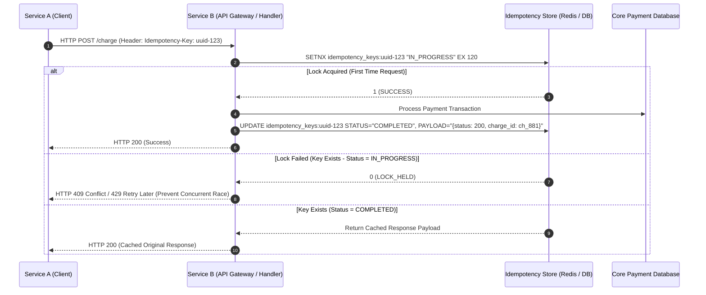

# 🌐 Distributed Systems Fundamentals — The Master Guide

| Field | Value |
|---|---|
| **Concept ID** | C000 |
| **Category** | High-Level Design / Fundamentals |
| **Difficulty** | 🟡 Medium |
| **Interview Frequency** | 🔥 High (Essential for all SDE-2/L4+ Systems Interviews) |

---

## 1. What is a Distributed System?

A **Distributed System** is a collection of autonomous computing nodes (servers, containers, databases) connected over a network that communicate via message passing, coordinating their actions to appear to the end-user as a **single, unified, coherent system**.

---

## 2. The 3 Hard Realities of Distributed Systems

Unlike single-node in-memory execution, distributed systems operate under three inescapable physical constraints:

1. **Partial Failure:** A single machine either runs or crashes. A distributed system can have 10 nodes healthy, 2 nodes crashed, and 1 node stuck in a 10-second GC pause. The system is simultaneously dead and alive.
2. **Unreliable Networks (Asynchronous Network Model):** Network packets can be dropped, delayed indefinitely, reordered, or duplicated. There is no shared memory.
3. **No Shared Physical Clock:** Physical clocks drift. You cannot rely on `System.currentTimeMillis()` across different servers to accurately order events.

---

## 3. The 3 States of Network Timeout (The Fundamental Uncertainty)

When **Service A** calls **Service B** over a network and times out, Service A experiences **Three-State Ambiguity**:

```
                  ┌─────────────────────────────────────────┐
                  │           Service A (Client)            │
                  └────────────────────┬────────────────────┘
                                       │ HTTP POST /charge
                                       ▼
                   ┌───────────────────────────────────────┐
                   │             NETWORK WIRE              │
                   └───────────────────┬───────────────────┘
                                       │
     ┌─────────────────────────────────┼─────────────────────────────────┐
     │ STATE 1: Request Lost           │ STATE 2: Response Lost          │ STATE 3: In-Flight / Slow
     ▼                                 ▼                                 ▼
┌─────────┐                      ┌─────────┐                       ┌─────────┐
│Service B│                      │Service B│                       │Service B│
│  (0%)   │                      │ (100%)  │                       │ (50%)   │
└─────────┘                      └─────────┘                       └─────────┘
Request never arrived.           Successfully charged card.        Currently executing query.
Action did NOT happen.           Response dropped on network wire. Action IS happening right now.
```

| State | What Happened | Execution Status on Service B | Danger if Service A Retries |
|---|---|---|---|
| **State 1: Request Dropped** | Packet lost *before* reaching Service B. | **0% Executed** | Safe to retry. |
| **State 2: Response Dropped** | Service B executed 100%, but HTTP 200 lost on return wire. | **100% Executed** | ⚠️ **DUPLICATE EXECUTION** (Double Charge!) |
| **State 3: In-Flight / Slow** | Service B is slow (GC pause or DB lock), hasn't replied yet. | **In-Progress** | ⚠️ **RACE CONDITION & DUPLICATE EXECUTION** |

---

## 4. Idempotency Architecture (Stripe-Style Implementation)

### 4.1 Definition
An operation is **idempotent** if performing it multiple times produces the exact same state and output as performing it once:
$$f(f(x)) = f(x)$$

### 4.2 Idempotency Key Workflow & Storage Engine



### 4.3 Database Schema for Idempotency Store

```sql
CREATE TABLE idempotency_keys (
    idempotency_key VARCHAR(255) PRIMARY KEY,
    user_id VARCHAR(64) NOT NULL,
    request_hash VARCHAR(64) NOT NULL, -- SHA-256 hash of payload to detect parameter tampering
    status VARCHAR(32) NOT NULL,      -- 'IN_PROGRESS', 'COMPLETED', 'FAILED'
    response_code INT,
    response_body TEXT,
    created_at TIMESTAMP WITH TIME ZONE DEFAULT CURRENT_TIMESTAMP,
    updated_at TIMESTAMP WITH TIME ZONE DEFAULT CURRENT_TIMESTAMP
);

-- Index for background cleanup worker
CREATE INDEX idx_idempotency_created ON idempotency_keys(created_at);
```

---

## 5. Senior Interview Flashcards

> **Q: "How do you handle a scenario where two identical HTTP POST requests with the same Idempotency Key arrive at Service B at the exact same millisecond?"**
>
> *"We enforce strict atomic locking at the storage layer using Redis `SETNX` (SET if Not Exists) with a 2-minute TTL or a SQL `INSERT INTO idempotency_keys` with a UNIQUE PRIMARY KEY constraint. The first request acquires the lock and sets status to `IN_PROGRESS`. The second concurrent request fails to acquire the lock and receives HTTP 409 Conflict or waits for the lock to complete, preventing race conditions and duplicate double-spending."*
