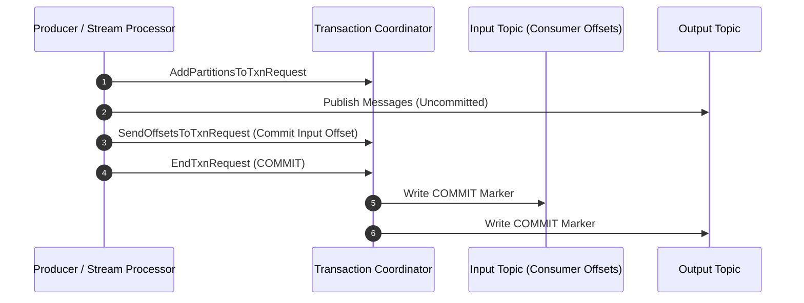

# ⚡ Kafka Architecture — The Master Guide

| Field | Value |
|---|---|
| **Concept ID** | C098 |
| **Category** | Messaging & Event Streams |
| **Difficulty** | 🔥 Hard |
| **Interview Frequency** | 🔥 High (Google, Meta, Uber, LinkedIn, Netflix, Confluent) |

---

## 1. The Core Concept

### The Problem: Message Queues vs. Persistent Log Streams

Traditional message brokers (e.g., RabbitMQ, ActiveMQ) use a **"Smart Broker / Dumb Consumer"** architecture:
* The broker routes messages, tracks per-consumer ACKs, and **deletes messages immediately after consumption**.
* **Limit:** High CPU overhead per message on the broker, limited throughput (~50k msg/s), and **inability to replay past events**.

Kafka flips this paradigm with a **"Dumb Broker / Smart Consumer"** architecture:
* Kafka treats messages as an **append-only, immutable sequence of records on disk (a log)**.
* Consumers track their own read position (**offset**). The broker merely appends and reads from disk.
* **Result:** Extreme write throughput ($1\text{M}+$ msg/s), zero-copy reads, configurable retention, and the ability for any consumer group to **replay history at any time**.

```
TRADITIONAL QUEUE vs. KAFKA DISTRIBUTED LOG

Traditional Queue (RabbitMQ):
  Producer ──► [ Msg 1 ][ Msg 2 ][ Msg 3 ] ──► Consumer (Deleted after ACK)

Kafka Persistent Log:
  Producer ──► [ Offset 0 ][ Offset 1 ][ Offset 2 ][ Offset 3 ][ Offset 4 ]
                      ▲                   ▲
                      │                   │
               Consumer A (Offset 1)  Consumer B (Offset 3)
               (Replay available)     (Reading live stream)
```

### Architectural Component Hierarchy

```
┌────────────────────────────────────────────────────────────────────────────────────────┐
│  KAFKA CLUSTER                                                                         │
│                                                                                        │
│  TOPIC: "payment-events" (Partition Count = 3, Replication Factor = 3)                 │
│                                                                                        │
│  Partition 0: [Off 0][Off 1][Off 2][Off 3] ──► Leader: Broker 1 (Followers: B2, B3)    │
│  Partition 1: [Off 0][Off 1][Off 2]        ──► Leader: Broker 2 (Followers: B1, B3)    │
│  Partition 2: [Off 0][Off 1][Off 2][Off 3] ──► Leader: Broker 3 (Followers: B1, B2)    │
│                                                                                        │
│  Consensus / Metadata Engine: KRaft (Raft Quorum) or ZooKeeper                          │
└────────────────────────────────────────────────────────────────────────────────────────┘
```

| Component | Responsibility |
|---|---|
| **Broker** | A single Kafka server node storing partitions and serving produce/consume requests. |
| **Topic** | A logical stream/category to which messages are published. |
| **Partition** | An ordered, immutable sequence of records continuously appended to an underlying log file. The unit of parallelism in Kafka. |
| **Offset** | A sequential integer assigned to each message within a partition, uniquely identifying its position. |
| **Consumer Group** | A collection of consumers sharing a single `group.id` that cooperatively divide topic partitions among themselves. |
| **ISR (In-Sync Replicas)** | The set of partition replicas currently caught up with the leader's log end offset. |

---

## 2. Deep Dive: Storage Engine & Zero-Copy I/O

### 2.1 Append-Only Log & Binary Segment File Layout

A Kafka partition is stored on disk as a directory of **segment files** (default 1 GB per segment). Each segment consists of three physical files:

```
/var/lib/kafka/data/payment-events-0/
├── 00000000000000000000.log        <-- Actual binary record batches
├── 00000000000000000000.index      <-- Sparse index: Relative offset -> Physical byte offset
└── 00000000000000000000.timeindex  <-- Sparse index: Timestamp -> Relative offset
```

```
SPARSE INDEX LOOKUP MECHANICS (Reading Offset 4820):

  1. Search .index binary file (In-Memory Page Cache):
     Offset 4000 ──► Physical Byte Position 0
     Offset 4500 ──► Physical Byte Position 14,200
     Offset 5000 ──► Physical Byte Position 28,900

  2. Binary search identifies Offset 4500 is closest preceding entry.
  3. Jump directly to Byte Position 14,200 in .log file and scan sequentially until Offset 4820 is found.
```

> **Why Sparse Indexing?** Storing an index entry for *every single message* would bloat RAM. Sparse indexing stores an index entry every $N$ bytes (default 4 KB), drastically reducing RAM usage while maintaining fast $O(\log N)$ binary searches.

---

### 2.2 Zero-Copy I/O Data Transfer Path

In traditional network file serving, data passes through **4 context switches and 3 CPU memory buffer copies**:

```
TRADITIONAL READ PATH (4 Copies, 4 Context Switches):
  Disk ──(DMA)──► Kernel Page Cache ──(CPU Copy)──► User Space Buffer
                                                          │
  NIC Wire ◄──(DMA)─── Socket Buffer ◄───(CPU Copy)───────┘
```

Kafka utilizes the Linux `sendfile()` system call to achieve **Zero-Copy I/O**:

```
ZERO-COPY READ PATH (Zero CPU Copies, 2 Context Switches):
  Disk ──(DMA)──► Kernel Page Cache ──(DMA Direct Transfer via Descriptor)──► NIC Network Socket
```

```
Key Benefit:
1. Data never crosses into User-Space memory.
2. CPU utilization remains near 0% even under gigabytes/second of consumer read load.
3. Multiple consumers reading the same topic fetch data directly from OS Page Cache without touching disk.
```

---

### 2.3 Log Retention vs. Log Compaction

Kafka offers two distinct log cleanup strategies configured via `log.cleanup.policy`:

1. **Delete Policy (`log.cleanup.policy=delete`):**  
   Retains messages based on time (`log.retention.hours=168` — 7 days) or size (`log.retention.bytes`). Segments older than the limit are deleted.
2. **Compact Policy (`log.cleanup.policy=compact`):**  
   Retains at least the **latest value for every primary key** in the partition log.

```
LOG COMPACTION FLOW:

  Before Compaction:
  [ Key: "user_1", Val: "v1" ][ Key: "user_2", Val: "v1" ][ Key: "user_1", Val: "v2" ][ Key: "user_1", Val: "v3" ]

  After Background Cleaner Thread Runs:
  [ Key: "user_2", Val: "v1" ][ Key: "user_1", Val: "v3" ]
```

> **Use Case for Log Compaction:** Database Change Data Capture (CDC) or restoring KTable state in Kafka Streams—where only the latest state per key matters.

---

## 3. Delivery Semantics, Idempotency & Exactly-Once Processing (EOS)

### 3.1 Delivery Guarantees Spectrum

| Semantic | Producer Config | Consumer Config | Behavior / Risk |
|---|---|---|---|
| **At-Most-Once** | `acks=0` or `retries=0` | Commit offset *before* processing message | Fast; potential data loss if consumer crashes after committing offset. |
| **At-Least-Once** | `acks=all`, `retries>0` | Commit offset *after* processing message | Safe against data loss; duplicates possible if consumer crashes mid-processing. |
| **Exactly-Once (EOS)** | `enable.idempotence=true`, `acks=all` | Read-Process-Write within Kafka Transaction | Zero data loss, zero duplicates across processing steps. |

---

### 3.2 Idempotent Producer Mechanics

Under network retries, a standard producer might resend a message that the broker received but failed to ACK, producing duplicates. 

Setting `enable.idempotence=true` prevents this:
1. Each producer is assigned a 64-bit **Producer ID (PID)** by the broker upon initialization.
2. Each record batch includes a monotonically increasing **Sequence Number (`seq_num`)**.
3. The broker tracks `(PID, Partition) -> Last_Seq_Num`.

$$\text{If } \text{Incoming } \texttt{seq\_num} == \text{Stored } \texttt{seq\_num} + 1 \implies \text{Accept \& Append}$$
$$\text{If } \text{Incoming } \texttt{seq\_num} \le \text{Stored } \texttt{seq\_num} \implies \text{Discard Duplicate, Return Success ACK}$$

---

### 3.3 Transactional Messaging & 2PC Flow (EOS)

When consuming from Topic A and producing to Topic B (e.g. Stream Processing), Kafka provides **Atomic Read-Process-Write** using a 2-Phase Commit managed by a **Transaction Coordinator**:



> **Consumer Isolation Level:** Consumers set `isolation.level=read_committed` to skip uncommitted messages or aborted transaction batches.

---

## 4. Partitioning, Consumer Groups & Rebalancing

### 4.1 Partition Hashing & Key Distribution

Messages with a key are assigned to partitions using **MurmurHash2**:

$$\text{Partition Index} = \text{MurmurHash2}(\text{key}) \pmod{\text{Total Partitions}}$$

* **Key Present:** All messages with the exact same key land on the **same partition**, preserving strict per-key ordering.
* **Key Null:** Kafka uses a Round-Robin / Sticky Partitioner strategy to distribute records evenly across partitions.

#### 🔥 Mitigating Hot Partitions (Skewed Traffic):
1. **Random Key Salting:** Append a pseudo-random suffix (`key = adId + "_" + random(1..10)`) to distribute high-velocity events across multiple partitions.
2. **Compound Keys:** Combine business ID with an orthogonal property (`key = adId + "_" + regionId + "_" + userSegment`).
3. **Sticky / No-Key Strategy:** Omit keys if strict message ordering is not required; modern producers batch to a partition and rotate evenly.
4. **Producer Backpressure:** Throttle producer publishing rate when target partition consumer lag exceeds safety thresholds.

*(For full interview problem breakdowns and code snippets, see [Kafka System Design Interview Deep Dive](./11-Kafka-System-Design-Interview-Deep-Dive.md).)*

---

### 4.2 Consumer Group Scaling Architecture

```
PARTITION-TO-CONSUMER ASSIGNMENT RULES:

  Scenario A: Partitions (4), Consumers in Group (2)
    Consumer 1 ──► Partition 0, Partition 1
    Consumer 2 ──► Partition 2, Partition 3

  Scenario B: Partitions (4), Consumers in Group (4)
    Consumer 1 ──► Partition 0
    Consumer 2 ──► Partition 1
    Consumer 3 ──► Partition 2
    Consumer 4 ──► Partition 3  (Ideal 1:1 Parallelism)

  Scenario C: Partitions (4), Consumers in Group (5)
    Consumers 1..4 ──► Partitions 0..3
    Consumer 5     ──► IDLE (Sits idle waiting for failover; excess consumers do not increase throughput)
```

---

### 4.3 Rebalance Protocols: Eager vs. Cooperative Sticky

When a consumer joins, leaves, or crashes, the **Group Coordinator** triggers a rebalance:

```
1. EAGER REBALANCING (Legacy "Stop-the-World"):
   All consumers stop processing ──► Revoke ALL partitions ──► Re-join group ──► Re-assign partitions
   (Result: Complete latency spike across the whole consumer cluster)

2. COOPERATIVE STICKY REBALANCING (Modern Default):
   Identify specific affected partitions ──► Revoke ONLY affected partitions ──► Re-assign incrementally
   (Result: Non-affected consumers continue processing without interruption)
```

#### Avoiding Rebalance Storms in Production:
Set static membership via `group.instance.id`. During rolling deployments or container restarts, the broker holds the consumer's partition assignments for `session.timeout.ms` without triggering a rebalance storm.

---

## 5. High Availability, Consensus & Fault Tolerance

### 5.1 Replication & In-Sync Replicas (ISR)

```
HIGH WATERMARK (HW) & LOG END OFFSET (LEO):

Leader Broker:    [ Off 0 ][ Off 1 ][ Off 2 ][ Off 3 ]  (LEO = 4)
Follower 1 (ISR): [ Off 0 ][ Off 1 ][ Off 2 ]           (LEO = 3)
Follower 2 (ISR): [ Off 0 ][ Off 1 ][ Off 2 ]           (LEO = 3)

High Watermark (HW) = 3  <-- Maximum offset replicated to ALL members of ISR.
Consumers can ONLY read up to the High Watermark (HW = 3) to prevent reading uncommitted data.
```

#### Durability Configuration Matrix:
To guarantee **Zero Data Loss**, configure:
* `acks=all` (Producer waits for all ISR nodes to replicate).
* `min.insync.replicas=2` (Broker rejects writes if ISR count drops below 2).
* `unclean.leader.election.enable=false` (Prevents non-ISR out-of-sync replicas from becoming leader).

---

### 5.2 Consensus Engine: ZooKeeper vs. KRaft

```
ZooKeeper-Based Cluster (Legacy):
  External ZK Ensemble ──(Metadata Sync)──► Kafka Controller Broker ──► Kafka Workers
  (Limitation: Metadata bottleneck at ~200k total partitions per cluster)

KRaft Cluster (Kafka Raft Metadata Mode - Modern Production):
  KRaft Quorum Controllers ──(Internal @metadata Topic)──► Kafka Workers
  (Scales to 1,000,000+ partitions with sub-second leader failover times)
```

---

## 6. Failure Modes, Poison Pills & Resiliency Topology

### 6.1 Poison Pill Messages & Dead Letter Queue (DLQ)

A **Poison Pill** is a malformed message (e.g., corrupted JSON) that causes the consumer deserializer to throw an exception repeatedly. If unhandled, the consumer gets stuck in an infinite retry loop, blocking partition progress.

```
DEAD LETTER QUEUE (DLQ) TOPOLOGY:

  Main Topic "orders" ──► Consumer Process ──(Deserialization Error)──► Catch Exception
                                                                               │
                                 ┌─────────────────────────────────────────────┘
                                 ▼
                    Publish to "orders-DLQ" ──► Commit Offset on "orders" ──► Continue Processing Next Msg
```

---

### 6.2 Exponential Backoff Retry Topics

```
MULTI-TIER RETRY TOPOLOGY:

  Main Topic ("orders")
         │
    (Fails) ──► Retry Topic 1 ("orders-retry-5m")  [Delayed Consumer: 5m]
                     │
                (Fails again) ──► Retry Topic 2 ("orders-retry-15m") [Delayed Consumer: 15m]
                                       │
                                  (Fails again) ──► Dead Letter Queue ("orders-dlq")
```

---

## 7. Integration Patterns: Transactional Outbox Pattern

### Dual-Write Problem
When a service updates a database and publishes a message to Kafka, network failures can cause inconsistency (DB commits, but Kafka publish fails).

### Solution: Transactional Outbox + Debezium CDC

```mermaid
flowchart LR
    subgraph Microservice Transaction Boundary
        API[Client Request] --> DB[(App DB)]
        DB -->|1. Write Order Table| T1[Order Table]
        DB -->|2. Write Outbox Table| T2[Outbox Table]
    end

    subgraph Change Data Capture (CDC)
        T2 -.->|3. Read Postgres WAL| CDC[Debezium CDC Engine]
        CDC -->|4. Streaming Event| Kafka((Kafka Cluster))
    end
```

---

## 8. Comprehensive Architectural Comparison Matrix

| Property | Apache Kafka | RabbitMQ | AWS SQS | Redis Streams | Apache Pulsar |
|---|---|---|---|---|---|
| **Architecture** | Append-Only Log | AMQP Broker | Cloud Queue | In-Memory Stream | Layered (Broker + BookKeeper) |
| **Max Throughput** | 🚀 **Very High** ($1\text{M}+$ msg/s) | 🟡 Moderate (~50k msg/s) | 🟡 Moderate (Unlimited horizontal) | ⚡ Extremely High (In-RAM) | 🚀 **Very High** ($1\text{M}+$ msg/s) |
| **Read Latency** | 5–15ms | < 2ms | 10–50ms | **< 1ms** | 5–15ms |
| **Message Replay** | ✅ **YES** (Offset reset) | ❌ NO (Deleted on ACK) | ❌ NO (Deleted on ACK) | ✅ **YES** (Offset-based) | ✅ **YES** (Storage tiering) |
| **Ordering Scope** | Per Partition | Per Queue (Single consumer) | FIFO Queue option | Per Stream | Per Key / Partition |
| **Routing Flexibility** | Low (Topic/Key) | 🚀 **High** (Exchanges/Bindings) | Low | Low | Moderate |
| **Ops Complexity** | High (KRaft/ZooKeeper) | Low/Moderate | Zero (Serverless) | Low | Very High |

---

## 9. SDE-2 / Senior Interview Script

> **Q: "How does Apache Kafka achieve millions of messages per second write/read throughput while maintaining data durability?"**

**1. Opening & Core Philosophy:**
> *"Kafka achieves extreme throughput by treating data as an immutable, append-only log on disk and shifting broker responsibility to the consumer. Sequential disk writes bypass random I/O head movement, performing almost as fast as RAM."*

**2. Zero-Copy & Storage Engine:**
> *"On the read path, Kafka utilizes Linux Zero-Copy I/O via the `sendfile()` system call. Data is transferred directly from the OS Page Cache to the Network Socket (NIC) via DMA, bypassing User-Space memory entirely. This reduces CPU usage to near zero and eliminates context switches."*

**3. Partitioning & Parallelism:**
> *"Scalability is achieved through Topic Partitions. Each partition acts as an independent append-only log. Write throughput scales linearly with the number of partitions because partitions are distributed across separate physical brokers."*

**4. Durability & Consensus:**
> *"For durability without sacrificing performance, Kafka uses In-Sync Replicas (ISR) with `acks=all` and `min.insync.replicas=2`. The producer waits for memory replication across ISR nodes. Modern Kafka clusters use KRaft—a Raft-based internal consensus quorum—eliminating external ZooKeeper latency during metadata operations."*

---

## 10. SDE-2+ Operational Readiness Checklist

- [ ] Can explain why sequential append-only log writes perform significantly faster than random disk I/O.
- [ ] Can draw the Zero-Copy I/O data flow (`sendfile()`) vs traditional user-space 4-copy read paths.
- [ ] Can explain partition sparse indexing (`.index`, `.timeindex`, `.log`) and binary search offsets.
- [ ] Can state the partition hashing formula: `MurmurHash2(key) % total_partitions`.
- [ ] Can explain why Consumer Group parallelism is capped at the total number of topic partitions.
- [ ] Can articulate the difference between Eager Rebalancing and Cooperative Sticky Rebalancing.
- [ ] Can explain how Static Membership (`group.instance.id`) prevents rebalance storms during rolling deployments.
- [ ] Can describe the exact mechanics of Producer Idempotency (`PID` + `seq_num` deduplication).
- [ ] Can explain Kafka's 2-Phase Commit Transactional API (`read-process-write` EOS).
- [ ] Can state the zero-data-loss configuration triad: `acks=all`, `min.insync.replicas=2`, `unclean.leader.election.enable=false`.
- [ ] Can explain the High Watermark (HW) vs Log End Offset (LEO) safety boundary for consumer visibility.
- [ ] Can explain KRaft consensus vs legacy ZooKeeper controller ensembles.
- [ ] Can design a Poison Pill and Dead Letter Queue (DLQ) topology for resilient consumer groups.
- [ ] Can explain Log Compaction (`log.cleanup.policy=compact`) for CDC and state store recovery.
- [ ] Can describe the Transactional Outbox Pattern + Debezium CDC to solve DB-to-Kafka dual-write bugs.
