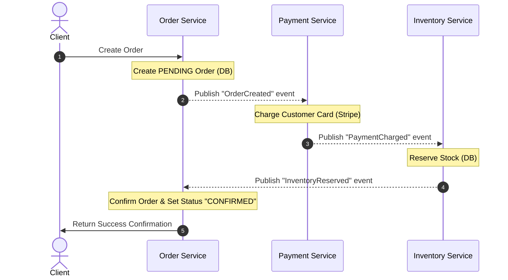
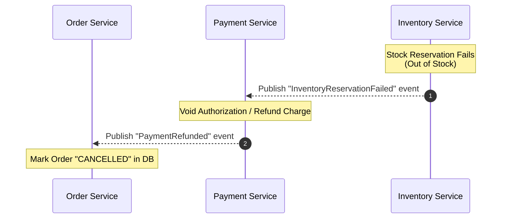
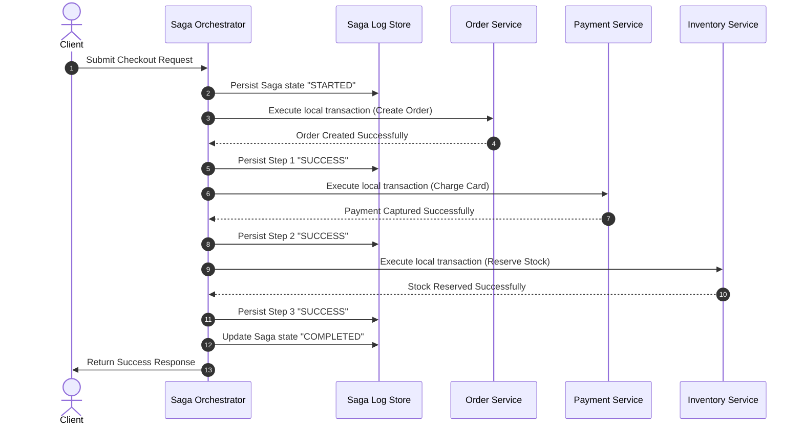
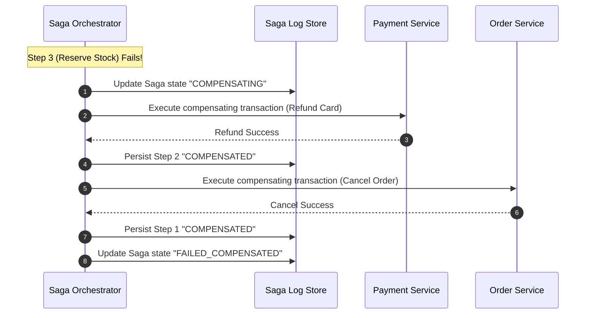

# Saga Pattern for Distributed Transactions (C077)

## 📋 Tracker Metadata
| Column | Value / Status |
| :--- | :--- |
| **Concept ID** | C077 |
| **Category** | Distributed Transactions |
| **Difficulty** | 🔴 Hard |
| **Interview Frequency** | 🔥 High |
| **Understanding** | [🔴 None / 🟡 Conceptual / 🟢 Applied] |
| **Can Explain** | [ ] Yes / [ ] No |
| **Whiteboard Drawn** | [ ] Yes / [ ] No |
| **Taught Someone** | [ ] Yes / [ ] No |
| **Next Review** | YYYY-MM-DD |
| **Mastery** | [🔴 Familiar / 🟡 Competent / 🟢 Expert] |

---

## ⚡ 1. The Core Concept & Triggers
*   **Two-Sentence Trigger:** The Saga Pattern coordinates distributed transactions across multiple independent microservices via a sequence of local transactions, executing compensating transactions in reverse order if any step fails. It trades immediate database-level isolation (ACID) for high availability and throughput (BASE), removing the blocking resource locks inherent in [Two-Phase Commit (2PC)](03-Two-Phase-Commit.md).
*   **Scalability Dimension:** Primary: **System Latency & Throughput** (via lock-free execution). Secondary: **Eventually Consistent Data Model (BASE)**.

---

## ⚖️ 2. Trade-offs & Deep Dive

### Why 2-Phase Commit (2PC) Doesn't Scale
In monolithic systems, ACID transactions are trivial because a single database manages locks on all rows. In a distributed microservices architecture utilizing the *Database-per-Service* pattern, 2PC forces all participating databases to lock rows synchronously during the coordinator's voting and commit phases. 

If network latency is 50ms, locks are held for at least 100ms. This long lock duration:
*   **Blocking Protocol:** 2PC is a blocking protocol. If the coordinator crashes during the commit phase, participants remain in limbo, holding locks indefinitely. This causes cascading thread pool and resource exhaustion across the system.
*   **Latency Overhead:** Locks are held on database rows during the entire two round-trips over the network, severely degrading write throughput.
*   **SaaS and NoSQL Incompatibility:** 2PC requires standard XA transaction support. Modern microservices frequently use NoSQL databases (e.g., [Redis](../24-components-library/02-Caches/In_Memory_KV/L013-Redis/README.md), Cassandra) or third-party SaaS APIs (Stripe, Twilio) that do not support XA or 2PC protocols.
*   **Tight Coupling:** Services must coordinate synchronously, breaking the operational independence of microservices.

For a mathematical view of consistency trade-offs, refer to the [PACELC Theorem](../10-Consistency-Models/04-PACELC-Theorem.md).

### The Saga Solution
A Saga breaks a single distributed transaction into a sequence of **local transactions**. Each participant commits its local changes immediately. If any step fails, the Saga runs **compensating transactions** (semantic rollbacks) to undo the committed changes in reverse order.

---

### Architectural Flavors: Orchestration vs. Choreography

#### 1. Choreography Saga (Decentralized Pub/Sub)
There is no central coordinator. Services listen to events emitted by other services and execute local transactions in a decentralized event loop.



##### Failure and Compensation Flow:


*   **Drawbacks of Choreography:**
    *   **Cognitive Load:** No single service contains the global state machine. To understand the workflow, developers must trace events across multiple codebases.
    *   **Cyclic Dependencies:** Services must subscribe to each other's events, which can easily create circular event paths.
    *   **Complex Testing:** Simulating a failure recovery scenario requires spinning up the entire event broker and all downstream consumer services.

---

#### 2. Orchestration Saga (Central Coordinator)
A centralized service (the **Orchestrator**) coordinates the state transitions. It directs participants to execute local transactions, receives their responses, and triggers compensations if necessary. The orchestrator tracks progress in a persistent **Saga Log**.



##### Orchestration Compensation Flow:


*   **Pros:** Centralized state tracking simplifies debugging and operations; explicit DAG/State-Machine definition; avoids circular event dependencies.
*   **Cons:** Orchestrator database can become a performance bottleneck; introducing a central coordinator adds infrastructure complexity.

---

### Detailed Saga Log Schema
The orchestrator must persist state before executing network steps. Below is an enterprise-ready [PostgreSQL](../24-components-library/01-Databases/SQL/L001-PostgreSQL/README.md) schema:

```sql
CREATE TABLE saga_instances (
    saga_id UUID PRIMARY KEY,
    saga_type VARCHAR(100) NOT NULL, -- e.g., 'E_COMMERCE_CHECKOUT'
    status VARCHAR(50) NOT NULL,     -- 'STARTED', 'COMPLETED', 'FAILED', 'COMPENSATING', 'COMPENSATED'
    payload JSONB NOT NULL,          -- Arguments needed for recovery or compensations
    created_at TIMESTAMP WITH TIME ZONE DEFAULT CURRENT_TIMESTAMP,
    updated_at TIMESTAMP WITH TIME ZONE DEFAULT CURRENT_TIMESTAMP
);

CREATE TABLE saga_steps (
    step_id UUID PRIMARY KEY,
    saga_id UUID REFERENCES saga_instances(saga_id) ON DELETE CASCADE,
    step_name VARCHAR(100) NOT NULL, -- e.g., 'CHARGE_PAYMENT'
    sequence_order INT NOT NULL,
    status VARCHAR(50) NOT NULL,     -- 'PENDING', 'SUCCESS', 'FAILED', 'COMPENSATED'
    executed_at TIMESTAMP WITH TIME ZONE,
    compensated_at TIMESTAMP WITH TIME ZONE,
    error_message TEXT,
    CONSTRAINT unique_saga_step UNIQUE (saga_id, sequence_order)
);

CREATE INDEX idx_saga_instances_status ON saga_instances(status, updated_at);
```

#### Orchestrator Crash Recovery Daemon
When an orchestrator crashes, a background worker polls for unresolved sagas:
```sql
SELECT saga_id, saga_type, payload 
FROM saga_instances 
WHERE status IN ('STARTED', 'COMPENSATING') 
  AND updated_at < NOW() - INTERVAL '1 minute'
LIMIT 100;
```
For each active saga, the recovery worker identifies the first step with status `PENDING` or `FAILED` and resumes execution from that point. If it was `COMPENSATING`, the worker resumes executing compensating steps in descending order.

---

### Code Pattern for an Orchestration Saga Engine
Below is a conceptual Python implementation of an Orchestration Saga controller:

```python
import uuid
import logging
from abc import ABC, abstractmethod

logging.basicConfig(level=logging.INFO)

class SagaStep(ABC):
    @abstractmethod
    def execute(self, payload: dict) -> bool:
        pass

    @abstractmethod
    def compensate(self, payload: dict) -> bool:
        pass

class CreateOrderStep(SagaStep):
    def execute(self, payload: dict) -> bool:
        logging.info(f"Order DB: Creating pending order: {payload.get('order_id')}")
        return True
    
    def compensate(self, payload: dict) -> bool:
        logging.info(f"Order DB: Reverting/Cancelling order: {payload.get('order_id')}")
        return True

class ChargePaymentStep(SagaStep):
    def execute(self, payload: dict) -> bool:
        if payload.get("fail_payment"):
            logging.error("Payment Gateway: Declined charge due to insufficient funds.")
            return False
        logging.info(f"Payment Gateway: Charged card for order {payload.get('order_id')}")
        return True
        
    def compensate(self, payload: dict) -> bool:
        logging.info(f"Payment Gateway: Issuing Stripe refund for order {payload.get('order_id')}")
        return True

class ReserveInventoryStep(SagaStep):
    def execute(self, payload: dict) -> bool:
        if payload.get("fail_inventory"):
            logging.error("Inventory DB: SKU out of stock.")
            return False
        logging.info(f"Inventory DB: Reserved items for order {payload.get('order_id')}")
        return True
        
    def compensate(self, payload: dict) -> bool:
        logging.info(f"Inventory DB: Releasing reserved items for order {payload.get('order_id')}")
        return True

class SagaOrchestrator:
    def __init__(self, steps: list[SagaStep]):
        self.steps = steps

    def execute(self, payload: dict) -> bool:
        saga_id = str(uuid.uuid4())
        logging.info(f"--- Starting Saga {saga_id} ---")
        completed_steps = []
        
        for step in self.steps:
            step_name = step.__class__.__name__
            logging.info(f"[SAGA LOG {saga_id}]: Step {step_name} -> PENDING")
            
            success = step.execute(payload)
            if success:
                completed_steps.append(step)
                logging.info(f"[SAGA LOG {saga_id}]: Step {step_name} -> SUCCESS")
            else:
                logging.error(f"[SAGA LOG {saga_id}]: Step {step_name} -> FAILED")
                self._compensate(saga_id, completed_steps, payload)
                return False
                
        logging.info(f"Saga {saga_id} completed successfully.")
        return True

    def _compensate(self, saga_id: str, completed_steps: list[SagaStep], payload: dict):
        logging.warning(f"Saga {saga_id} initiated rollback...")
        for step in reversed(completed_steps):
            step_name = step.__class__.__name__
            logging.info(f"[SAGA LOG {saga_id}]: Step {step_name} -> COMPENSATING")
            
            comp_success = False
            retries = 3
            while not comp_success and retries > 0:
                try:
                    comp_success = step.compensate(payload)
                except Exception as e:
                    logging.error(f"Network error during compensation of {step_name}: {e}")
                retries -= 1
            
            if not comp_success:
                logging.critical(f"ALERT: Saga {saga_id} COMPENSATION FAILED AT {step_name}! Routing to Dead Letter Queue (DLQ).")
            else:
                logging.info(f"[SAGA LOG {saga_id}]: Step {step_name} -> COMPENSATED")

if __name__ == "__main__":
    steps = [CreateOrderStep(), ChargePaymentStep(), ReserveInventoryStep()]
    orchestrator = SagaOrchestrator(steps)
    
    # Happy Path
    orchestrator.execute({"order_id": "1001", "fail_payment": False, "fail_inventory": False})
    # Failure Path at Payment
    orchestrator.execute({"order_id": "1002", "fail_payment": True, "fail_inventory": False})
    # Failure Path at Inventory
    orchestrator.execute({"order_id": "1003", "fail_payment": False, "fail_inventory": True})
```

---

### Failure Recovery Modes: Forward vs. Backward Recovery

#### 1. Backward Recovery
Rolls back the system to its initial state using compensating transactions in reverse order.
*   **Use Case:** Business failures where continuation is impossible (e.g., card declined, account inactive).
*   **Requirement:** Every step must have a reliable, idempotent compensating action.

#### 2. Forward Recovery
Retries the failed step or routes to an alternative step until the entire transaction succeeds.
*   **Use Case:** Technical or network failures (e.g., network timeout, downstream API down) or post-pivot phases where rollback is impossible.
*   **Requirement:** All operations must be strictly idempotent.

---

## ⚡ 3. SDE-3 (L5) Deep Dive: Edge Cases & Operational Resiliency

### 3.1 Out-of-Order Execution (The Cancellation Tombstone)
In high-throughput, asynchronous event-driven networks, a compensation message (e.g., `CancelOrder`) can arrive at a microservice before the original command message (e.g., `CreateOrder`). This is known as **Out-of-Order Delivery**.

*   **The Risk:** If the service handles `CancelOrder` first, it finds no order record and returns success. When the late `CreateOrder` arrives, it inserts the record. The order remains active indefinitely, creating a zombie resource.
*   **The Solution:** Use **Cancellation Tombstones**. When a compensation action arrives for a non-existent identifier, insert a record in a tombstone/status table indicating that this ID is pre-cancelled. When the creation command eventually arrives, check this table and reject the transaction.

```sql
-- Step 1: Compensation CancelOrder arrives first: write tombstone
INSERT INTO order_tombstones (order_id, status) 
VALUES ('order_123', 'PRE_CANCELLED')
ON CONFLICT (order_id) DO NOTHING;

-- Step 2: Late CreateOrder arrives: conditionally insert
INSERT INTO orders (order_id, amount, status)
SELECT 'order_123', 149.99, 'CREATED'
WHERE NOT EXISTS (
    SELECT 1 FROM order_tombstones WHERE order_id = 'order_123'
);
```

---

### 3.2 Dual-Write Prevention (Transactional Outbox + CDC)
Inside any Saga step, a participant service must update its local database *and* publish an event to Kafka. If done as two separate network calls, a crash between them causes data drift (e.g., DB commits but no message is sent, or vice-versa).

*   **The Solution:** Use the **Transactional Outbox Pattern**. The participant service writes its data changes and an outbox message to the same database in a single ACID transaction. A log reader or Change Data Capture (CDC) tool like Debezium reads the database's Write-Ahead Log (WAL) and publishes the message to the event broker (Kafka) with at-least-once delivery guarantees.

```
+------------------------------------------------------------+
| Microservice                                               |
|  [Code Logic] ---> Starts local SQL transaction            |
|                     |--> Writes to Business Table          |
|                     |--> Writes event to Outbox Table      |
|                     +-> Commits Transaction (ACID)         |
+------------------------------------------------------------+
                                  |
                                  v
+------------------+     +------------------+     +---------------+
| PostgreSQL WAL   | --> | Debezium (CDC)   | --> | Apache Kafka  |
| (Write-Ahead Log)|     | Engine           |     | Broker        |
+------------------+     +------------------+     +---------------+
```

---

### 3.3 Persistent Compensation Failures
If a compensating step fails repeatedly (e.g., credit card expired during refund, external server offline), the Saga is blocked.

*   **Resiliency Workflow:**
    1.  **Exponential Backoff & Jitter:** Prevent DDOSing downstream APIs.
    2.  **Dead Letter Queue (DLQ):** After a configurable limit (e.g., 5 retries), route the saga state to a DLQ.
    3.  **Manual Reconciliation Console:** An administrative UI displays these failed states. Operations staff can manually override values, reissue payment checks, or override database states.

---

### 3.4 Deterministic Workflow Replays (Event Sourced Orchestration)
Orchestration frameworks like Temporal use event sourcing to capture the state of execution. Rather than storing variables in database cells, the engine records an append-only log of every completed action (history event).

*   **Replay Mechanics:** When the orchestrator worker node crashes, it recovers state by replaying the workflow code from start to finish. When the code invokes an action (an "Activity") that has already run, the framework intercepts the execution, reads the result from the history log, and returns it immediately.
*   **Determinism Constraints:** Workflow code must be strictly deterministic. You **cannot** use current time utilities (`datetime.now()`), random numbers, or direct network queries inside the workflow definition. Doing so causes the replay path to diverge, throwing a `NonDeterministicWorkflowError`.

```python
# Bad Pattern (Throws NonDeterministicWorkflowError on replay)
def my_workflow(order_id):
    if datetime.now().hour > 12: # Non-deterministic branch!
        execute_activity(morning_promo)
    execute_activity(process_payment)

# Good Pattern
def my_workflow(order_id):
    current_time = workflow.now() # Framework-safe deterministic clock
    if current_time.hour > 12:
        execute_activity(morning_promo)
    execute_activity(process_payment)
```

---

### 3.5 Code-First Orchestration (Temporal) vs. State-Machine-Based Orchestration (AWS Step Functions / Conductor)

When designing a centralized orchestration system, engineers generally choose between two architecture types:

#### A. Code-First Orchestration (e.g., Temporal, Cadence)
Workflows are defined in standard programming languages (Python, Go, Java, TypeScript).
*   **Execution:** Virtual actors replay deterministic code blocks, using history events to bypass already-executed steps.
*   **Pros:** Full programming expressiveness (loops, try-catch, dynamic branches), code can be unit-tested directly, version control fits naturally in git repository.
*   **Cons:** Strict determinism requirements require developers to learn specific library patterns.

#### B. State-Machine-Based Orchestration (e.g., AWS Step Functions, Netflix Conductor)
Workflows are defined in JSON or YAML formats representing a Directed Acyclic Graph (DAG).
*   **Execution:** An engine parses the JSON/YAML and evaluates input/output paths to execute transition nodes.
*   **Pros:** Simple UI builders, clean visual DAG views, easy configuration of parallel states without code compilation.
*   **Cons:** JSON/YAML definitions become extremely verbose and difficult to maintain for complex business logic containing nested loops, error routing, and data filtering.

---

### 3.6 Lack of Isolation (ACID vs. BASE) & Countermeasures
Sagas are **BASE** (Basically Available, Soft state, Eventual consistency), not ACID. Specifically, they lack **Isolation**.
Because local transactions commit immediately to their respective databases, their changes are visible to other concurrent transactions *before* the entire Saga completes. This introduces three consistency risks:

1.  **Lost Updates:** Saga $A$ updates record $X$. Before Saga $A$ finishes, Saga $B$ overwrites record $X$. Later, Saga $A$ fails and triggers compensation, rolling back record $X$ to its initial value. Saga $B$'s update is silently lost.
2.  **Dirty Reads:** Saga $A$ updates a user balance. Saga $B$ reads the updated balance and lets the user buy an item. Saga $A$ fails and compensates, reverting the balance. The user has now purchased an item they cannot afford.
3.  **Non-Repeatable Reads:** A service reads a record, and before the Saga completes, another transaction updates the same record, causing a subsequent read in the Saga to see different data.

#### Isolation Anomaly Countermeasures:
*   **Semantic Lock:** Set a status field like `PENDING_RESERVATION` or `LOCKED_BY_SAGA_XYZ` on the record. Other transactions must check this state and decide whether to ignore, block, or bypass this record.
*   **Commutative Updates:** Design operations that do not care about order. For example, instead of absolute values (`SET balance = 100`), use delta adjustments (`ADD balance, 10`).
*   **Pessimistic Locking / Pivot Comparison:** Read values and perform strict validation before execution, committing changes only at the pivot point.
*   **Value-by-value comparison:** If a compensation attempts to roll back a record, it must check if the value was modified by another process. If so, it raises an alert instead of overwriting the concurrent change.

```sql
-- Acquiring a semantic lock during Step 1 of a Saga
UPDATE accounts 
SET balance = balance - 100,
    lock_status = 'PENDING_DEBIT',
    locked_by_saga_id = 'saga_abc_123'
WHERE account_id = 'acc_456' 
  AND lock_status = 'UNLOCKED';
  
-- Concurrent check: Any other transaction trying to modify the account
-- will fail to acquire the lock and must wait or fail.
```

---

### 3.7 Scaling the Saga Log Store
At high scale (e.g., 50,000 requests per second), writing every step transition to a single SQL relational database creates a write bottleneck.

*   **Scale Strategies:**
    1.  **Distributed Key-Value Logs:** Use a sharded database like Cassandra or ScyllaDB. Partition key by `saga_id` (`PRIMARY KEY ((saga_id), sequence_order)`). This distributes the writes evenly across the database ring.
    2.  **Short Retention Policies:** Archive completed sagas (`COMPLETED`, `FAILED_COMPENSATED`) directly to cold storage (S3/GCS) after 48 hours to keep the hot database tables small and performant.

---

## 🗺️ 4. High-Level Design (HLD) Problem Mappings

Here is how you apply the Saga Pattern to standard system design interview questions.

### 1. Food Delivery Service (DoorDash / UberEats)
*   **Problem:** Coordinate order placements, payments, courier dispatching, and restaurant acceptance.

| Step | Service | Action | Compensation (Undo) |
| :--- | :--- | :--- | :--- |
| **Step 1** | Order Service | Create order status `PENDING` | Update status to `CANCELLED` |
| **Step 2** | Payment Service | Pre-authorize payment hold | Release authorization hold (void hold) |
| **Step 3** | Delivery Service | Find and assign nearby courier | Release courier assignment |
| **Step 4 (PIVOT)** | Restaurant Service | Restaurant accepts order | *Point of no return.* No business compensation allowed. |
| **Step 5 (Post-Pivot)**| Delivery Service | Dispatch courier to restaurant | (Forward Recovery Only) Retry courier search. |
| **Step 6 (Post-Pivot)**| Notification Service| Send SMS/Push alerts to customer | (Forward Recovery Only) Retry delivery notification. |

---

### 2. Ride-Sharing Service (Uber / Lyft)
*   **Problem:** Booking a ride involves assigning a driver, securing a card hold, and dispatching.

| Step | Service | Action | Compensation (Undo) |
| :--- | :--- | :--- | :--- |
| **Step 1** | Trip Service | Create trip record `PENDING` | Update trip status to `CANCELLED` |
| **Step 2** | Matcher Service | Lock driver to trip `DRIVER_RESERVED` | Release driver hold, revert to `AVAILABLE` |
| **Step 3** | Payment Service | Authorize payment capture | Release credit card authorization |
| **Step 4 (PIVOT)** | Driver Service | Driver accepts & dispatches | *Point of no return.* (Forward Recovery Only) |
| **Step 5 (Post-Pivot)**| Dispatch Service | Route driver to client via GPS | (Forward Recovery Only - if driver cancels mid-way, initiate driver re-assignment sub-saga) |

---

## 📊 5. Comparison Table

| Metric / Dimension | Two-Phase Commit (2PC) | Saga Orchestration | Saga Choreography |
| :--- | :--- | :--- | :--- |
| **Consistency Model** | Strong Consistency (ACID) | Eventual Consistency (BASE) | Eventual Consistency (BASE) |
| **Resource Locking** | Blocking row locks held across phases | Lock-free; local transactions commit immediately | Lock-free; local transactions commit immediately |
| **Network Overhead** | High (blocking round trips) | Medium (central coordinator queries) | Low (asynchronous message pub/sub) |
| **SPOF Risk** | Yes (Coordinator node failure) | Yes (Orchestrator node, needs high-availability) | No (Fully decentralized broker) |
| **Third-Party API Support** | No (Requires XA database support) | Yes (Wrapped in orchestration handlers) | Yes (Handled by adapter consumers) |
| **Observability** | Easy to trace (DBMS level) | High (Central state tracking db) | Poor (Requires distributed tracing like Jaeger) |
| **Scalability Limit** | Low (Throttled by slowest node) | Medium-High (Limited by state store capacity) | Extremely High (Fully decoupled) |

---

## 🏢 6. Real-World Usage

### 1. Netflix (Conductor)
Netflix uses a centralized orchestration engine called **Netflix Conductor** to coordinate microservices for media ingestion. When a movie is uploaded, it must be transcoded, localized subtitles matched, and metadata generated. Since transcoding takes hours and can fail midway, Netflix uses Orchestration Sagas with forward and backward recovery to coordinate these steps.

### 2. Uber (Cadence / Temporal)
Uber developed **Cadence** (which later spawned the open-source fork **Temporal**) to orchestrate complex stateful transactions. A user hailing a ride initiates a multi-step Saga involving: finding a driver, reserving the trip, executing credit card authorization, and notifying the passenger. If the driver cancels, Cadence orchestrates the compensation flow.

### 3. E-Commerce Checkout Flow
A modern e-commerce platform using Cassandra for order history, Postgres for inventory, and Stripe for payments uses a Saga. Because Stripe is an external SaaS API, 2PC is impossible. They implement an Orchestration Saga using Temporal to guarantee that if inventory reservation fails after payment, Stripe's API is invoked to issue a refund.

---

## ❓ 7. FAQ & Common Pitfalls

### Q1: What happens if a compensating transaction fails?
A compensating transaction must never fail due to business logic validation. If it fails due to network or infrastructure issues, it must be retried with exponential backoff and jitter. If it still fails, it must trigger high-priority alerts for manual operational intervention (routed via a Dead Letter Queue to an administration console) to prevent data inconsistency.

### Q2: Should we use Saga for all microservice updates?
No. Sagas add significant complexity, testing overhead, and isolation anomalies. Use Sagas only when a single business operation requires atomicity across physically separated datastores where a single database transaction is impossible.

### Q3: Can Sagas guarantee read consistency?
No. Because Sagas commit changes to databases immediately in local transactions, intermediate states are visible to other users (soft state). If strong read consistency is required, you must implement application-level checks, utilize [Semantic Locks](#36-lack-of-isolation-acid-vs-base-countermeasures), or route queries through the orchestrator to check current transaction lease states.

---

## 🚫 8. Interview Playbook

### Common Mistakes (The "Junior" Signals)
*   Recommending 2PC for high-throughput microservices without detailing its latency and blocking lock penalties.
*   Assuming compensating transactions cannot fail.
*   Forgetting to handle the **Out-of-Order Delivery** anomaly (zombie records created when Cancel arrives before Create).
*   Proposing a direct API update + Kafka event write without addressing the **Dual-Write** problem.
*   Using simple floats or doubles to store financial currency balances.

### Strong Hire Tips (The "L5/Senior" Signals)
*   Highlighting the **Pivot Step** to define when backward recovery stops and forward recovery starts.
*   Proposing **Cancellation Tombstones** using SQL examples to handle asynchronous out-of-order networks.
*   Integrating the **Transactional Outbox Pattern** with CDC (Debezium/Kafka) to keep local datastores and event systems in sync.
*   Explaining how to manage persistent compensation failures (DLQ + alerting + admin consoles).
*   Discussing **Semantic Locks** to address the lack of isolation (dirty reads/lost updates) in BASE-based systems.
*   Explaining the **Deterministic Replay** constraints in Event Sourced orchestrators like Temporal.

---

### Interview Dialogue Scenario 1: Airbnb Booking Flow
**Interviewer:** Design a transaction system for booking an Airbnb. The user reserves a room, gets charged, and receives a confirmation email. What is your design pattern?

**Candidate (L5):** I will design this transaction using an **Orchestrated Saga**. Since we coordinate across an Inventory Database, an external Stripe Payment API, and a Notification service, a 2PC protocol is impossible. I will place a centralized Orchestrator at the center.

**Interviewer:** What if the booking is successful, payment is processed, but the booking is cancelled? How do you undo payment?

**Candidate (L5):** We will use **Backward Recovery**. The Orchestrator will issue a compensation transaction `RefundPayment` to the Payment service. Because networks are unreliable, the Payment service must make `RefundPayment` idempotent by caching the `Saga ID`. If the payment gateway times out, the orchestrator retries.

**Interviewer:** What if the network delays the original booking command, and the cancel command gets processed first?

**Candidate (L5):** That is the Out-of-Order Delivery anomaly. To prevent a zombie booking from getting created when the late booking command finally arrives, I will insert a **Cancellation Tombstone** record in the database for that `Booking ID` when the cancel command hits the service first. When the late booking transaction arrives, it will attempt to insert but fail because of the tombstone block.

**Interviewer:** And what if the refund transaction fails permanently—for example, because the user's credit card expired?

**Candidate (L5):** The refund step is a compensation. In this case, automatic retries will eventually exhaust. I will configure the orchestrator to route the failed saga state to a **Dead Letter Queue (DLQ)**. This will trigger a PagerDuty alert and surface the transaction on an operational dashboard. Support staff can then issue an offline check or reach out to the user for updated bank details, resolving the consistency mismatch.

---

### Interview Dialogue Scenario 2: Ride-Sharing Service (Uber)
**Interviewer:** Let’s design the system for booking a ride on our app. When a user requests a ride, we need to reserve a driver, authorize payment on the user's credit card, and update the trip status to "En Route". How would you design the transactional flow across these microservices?

**Candidate (L5):** To handle this across microservices, I would avoid 2-Phase Commit (2PC) because it would hold database locks across the payment gateway API call, which is a slow external network dependency. Instead, I would implement the **Saga Pattern** using an **Orchestration** approach.

**Interviewer:** Why choose Orchestration over Choreography?

**Candidate (L5):** Choreography gets complicated fast. With Choreography, the Rider service would publish a `TripRequested` event, Driver service would reserve the driver and publish `DriverReserved`, Payment service would charge and publish `PaymentAuthorized`. If a failure occurs, say the driver rejects the ride last-minute, managing the reverse workflow through cascading events becomes hard to trace. 
By using an Orchestrator (like Temporal or a custom state engine), we define the workflow in a single location. The Orchestrator manages the state store—the Saga Log—guaranteeing that if it crashes mid-saga, it can recover and resume execution or compensation.

**Interviewer:** Walk me through how you handle a failure where the payment authorization succeeds, but the driver cancels before accepting the ride.

**Candidate (L5):** That involves **Backward Recovery**. 
1. The Orchestrator initiates step 1: `ReserveDriver`. The Driver Service returns success.
2. The Orchestrator persists this step to the Saga Log and proceeds to step 2: `AuthorizePayment`. The Payment Service successfully holds the funds on the credit card.
3. Next, the driver cancels the ride assignment. The Driver Service updates its state and returns a failure response to the orchestrator.
4. The Orchestrator identifies this as a failure. It looks at the Saga Log, sees that `AuthorizePayment` completed successfully, and executes the compensating step: `ReleasePaymentAuthorization` (or void capture).
5. Once the Payment service releases the hold, the Orchestrator marks the Saga as `CANCELLED` and notifies the client.

**Interviewer:** What if the network drops while the Orchestrator is calling the payment compensation step, and it fails? How do you prevent double-refunding or leaking money?

**Candidate (L5):** The compensation step must be designed to be **idempotent**. If the orchestrator times out waiting for the payment service response, it will retry calling `ReleasePaymentAuthorization`. 
To handle this safely:
*   The payment service must track request IDs. If it receives a second request with the same `Saga ID`, it must recognize that it already voided that transaction, bypass the API call to Stripe, and immediately return `HTTP 200 OK`.
*   Additionally, we must handle the **Out-of-Order Delivery** anomaly. If the payment authorization call was delayed on the network and the compensation request arrives *first*, the payment service must write a "Cancellation Tombstone" for that Saga ID. When the late authorization request finally arrives, it checks the database, sees the tombstone, and rejects the authorization.

**Interviewer:** Excellent. How do you handle database isolation anomalies, since Sagas commit local transactions immediately? For instance, what if two sagas try to reserve the same driver?

**Candidate (L5):** We apply a **Semantic Lock**. When the driver is reserved in Step 1, the Driver Service doesn't just change the driver's status to `BUSY`. It sets it to `PENDING_SAGA_RIDE_XYZ`. If another ride request queries drivers, it ignores drivers with a semantic lock. If the saga completes successfully, the status changes to `OCCUPIED`. If the saga fails and compensates, the status reverts back to `AVAILABLE`. This prevents other transactions from dirty-reading the driver's availability.

**Interviewer:** What happens if the Orchestrator itself crashes? How does it remember where it was?

**Candidate (L5):** If the orchestrator runs on a framework like Temporal, it uses event sourcing of the workflow history. Every completed activity is logged. Upon restart, the orchestrator replays the code. When it reaches a step that has already run, it returns the stored result from the database rather than executing the network call again. This relies on the workflow execution code being completely deterministic, which means no raw timestamps or random number generators can be run directly inside the workflow logic.

**Interviewer:** What about parallel steps? Can the orchestrator reserve a driver and authorize payment at the same time? How do we compensate if one of the parallel steps fails?

**Candidate (L5):** Yes, we can design the orchestrator to execute independent branches concurrently (e.g., executing `ReserveDriver` and `AuthorizePayment` concurrently). If `ReserveDriver` fails but `AuthorizePayment` succeeds, the orchestrator awaits the completion of all outstanding parallel steps before executing the compensations. This guarantees we don't attempt to compensate an action that is still actively processing or hasn't finished registering in its local datastore.

---

## 📋 9. SDE-3 Readiness Checklist

- [ ] I understand why **2-Phase Commit (2PC)** is anti-scalable due to blocking lock durations.
- [ ] I can design **cancellation tombstones** to prevent zombie records during out-of-order messaging.
- [ ] I know how to use the **Transactional Outbox Pattern** with CDC (Debezium) to prevent dual-writes.
- [ ] I can identify the **Pivot Step** in a workflow and structure recovery modes accordingly (Backward vs. Forward).
- [ ] I know how to scale a **Saga Log Database** using consistent hashing sharding keys (e.g. Cassandra partitioned by `saga_id`).
- [ ] I understand the isolation anomalies of Sagas and can implement mitigation strategies like **Semantic Locks**.
- [ ] I understand the **Deterministic Replay** mechanics and constraints of engines like Temporal.
- [ ] I can structure a complete resiliency loop for compensating transaction failures (DLQ + administrative overrides).
- [ ] I know when to recommend **Saga Orchestration** over **Choreography** and can map them to high-level design problems.
