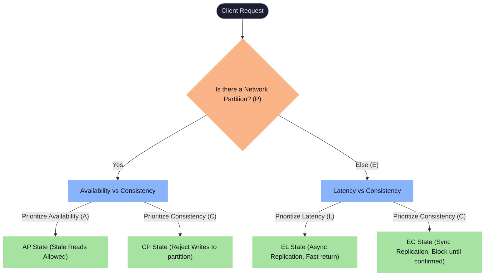

# ⚡ 04 - PACELC Theorem

## 📋 Tracker Metadata
| Column | Value / Status |
| :--- | :--- |
| **Concept ID** | C070 |
| **Category** | Consistency Models |
| **Difficulty** | 🟡 Medium |
| **Interview Frequency** | 🔥 High |
| **Understanding** | [🔴 None / 🟡 Conceptual / 🟢 Applied] |
| **Can Explain** | [ ] Yes / [ ] No |
| **Whiteboard Drawn** | [ ] Yes / [ ] No |
| **Taught Someone** | [ ] Yes / [ ] No |
| **Next Review** | YYYY-MM-DD |
| **Mastery** | [🔴 Familiar / 🟡 Competent / 🟢 Expert] |

---

## ⚡ 1. The Core Definition & Trigger
*   **Two-Sentence Trigger:** The PACELC Theorem is an extension of the [CAP Theorem](03-CAP-Theorem.md) that describes distributed data trade-offs during both network failures and normal operation. It states: If there is a **P**artition, choose between **A**vailability and **C**onsistency; **E**lse (under normal conditions), choose between **L**atency and **C**onsistency. It is triggered when designing database replication paths, deciding whether to write synchronously to all replicas (trading off latency for correctness) or asynchronously (trading off correctness for speed).
*   **Scalability Dimension:** Primary: **Healthy State Write Latency vs. Read Correctness**.
*   **Fundamental Guide:** Read how this impacts architectural decisions in the [SQL vs. NoSQL Decision](../05-Databases/01-SQL-vs-NoSQL-Decision.md).

---

## ⚖️ 2. Trade-offs & Deep Dive

### PACELC Decision Flow

### System Classifications Matrix
By combining CAP and PACELC decisions, we can classify major databases. Click on the database name to view its deep-dive component sheet:
| Type | CAP | Normal | Representative Databases | How It Works Under the Hood |
| :--- | :--- | :--- | :--- | :--- |
| **PC/EC** | Consistent | Consistent | <ul><li>[Google Spanner](../24-components-library/01-Databases/SQL/L011-Google-Spanner/README.md)</li><li>[CockroachDB](../24-components-library/01-Databases/SQL/L010-CockroachDB/README.md)</li></ul> | Under partition, blocks writes. Under normal operation, uses synchronous replication (TrueTime Paxos/Raft consensus) to guarantee [Strong Consistency](05-Strong-Consistency.md) at the cost of write latency. |
| **PC/EL** | Consistent | Latency | <ul><li>[MongoDB](../24-components-library/01-Databases/NoSQL_Document/L003-MongoDB/README.md)</li><li>[PostgreSQL](../24-components-library/01-Databases/SQL/L001-PostgreSQL/README.md) (Async mode)</li><li>[MySQL](../24-components-library/01-Databases/SQL/L002-MySQL/README.md) (Async mode)</li></ul> | Under partition, blocks reads/writes on partitioned nodes. Under normal operation, writes go to the primary/leader node and replicate asynchronously; reads can hit secondaries (fast but stale). |
| **PA/EL** | Available | Latency | <ul><li>[Apache Cassandra](../24-components-library/01-Databases/NoSQL_WideColumn/L004-Cassandra/README.md)</li><li>[Amazon DynamoDB](../24-components-library/01-Databases/NoSQL_WideColumn/L005-DynamoDB/README.md)</li><li>[Couchbase](../24-components-library/01-Databases/NoSQL_Document/L065-Couchbase/README.md)</li></ul> | Under partition, nodes accept writes. Under normal operation, uses asynchronous gossip replication; reads and writes are direct and local (low latency, [Eventually Consistent](06-Eventual-Consistency.md)). |
| **PA/EC** | Available | Consistent | **Rare / Custom** | Under partition, remains available. Under normal operation, enforces strong consistency (very rare due to high complexity and low utility). |

> [!NOTE]
> **Application-Level Transactional Consistency**
> While PACELC describes database-level replication trade-offs, orchestrating consistency across multiple physical databases or microservices is managed at the application layer. Refer to [Two-Phase Commit (2PC)](../08-Distributed-Transactions/03-Two-Phase-Commit.md) for synchronous, strongly consistent coordination (PC/EC at application layer) and [Saga Pattern](../08-Distributed-Transactions/02-Saga-Pattern.md) for asynchronous, eventually consistent orchestration (PA/EL at application layer).

### 🛠️ Tunable Quorums & WAN Mechanics (L5 Deep Dive)
In multi-datacenter (Multi-DC) environments, the speed of light limits the latency of cross-region network packets (e.g., US-East to EU-West round-trip is $\approx 70\text{ms}$). A true L5 design tunes PACELC at the datacenter boundary:

> [!IMPORTANT]
> **Replication Factor vs. Consistency Levels**
> By tuning $N$ (Replication Factor), $W$ (Write Consistency), and $R$ (Read Consistency) at the API query level, we dynamically slide across the PACELC spectrum (see [Quorum](../20-Distributed-Consensus/11-Quorum.md)).

*   **`QUORUM` (Global):** Enforces a majority across *all* global nodes. Highly consistent, but write latency is throttled by cross-region WAN link RTT.
*   **`LOCAL_QUORUM`:** Enforces a majority within the *initiating datacenter's local replicas* (e.g., $2$ out of $3$ local nodes). Low latency ($\approx 2-5\text{ms}$). Replicas in other datacenters are updated asynchronously.
*   **`EACH_QUORUM`:** Enforces a majority inside *each* separate datacenter synchronously before returning. Highly durable and cross-region consistent, but suffers from slowest-DC tail latency.

#### Convergence Mechanics (How PA/EL eventually syncs):
1.  **Hinted Handoff:** If Node B is down during a write, the coordinator stores a "hint" locally. Once Node B recovers, the coordinator replays the hint to bring it up to date.
2.  **Read Repair:** When a client issues a read with a quorum consistency, the coordinator fetches data from multiple replicas. If it detects mismatched version timestamps, it returns the newest version to the client and fires an asynchronous background write to update the stale replicas.
3.  **Active Anti-Entropy (Merkle Trees):** Background workers generate cryptographic Merkle trees (see [Merkle Trees](../07-Database-Scaling/06-Merkle-Trees.md)) of partition datasets and exchange hashes between replicas to find and fix inconsistencies without scanning raw data.

### 🗺️ High-Level Design (HLD) Mapping
Here is how to map PACELC decisions to classic system design interview problems:

| HLD Problem | PACELC Profile | Architectural Reason |
| :--- | :--- | :--- |
| **Payment Ledger & Wallet Balance** | **PC/EC** (e.g., Spanner) | Zero double-spend tolerance. Writes must block until a distributed consensus quorum confirms replication to prevent data loss. |
| **Uber Telemetry Ingestion** | **PA/EL** (e.g., Cassandra) | GPS updates happen every $1\text{s}$. Low latency writes are critical. Dropping or delaying a coordinate packet is acceptable since the next one corrects it. (Links to [B-Trees vs. LSM-Trees](../05-Databases/07-B-Trees-vs-LSM-Trees.md)). |
| **Twitter / Social Timeline** | **PA/EL** (e.g., Cassandra + Redis) | Posting tweets must return within $< 100\text{ms}$ (L). Followers seeing the tweet $2\text{s}$ later (Eventually Consistent) is perfectly fine. |
| **E-commerce Shopping Cart** | **PA/EL** (e.g., DynamoDB) | High availability (A) is critical to prevent checkout drop-offs. If a network split occurs, users can still add items. Inconsistencies are resolved at checkout by merging the item sets. |

---

## 💥 3. Resiliency & Operations

### Operational Pitfalls & Mitigations
*   **The Latency Slope (PC/EC Bottleneck):**
    *   *Problem:* In a PC/EC configuration, if one replica node suffers from packet loss or CPU saturation, all client write operations slow down because the synchronous write confirmation threshold is delayed.
    *   *Mitigation:* Configure write timeouts at the client layer and use a dynamic quorum cluster (e.g., if Node 3 is slow, write to Node 1 & Node 2 to satisfy $W=2$ quorum without waiting for Node 3).

---

## 🚫 4. Interview Playbook

### L4 (SDE-2) vs. L5 (SDE-3) Performance Signals

*   **L4 Signal (Strong Hire for SDE-2):**
    *   Explains the difference between CAP and PACELC.
    *   Knows that quorums are configurable ($N, W, R$).
    *   Can correctly classify Cassandra as PA/EL by default and Spanner as PC/EC.
*   **L5 Signal (Baseline for SDE-3 / Principal):**
    *   Proactively discusses the latency cost of cross-region network hops ($\approx 70-150\text{ms}$ WAN latency) and suggests DC-local optimizations (`LOCAL_QUORUM` vs `EACH_QUORUM`).
    *   Explains *how* eventual consistency converges under the hood (Active Anti-Entropy via [Merkle Trees](../07-Database-Scaling/06-Merkle-Trees.md), Hinted Handoff, and Read Repair).
    *   Directly maps consistency requirements to concrete business domains (e.g., checkout vs. analytics ingest).

> [!WARNING]
> **Common Mistake (The "Junior" Signals)**
> *   Assuming Cassandra is always PA/EL. Cassandra can be tuned to PC/EC by setting read/write levels to `QUORUM` or `ALL` (see [Quorum](../20-Distributed-Consensus/11-Quorum.md)).

### Interview Tip (The "L5 / Strong Hire" Signal)
> [!TIP]
> **Senior Play:** *"We avoid the limitations of the CAP theorem by evaluating our databases using the PACELC theorem. For our shopping cart, we configure Cassandra in a PA/EL state, ensuring 2ms write times by writing to a single node and syncing replicas asynchronously. However, for our user balance database, we enforce a PC/EC quorum configuration where writes must be confirmed by a majority of replicas before returning (using `LOCAL_QUORUM` to avoid cross-DC WAN latency), trading off write latency for absolute read correctness. See also [Strong Consistency](05-Strong-Consistency.md) vs. [Eventual Consistency](06-Eventual-Consistency.md) trade-offs."*

---

## 💡 5. My Custom Study Notes & Whiteboard
*Use this section to document your sketches, code blocks, or personal notes.*
