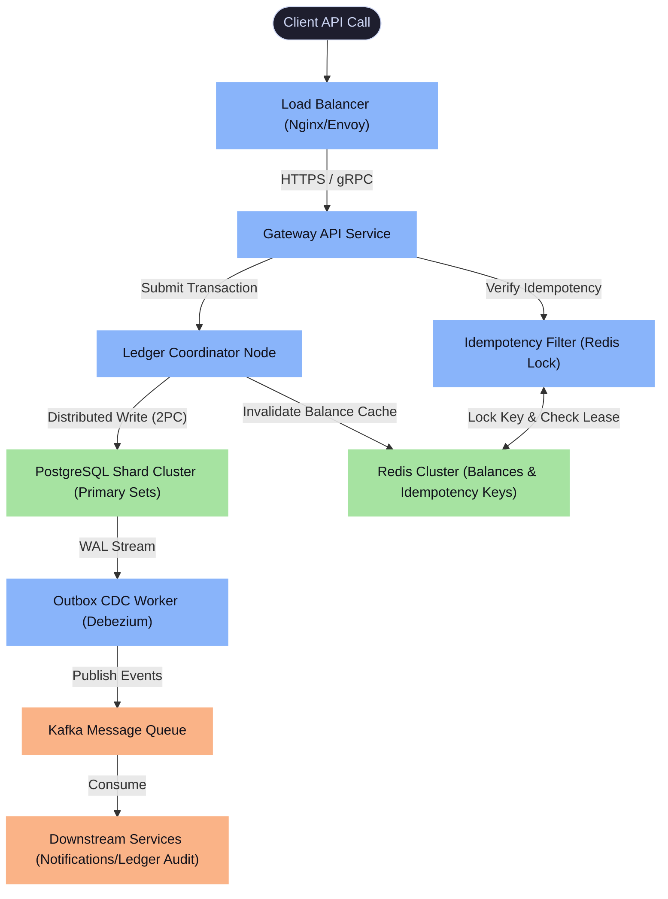

# 🏢 SD056 - Design an Enterprise Double-Entry Ledger (Gold Standard HLD)

## 📋 Tracker Metadata
| Column | Value / Status |
| :--- | :--- |
| **Problem ID** | SD056 |
| **Category** | Finance |
| **Difficulty** | 🔴 Expert |
| **Interview Frequency** | 🔥 Must Know (2024–2026) |
| **Target Companies** | Stripe, Adyen, PayPal, Square, Uber |
| **SDE-2 Mandatory** | ✅ Yes |
| **Status** | Completed |
| **Times Practiced** | 2 |
| **Last Practiced** | 2026-06-22 |
| **Next Review** | 2026-09-22 |
| **Confidence** | 🟢 Applied |
| **Mastery** | 🟢 Expert |

---

## 📋 1. Core Requirements & Scale

### Functional Requirements
*   **Double-Entry Invariant:** Every financial transaction must consist of two or more postings (journal entries) where the sum of debits and credits is exactly zero:
    $$\sum \text{Postings.amount} = 0$$
*   **Multi-Currency Isolation:** Account balances must be tracked strictly per currency (e.g., USD, EUR). Mixing currencies in a single entry without an exchange rate is forbidden.
*   **Real-time Balance Inquiries:** Support querying the current balance of any merchant account in $< 10\text{ms}$ (P99).
*   **Auditability & Immutability:** Ledger records are append-only. Once committed, journal entries can never be modified or deleted. Errors are corrected only via new reversal transactions.
*   **Reconciliation Engine:** Support automated background checks to audit the ledger state against banking and processor statements.

### Non-Functional Requirements
*   **Strong Consistency (Linearizability):** Zero tolerance for data drift, double-spend, or phantom balances. Strong ACID transactions are non-negotiable.
*   **High-Volume Ingestion:** Support up to $10,000$ write Transactions Per Second (TPS) peak.
*   **Idempotency:** Enforce strict deduplication of API requests during client-side retries (zero double-charging).
*   **High Availability (HA):** Enforce a target of $99.999\%$ (five-9s) write and read availability.

### Scale Targets (Back-of-the-Envelope Calculations)
*   **Daily Transaction Volume:** $100\text{M}$ transactions/day.
*   **Throughput Pacing:**
    *   *Average Transaction rate:*
        $$\text{Avg TPS} = \frac{100,000,000\text{ transactions}}{86,400\text{ seconds}} \approx 1,157\text{ TPS}$$
    *   *Peak TPS:* $10\text{x}$ average to handle sales spikes $\rightarrow 11,570\text{ TPS}$ (target design: $10,000\text{ TPS}$).
*   **Storage Calculations (5-Year Horizon):**
    *   *Payload Sizes:*
        *   `Journal` header row: $\approx 100\text{ bytes}$ (IDs, timestamps, idempotency key).
        *   `Posting` entry row: $\approx 150\text{ bytes}$ (UUIDs, int64 amount, currency).
        *   A minimum of 2 postings per journal $\rightarrow 100\text{B} + 2 \times 150\text{B} = 400\text{ bytes}$ per transaction.
    *   *Raw Data Growth:*
        $$100\text{M transactions/day} \times 400\text{ bytes/transaction} = 40\text{ GB/day}$$
    *   *Total Database Storage (with Indexes, logs, and replicas $\approx 2.5\text{x}$ multiplier):*
        $$40\text{ GB/day} \times 2.5 = 100\text{ GB/day} \rightarrow 36.5\text{ TB/year}$$
        $$\text{5-Year Storage} = 182.5\text{ TB}$$
*   **Memory Cache Sizing (Redis):**
    *   Assume 10% of total accounts ($10\text{M}$ total $\rightarrow 1\text{M}$ accounts) are active daily.
    *   `Active Balance Cache`: Key size (36B UUID) + value size (8B balance + 3B currency + 8B version + 8B timestamp = 27B) $\approx 63\text{ bytes}$ per entry.
    *   With Redis metadata and hash overhead $\approx 256\text{ bytes}$ per active account.
    *   *RAM required:*
        $$1,000,000\text{ accounts} \times 256\text{ bytes/account} \approx 256\text{ MB RAM}$$
        Easily fits in a single memory cache node.

---

## 📐 2. High-Level Architecture

The ledger architecture is divided into the Gateway Ingress layer, the Distributed Consistency layer, the Sharded Persistence layer, and the Asynchronous Event Streaming layer.



### Component Details
1.  **Gateway API Service:** Terminates SSL, validates requests, and enforces Rate-Limiting.
2.  **Idempotency Filter:** Uses a Redis lease lock to prevent duplicate processing of the same transaction payload within a $5$-second window.
3.  **Ledger Coordinator Node:** Validates the double-entry invariant (zero-sum) and coordinates writes across database shards using Two-Phase Commit.
4.  **PostgreSQL Shard Cluster:** Stores immutable journals and postings. Organized as highly available replica sets (see [Read Replicas](../07-Database-Scaling/02-Read-Replicas.md)).
5.  **Outbox Worker (Debezium):** Asynchronously reads PostgreSQL's Write-Ahead Log (WAL) and publishes committed ledger events to Kafka without using database locks.

---

## ⚖️ 3. Data Model & API Contract

### REST API Definition
#### 1. Create Transaction (Debit/Credit Journal)
*   **Request:** `POST /v1/ledger/transactions`
```json
{
  "idempotency_key": "ac0de329-873f-4e00-a292-126ad932145b",
  "description": "Customer purchase - Order #10423",
  "postings": [
    {
      "account_id": "893c59de-1294-43ff-90a8-bcf9438db021",
      "amount": 10000, 
      "currency": "USD"
    },
    {
      "account_id": "a93f54de-2938-410c-be39-ff9438dc2042",
      "amount": -10000, 
      "currency": "USD"
    }
  ]
}
```
*(Note: Monetary values are represented as 64-bit integers in the smallest currency unit, e.g., 10000 = $100.00 USD).*

*   **Response:** `201 Created`
```json
{
  "transaction_id": "d0408d6d-1b32-4293-85fe-bf9438dd4023",
  "status": "committed",
  "created_at": "2026-06-22T01:13:00Z"
}
```

#### 2. Get Account Balance
*   **Request:** `GET /v1/ledger/accounts/{account_id}/balance`
*   **Response:** `200 OK`
```json
{
  "account_id": "893c59de-1294-43ff-90a8-bcf9438db021",
  "balance": 985000,
  "currency": "USD",
  "last_updated": "2026-06-22T01:13:02Z"
}
```

### PostgreSQL DDL Schema
We use [PostgreSQL](../24-components-library/01-Databases/SQL/L001-PostgreSQL/README.md) as the absolute source of truth for transactional durability.

```sql
-- Enforces account registration and classification
CREATE TABLE accounts (
    account_id UUID PRIMARY KEY,
    name VARCHAR(255) NOT NULL,
    type VARCHAR(50) NOT NULL CHECK (type IN ('asset', 'liability', 'equity', 'revenue', 'expense')),
    currency VARCHAR(3) NOT NULL,
    created_at TIMESTAMP WITH TIME ZONE DEFAULT CURRENT_TIMESTAMP
);

-- Stores transaction meta-headers. Idempotency key prevents duplicate operations
CREATE TABLE journals (
    journal_id UUID PRIMARY KEY,
    idempotency_key UUID UNIQUE NOT NULL,
    description TEXT,
    created_at TIMESTAMP WITH TIME ZONE DEFAULT CURRENT_TIMESTAMP
);

-- Stores individual debits (+) and credits (-)
CREATE TABLE postings (
    entry_id UUID PRIMARY KEY,
    journal_id UUID NOT NULL REFERENCES journals(journal_id) ON DELETE CASCADE,
    account_id UUID NOT NULL REFERENCES accounts(account_id),
    amount BIGINT NOT NULL, -- positive for debits, negative for credits
    currency VARCHAR(3) NOT NULL,
    created_at TIMESTAMP WITH TIME ZONE DEFAULT CURRENT_TIMESTAMP
);

-- Indexes for range scans and lookups
CREATE INDEX idx_postings_account ON postings(account_id);
CREATE INDEX idx_postings_journal ON postings(journal_id);

-- Transactional outbox table for CDC event streaming
CREATE TABLE transactional_outbox (
    event_id UUID PRIMARY KEY,
    aggregate_type VARCHAR(100) NOT NULL,
    aggregate_id UUID NOT NULL,
    payload JSONB NOT NULL,
    created_at TIMESTAMP WITH TIME ZONE DEFAULT CURRENT_TIMESTAMP
);
```

---

## ⚙️ 4. SDE-3 / L5 Architectural Deep Dives

### A. Enforcing the Double-Entry Invariant (Atomic Verification)
To guarantee the zero-sum ledger balance constraint is strictly evaluated:
1.  **Transactional Scope:** Every journal entry and its postings are wrapped inside a single database transaction set to `SERIALIZABLE` isolation.
2.  **SQL Execution Path:**
    ```sql
    BEGIN;
    
    INSERT INTO journals (journal_id, idempotency_key, description) 
    VALUES ('d0408d6d-1b32-4293-85fe-bf9438dd4023', 'ac0de329-873f-4e00-a292-126ad932145b', 'Purchase');
    
    INSERT INTO postings (entry_id, journal_id, account_id, amount, currency) 
    VALUES 
    ('e001...', 'd0408...', '893c...', 10000, 'USD'),
    ('e002...', 'd0408...', 'a93f...', -10000, 'USD');
    
    -- Assert sum is zero before committing
    SELECT SUM(amount) FROM postings WHERE journal_id = 'd0408d6d-1b32-4293-85fe-bf9438dd4023';
    
    -- If SUM != 0, application issues ROLLBACK; otherwise COMMIT.
    COMMIT;
    ```

### B. High-Scale Concurrency: Solving Hot-Account Contention
In systems like Stripe, a popular merchant or fee account may receive $10,000$ writes/sec. Updating a single balance cell in a database row directly causes massive locking contention and database deadlocks.

```
  Traditional: [10k requests] ──► Lock Row ──► Update balance (10k serialization bottleneck) ❌
  
  L5 Pattern:  [10k requests] ──► append-only INSERT into postings (No row locking) ✅
```

*   **Optimistic Concurrency Control (OCC) (Anti-Pattern at Scale):** Leads to massive write failures and retry storms under high contention.
*   **The L5 Solution: Log-Structured Append-Only Writes (Accumulator Pattern):**
    1.  **No Balance Column:** We remove the `balance` field from the `accounts` table entirely.
    2.  **Insert-Only Writes:** To execute a debit or credit, we perform a pure `INSERT` into the `postings` table. Inserts do not acquire row locks on existing balances, executing in parallel at $< 5\text{ms}$.
    3.  **Materialized Read Cache:** Current balances are stored in a [Redis](../../24-components-library/01-Databases/NoSQL_KV/L006-Redis/README.md) cache. On successful postings insert, the Ledger Coordinator executes `INCRBY ledger:account:{id}:balance amount`.
    4.  **Checkpointing Daemon:** To prevent reading millions of postings from genesis when rebuilding the cache, a background worker writes daily balance checkpoints to a `balance_checkpoints` table in Postgres. Reading balance becomes:
        $$\text{Current Balance} = \text{Latest Checkpoint Balance} + \sum \text{Postings since Checkpoint}$$

### C. Zero-Downtime Messaging (Transactional Outbox Pattern)
When ledger updates occur, downstream systems (e.g., billing, fraud engines, BI analytics) must be notified. Directly writing to the database and publishing to Kafka (a "Dual Write") risks partial failures (e.g., database transaction commits, but Kafka is down).

We resolve this by using a **Transactional Outbox Pattern**:
1.  **Same Transaction Unit:** The event payload is written directly to the `transactional_outbox` table within the same ACID database transaction.
2.  **Change Data Capture (CDC):** A **Debezium** connector reads PostgreSQL's Write-Ahead Log (WAL).
3.  **Publishing to Kafka:** Debezium detects the insert into the `transactional_outbox` table and streams the event to Kafka, guaranteeing **at-least-once delivery** with zero lock contention on the primary transaction tables.

```
  [Database Transaction] 
  ┌────────────────────────────────────────────────────────┐
  │  1. Insert Journal/Postings                             │
  │  2. Insert event payload into transactional_outbox      │
  └───────────────┬────────────────────────────────────────┘
                  │ (Atomic Commit)
                  v
         [PostgreSQL WAL Log] ──► [Debezium CDC] ──► [Kafka Topic]
```

### D. Idempotency Gatekeeper (Redis Status Leases)
To prevent double-charging users during client network retries, a strict idempotency gatekeeper is deployed at the Gateway API layer using [Redis](../../24-components-library/01-Databases/NoSQL_KV/L006-Redis/README.md):

1.  **Acquire Lock & Lease:** Upon receiving a request with an `idempotency_key`, execute:
    `SET ledger:idempotency:{key} "PROCESSING" NX PX 5000` (5-second lock).
2.  **In-Flight Check:** If the key already exists and its value is `"PROCESSING"`, return `409 Conflict` (Duplicate request in progress).
3.  **Result Retrieval:** If the value is `"COMPLETED:{response_payload}"`, return the cached response instantly without hitting the database.
4.  **Execution:** If the NX lock is acquired, route the request to the Ledger Coordinator. Once the coordinator successfully writes to PostgreSQL, update the key:
    `SET ledger:idempotency:{key} "COMPLETED:{payload}" EX 86400` (Cache response for 24 hours).

---

## 💥 5. Resiliency, Operations & Observability

### Critical Observability Metrics (The SLI/SLO Signal)
*   **Ledger Imbalance Counter:** A background cron job executes every minute checking for unbalanced transactions:
    ```sql
    SELECT journal_id, SUM(amount) FROM postings GROUP BY journal_id HAVING SUM(amount) != 0;
    ```
    *SLI Target:* Must always be exactly $0$. If $> 0$, trigger PagerDuty alerts immediately.
*   **P99 Write Latency:** Time taken from gateway ingress to PostgreSQL transaction commit.
    *SLO Target:* $< 50\text{ms}$ at peak $10,000\text{ TPS}$.
*   **Outbox Replication Lag:** Network latency between the outbox table insertion and event landing in Kafka.
    *SLO Target:* $< 200\text{ms}$.

### Disaster Recovery: Handling Outbox Lag or Crashes
If the Debezium outbox worker crashes:
1.  **No Data Loss:** Events remain safely stored in the `transactional_outbox` table.
2.  **Resume Pointer:** Once the worker recovers, it reads its committed offset checkpoint and continues streaming from the exact WAL position it crashed at.

---

## 🚫 6. Interview Playbook

### L4 (SDE-2) vs. L5 (SDE-3) Performance Signals

*   **L4 Signal (Strong Hire for SDE-2):**
    *   Designs a normalized SQL schema and enforces double-entry rules.
    *   Proposes Optimistic Concurrency Control (OCC) to handle race conditions.
    *   Recognizes the need for idempotency keys to prevent duplicate transactions.
*   **L5 Signal (Baseline for SDE-3 / Principal):**
    *   Identifies that direct updates / OCC cause lock contention bottlenecks on hot accounts (e.g. platform fees accounts) and proposes **Log-Structured Append-Only Writes (Accumulator Pattern)** to avoid locking.
    *   Proposes the **Transactional Outbox Pattern** using **Debezium/CDC** to avoid dual-write inconsistencies, showing deep distributed systems awareness.
    *   Addresses currency handling rules (using `bigint` integers in smallest units) and Multi-DC latency limits.

> [!WARNING]
> **Common Mistake (The "Junior" Signals)**
> *   Storing currency amounts as decimal/float types (causing IEEE 754 floating-point rounding errors that accumulate discrepancies).
> *   Relying on application-side validations to ensure double-entry summation equals zero, which fails during concurrent request races. Enforce it within database transaction boundaries.

### Interview Tip (The "L5 / Strong Hire" Signal)
> [!TIP]
> **Senior Play:** *"We avoid database lock contention on hot merchant accounts by using an insert-only postings schema, calculating balances downstream via a materialized Redis cache with background checkpoints. To ensure event consistency without dual-write risks, we use Debezium to read change events directly from PostgreSQL's WAL and publish them to Kafka. We represent all currencies as 64-bit bigints in micro-units to prevent IEEE 754 rounding errors."*

---

## 💡 7. Vault Cross-linking
*   **Database Engines:** [PostgreSQL Engine Mechanics](../24-components-library/01-Databases/SQL/L001-PostgreSQL/README.md) & [B-Trees vs. LSM-Trees](../05-Databases/07-B-Trees-vs-LSM-Trees.md).
*   **Distributed Transactions:** [Two-Phase Commit Protocol](../08-Distributed-Transactions/03-Two-Phase-Commit.md) & [Saga Choreography/Orchestration](../08-Distributed-Transactions/02-Saga-Pattern.md).
*   **Horizontal Scaling:** [Database Sharding Strategies](../07-Database-Scaling/04-Database-Sharding.md) & [Consistent Hashing Ring](../03-Load-Balancing/01-Consistent-Hashing.md).
*   **Memory Caching:** [Redis Key-Value Caching](../24-components-library/01-Databases/NoSQL_KV/L006-Redis/README.md).
