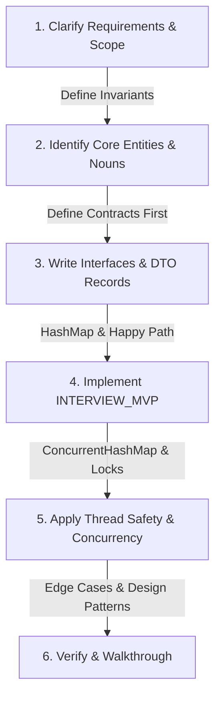

# 🚀 LLD Delivery Framework: The 90-Minute Strategy

This is the exact framework to follow during a Machine Coding or Low-Level Design interview. It ensures you cover all bases without getting bogged down in implementation details before your class contracts are solidified.

---

## 📊 LLD Design Lifecycle



---

## ⏱️ The 90-Minute Tracker Pacing

| Phase | Time | Goal | "Anti-Freeze" Trigger if Stuck |
| :--- | :--- | :--- | :--- |
| **1. Clarification & Requirements** | 0-10m | Define scope, entities, and actions. | Write down the top 3 core nouns (Entities) and top 3 verbs (Behaviors). |
| **2. Skeleton & Interfaces** | 10-20m | Define contracts and apply SOLID principles. | Define the `Interface` for the core strategy (e.g., `PaymentStrategy`) and empty classes. |
| **3. Core Implementation** | 20-60m | Implement business logic and design patterns. | Use simple in-memory `HashMap` data stores to avoid complex DB setup. |
| **4. Concurrency & Extensibility** | 60-80m | Add thread safety, locks, or advanced requirements. | Switch `HashMap` to `ConcurrentHashMap`; add `synchronized` blocks or `ReentrantLock`. |
| **5. Edge Cases & Review** | 80-90m | Walk through the code, state limitations. | Mention what you would do next if you had 2 more hours. |

---

## 🎯 The LLD Pattern Selection Matrix

Use this matrix during Phase 2 to map interview requirements directly to core design patterns:

| Requirement / Trigger | Primary Design Pattern | Key Benefit |
| :--- | :--- | :--- |
| Swappable behaviors / algorithms at runtime | **Strategy** | Open-Closed Principle (OCP) compliance |
| System behavior changes based on internal state | **State** | Eliminates cluttered nested `if/else` checks |
| Dynamic, nested behavior addition without inheritance | **Decorator** | Flexible extension at runtime |
| Process sequence/pipeline with chainable steps | **Chain of Responsibility** | Decoupled handlers (auth, rate-limiting, logging) |
| Event broadcast / publisher-subscriber notification | **Observer** | Loose coupling between subject and observers |
| Step-by-step construction of complex objects | **Builder** | Prevents telescoping constructors |

---

## 🧠 The LLD "Anti-Freeze" Protocol

If you blank out during an LLD mock, execute these steps immediately:
1. **The Architecture Freeze (Where to start?):** Stop overthinking the perfect pattern. Define the `Main` or `Orchestrator` class and the `Models`. The dependencies will naturally emerge.
2. **The Concurrency Freeze (How to make it thread-safe?):** If unsure about complex locks, default to `ConcurrentHashMap` for state management and Atomic variables (`AtomicInteger`) for counters. Say: *"I'll use a ConcurrentHashMap to handle multithreaded writes safely."*
3. **The Extensibility Freeze (Which pattern?):** If you see an `if-else` or `switch` statement based on a type, use the **Strategy Pattern**. If you see an object changing its behavior based on its internal state, use the **State Pattern**.

---

## 🔒 The Thread-Safety Verification Blueprint

To verify concurrency during verification (Phase 5), use this quick concurrent test harness:

```java
import java.util.concurrent.CountDownLatch;
import java.util.concurrent.ExecutorService;
import java.util.concurrent.Executors;

public class ConcurrencyTest {
    public static void main(String[] args) throws InterruptedException {
        int threadsCount = 10;
        ExecutorService executor = Executors.newFixedThreadPool(threadsCount);
        CountDownLatch latch = new CountDownLatch(threadsCount);
        
        for (int i = 0; i < threadsCount; i++) {
            executor.submit(() -> {
                try {
                    // Test concurrent mutations here (e.g., booking seats, updating balances)
                } finally {
                    latch.countDown();
                }
            });
        }
        latch.await();
        executor.shutdown();
        // Assert/print final thread-safe state
    }
}
```

---

## 🗣️ "Explain Aloud" Prompts (SDE-2+ Trade-off Articulation)

*   **DIP:** "I'm using an interface here to decouple high-level logic from infrastructure."
*   **OCP:** "I'm applying the Strategy pattern so I can add new variants without modifying this class."
*   **SRP:** "I'm moving this logic to a separate service to ensure this class only has one reason to change."
*   **LSP:** "I'm ensuring this subclass fulfills the behavioral contract of the parent to prevent runtime surprises."
*   **During Concurrency:** "I chose `ReentrantReadWriteLock` over `synchronized` because our application is highly read-heavy, and this avoids blocking concurrent readers."

---

## 🛠️ Modern SDE-3 Java Features

Keep your code clean, concise, and modern during the interview:
*   **Java Records (Java 17+):** Use them for immutable DTOs/Value Objects (automatically generates constructors, getters, equals, hashCode, and toString):
    ```java
    public record User(String id, String email, AccountStatus status) {}
    ```
*   **Sealed Classes/Interfaces:** Limit inheritance to a specific set of classes for safer pattern matching and type hierarchies:
    ```java
    public sealed interface PaymentResult permits Success, Failed {}
    public final class Success implements PaymentResult {}
    public final class Failed implements PaymentResult {}
    ```

---

## 🚫 Common Mistakes to Avoid
1.  **Writing Implementation First**: Never write the concrete classes before the interfaces. You will lose the big picture.
2.  **Ignoring Thread Safety**: In 2025, concurrency is non-negotiable for Senior roles. Always explain how your code handles multiple simultaneous requests.
3.  **God Classes**: Do not put the data, the business logic, and the print statements in a single class. Use SRP and MVC/DAO layers.
