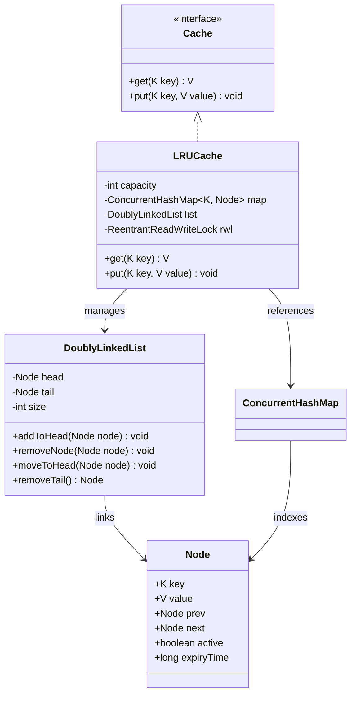

# Senior LLD Practice: Thread-Safe LRU Cache

## Problem Statement
Design and implement a **Thread-Safe Least Recently Used (LRU) Cache**. An LRU cache is a fixed-size cache that discards the least recently used items first when it reaches its capacity.

## Senior-Level Requirements
As an SDE-2/Senior candidate, your solution must address the following:

### 1. Concurrency & Thread-Safety
- The cache must be safe to use from multiple threads simultaneously.
- **Challenge**: How do you handle the race condition between checking if a key exists and updating its "recency"?
- **Optimization**: Can you avoid a "Global Lock" on the entire cache? (Hint: Consider `ReadWriteLock` or `ConcurrentHashMap` combined with fine-grained locking).

### 2. Time Complexity
- `get(key)`: Must be **O(1)**.
- `put(key, value)`: Must be **O(1)**.
- This typically requires a combination of a **HashMap** (for O(1) lookups) and a **Doubly Linked List** (for O(1) updates to recency).

### 3. Clean Architecture & SOLID
- Use the **Strategy Pattern** if you wanted to make the eviction policy swappable (e.g., LFU instead of LRU).
- Ensure **Interface Segregation**: Does the user need to know about the internal node structure? No.

### 4. Generics
- The cache should support any types for Keys and Values (e.g., `Cache<K, V>`).

---

## 📊 Class Architecture & Interactions



---

## Implementation Skeleton (Java)

Here is the complete, production-grade, thread-safe, and decomposed LRU Cache implementation.

```java
package addons.cache.decomposed;

import java.util.concurrent.ConcurrentHashMap;
import java.util.concurrent.locks.Lock;
import java.util.concurrent.locks.ReentrantReadWriteLock;

/**
 * Generic Cache interface defining the contract.
 */
interface Cache<K, V> {
    V get(K key);
    void put(K key, V value);
    int size();
    void clear();
}

/**
 * Node representing cache entries with double-checked safety flags.
 */
class Node<K, V> {
    final K key;
    volatile V value;
    volatile Node<K, V> prev;
    volatile Node<K, V> next;
    volatile boolean active; // Safety flag for eviction race conditions
    volatile long expiryTime; // Expiry timestamp in milliseconds

    Node(K key, V value) {
        this.key = key;
        this.value = value;
        this.active = true;
        this.expiryTime = -1; // -1 means no expiry
    }
}

/**
 * Custom generic Doubly Linked List with Sentinel nodes.
 */
class DoublyLinkedList<K, V> {
    private final Node<K, V> head;
    private final Node<K, V> tail;
    private int size;

    DoublyLinkedList() {
        head = new Node<>(null, null);
        tail = new Node<>(null, null);
        head.next = tail;
        tail.prev = head;
        size = 0;
    }

    void addToHead(Node<K, V> node) {
        node.next = head.next;
        node.prev = head;
        head.next.prev = node;
        head.next = node;
        node.active = true;
        size++;
    }

    void removeNode(Node<K, V> node) {
        if (node == null || node == head || node == tail) {
            return;
        }
        if (node.prev != null && node.next != null) {
            node.prev.next = node.next;
            node.next.prev = node.prev;
            node.prev = null;
            node.next = null;
            node.active = false;
            size--;
        }
    }

    void moveToHead(Node<K, V> node) {
        if (node == null || node == head || node == tail) {
            return;
        }
        if (node.active && head.next != node) {
            // Unlink
            node.prev.next = node.next;
            node.next.prev = node.prev;
            
            // Relink at head
            node.next = head.next;
            node.prev = head;
            head.next.prev = node;
            head.next = node;
        }
    }

    Node<K, V> removeTail() {
        if (isEmpty()) {
            return null;
        }
        Node<K, V> tailNode = tail.prev;
        removeNode(tailNode);
        return tailNode;
    }

    boolean isEmpty() {
        return head.next == tail;
    }

    int size() {
        return size;
    }

    void clear() {
        Node<K, V> current = head.next;
        while (current != tail) {
            current.active = false;
            Node<K, V> next = current.next;
            current.prev = null;
            current.next = null;
            current = next;
        }
        head.next = tail;
        tail.prev = head;
        size = 0;
    }
}

/**
 * High-Performance, Generic, Thread-Safe LRU Cache.
 */
public class LRUCache<K, V> implements Cache<K, V> {
    private final int capacity;
    private final ConcurrentHashMap<K, Node<K, V>> map;
    private final DoublyLinkedList<K, V> list;
    
    private final ReentrantReadWriteLock rwl = new ReentrantReadWriteLock();
    private final Lock readLock = rwl.readLock();
    private final Lock writeLock = rwl.writeLock();

    public LRUCache(int capacity) {
        if (capacity <= 0) {
            throw new IllegalArgumentException("Capacity must be positive");
        }
        this.capacity = capacity;
        this.map = new ConcurrentHashMap<>(capacity);
        this.list = new DoublyLinkedList<>();
    }

    @Override
    public V get(K key) {
        if (key == null) {
            throw new IllegalArgumentException("Key cannot be null");
        }

        // Phase 1: Fast Lock-free ConcurrentHashMap lookup
        Node<K, V> node = map.get(key);
        if (node == null) {
            return null; // Cache Miss: 100% Lock-Free path
        }

        // Passive Expiry Check
        if (node.expiryTime != -1 && System.currentTimeMillis() > node.expiryTime) {
            writeLock.lock();
            try {
                if (node.active && map.get(key) == node) {
                    list.removeNode(node);
                    map.remove(key);
                }
            } finally {
                writeLock.unlock();
            }
            return null; // Expired
        }

        // Phase 2: Cache Hit. Safely update recency
        writeLock.lock();
        try {
            // Double-Checked Lock: Validate node is active and unmodified by concurrent evictions
            if (node.active && map.get(key) == node) {
                list.moveToHead(node);
                return node.value;
            }
        } finally {
            writeLock.unlock();
        }

        return null;
    }

    @Override
    public void put(K key, V value) {
        put(key, value, -1);
    }

    public void put(K key, V value, long ttlMs) {
        if (key == null) {
            throw new IllegalArgumentException("Key cannot be null");
        }
        if (value == null) {
            throw new IllegalArgumentException("Value cannot be null");
        }

        writeLock.lock();
        try {
            Node<K, V> existingNode = map.get(key);
            long expiry = (ttlMs <= 0) ? -1 : System.currentTimeMillis() + ttlMs;

            if (existingNode != null) {
                existingNode.value = value;
                existingNode.expiryTime = expiry;
                list.moveToHead(existingNode);
            } else {
                // Evict if cache is full
                if (map.size() >= capacity) {
                    Node<K, V> tail = list.removeTail();
                    if (tail != null) {
                        map.remove(tail.key);
                    }
                }
                
                Node<K, V> newNode = new Node<>(key, value);
                newNode.expiryTime = expiry;
                list.addToHead(newNode);
                map.put(key, newNode);
            }
        } finally {
            writeLock.unlock();
        }
    }

    @Override
    public int size() {
        readLock.lock();
        try {
            return list.size();
        } finally {
            readLock.unlock();
        }
    }

    @Override
    public void clear() {
        writeLock.lock();
        try {
            map.clear();
            list.clear();
        } finally {
            writeLock.unlock();
        }
    }
}
```

---

### Senior Design & Concurrency Analysis

#### 1. Eviction Race Condition Prevention
Under high concurrency, a reader thread might perform a lock-free lookup in `ConcurrentHashMap` and retrieve a valid `Node`. Before it can acquire the `writeLock` to update the recency (move to head), a writer thread might call `put` on a new key, trigger an eviction of the least recently used element (which happens to be the node the reader is holding), and remove it from both the map and the linked list. 
To prevent the reader thread from operating on or re-inserting the evicted node, we implement a **Double-Checked Locking (DCL)** pattern under the write lock:
- Each node has a `volatile boolean active` flag.
- During eviction, the writer sets `active = false` and removes it from the map.
- When the reader thread acquires the `writeLock`, it verifies `node.active && map.get(key) == node`. If false, it detects the eviction and returns `null` safely.

#### 2. Cache Stampede Prevention (Double-Checked Lock)
A Cache Stampede occurs when a popular cache key expires or is evicted, causing multiple threads to simultaneously hit a cache miss and execute expensive database reads. 
To resolve this:
- Clients should wrap cache loads in a **Double-Checked Lock (DCL)** before querying the database, or use the `computeIfAbsent` API of `ConcurrentHashMap`. 
- `computeIfAbsent` uses internal bucket-level locks to ensure that only a single thread computes the database fetch for a given key, while other threads block until the value is ready, completely avoiding thundering herds.

#### 3. Mathematical Bounds of Concurrent Read Throughput vs. Write Mutex Synchronization
Let $R$ be the fraction of total operations that are reads, and $W = 1 - R$ be the fraction of writes.
Let $H$ be the hit rate of the cache (probability that a read is a hit).
- For a cache **miss** (probability $1 - H$), `get` is **100% lock-free** (only reads from `ConcurrentHashMap`).
- For a cache **hit** (probability $H$), `get` must acquire the `writeLock` of the doubly linked list.
- All writes (`put`) must acquire the `writeLock`.

Thus, the total rate of write lock acquisitions is:
$$\lambda_{lock} = R \cdot H + W$$

If the hit rate $H \approx 1.0$ (typical for warmed-up caches), then $\lambda_{lock} \approx R + W = 1.0$. This means almost every operation contends for the single write lock, causing the system throughput to degrade to a single-threaded bottleneck (no concurrent speedup).
To scale throughput:
- **Cache Segmentation / Key Striping:** Partition the cache into $N$ independent segments (each with its own lock and DLL). The collision probability on a single segment lock drops to $\frac{1}{N}$, scaling concurrent throughput linearly up to the physical core capacity of the machine.

---

## 🏢 SDE-3 Follow-Up Architecture Questions

### 1. How do you handle Cache Expiry (TTL)?
We combine two strategies to clean up expired keys efficiently:
*   **Passive Eviction (Checked On-Read):** When `get(key)` is invoked, we check the node's expiry timestamp. If `System.currentTimeMillis() > node.expiryTime`, we acquire the write lock, unlink it, remove it from the map, and return `null`. This prevents returning stale data.
*   **Active Eviction (Background Sweeper):** A scheduled background thread pool (`ScheduledExecutorService`) sweeps a random sample of keys periodically. Sweeping the entire map can cause latency spikes, so sampling (e.g., checking 20 random keys every 100ms and evicting expired ones) keeps CPU bounds low.

### 2. How do you implement a Distributed LRU Cache (e.g., Redis)?
*   **Consistent Hashing:** Partition keys across nodes using a ring structure (Consistent Hashing) with virtual nodes. This ensures even distribution and minimizes key relocation when scaling nodes up or down.
*   **Eviction Coordination:** In a distributed setup, memory-level eviction is localized to the node. If a key is updated, we broadcast invalidation events across nodes using Redis Pub/Sub or a dedicated event bus.
*   **Distributed Mutex (Redlock):** To prevent multiple nodes from running database queries during a cache miss (cache stampede), we acquire a distributed lock on the key. Only the lock winner queries the DB and repopulates the distributed cache, while others wait/retry.

### 3. How does the Double-Checked Locking pattern apply to a Singleton Cache Manager?
Double-Checked Locking allows us to initialize a shared cache manager instance in a thread-safe way while avoiding synchronization overhead on subsequent reads. The reference **must** be marked `volatile` to prevent instruction reordering (where the JVM allocates memory and writes a reference before the object constructor runs):

```java
public class CacheManager {
    private static volatile CacheManager instance;
    private final Cache<?, ?> defaultCache;

    private CacheManager() {
        this.defaultCache = new LRUCache<>(1000);
    }

    public static CacheManager getInstance() {
        if (instance == null) { // Check 1: Lock-free fast path
            synchronized (CacheManager.class) {
                if (instance == null) { // Check 2: Thread-safe slow path
                    instance = new CacheManager();
                }
            }
        }
        return instance;
    }
}
```
