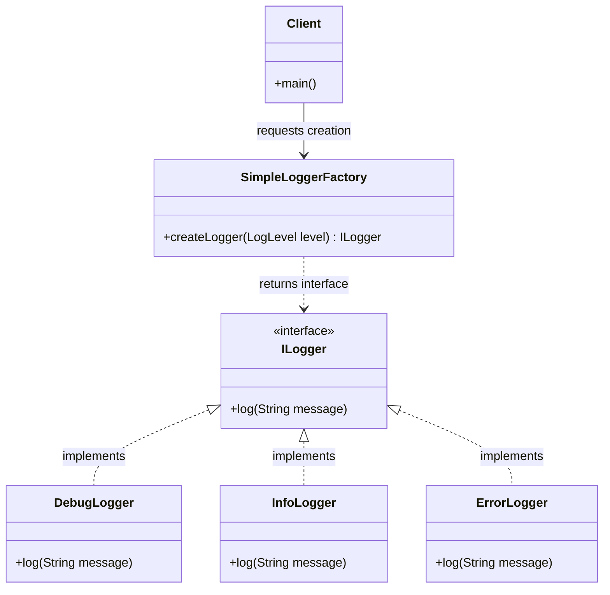

# ⚡ Module 01: Anatomy, Mechanics & The OCP Violation Paradox

[🏠 Back to Master Guide](./README.md) &nbsp; | &nbsp; [Next: 🛡️ Modern Supplier & EnumMap Factory](./02-MODERN_SUPPLIER_AND_ENUMMAP_FACTORY.md)

---

## 🎯 Executive Overview

The **Simple Factory** (often called the **Static Factory Idiom**) is a centralized creational pattern that encapsulates object instantiation logic inside a single class or static method based on given input parameters (such as an Enum, String, or Configuration flag).

Unlike **Factory Method** or **Abstract Factory**, Simple Factory is **not an official Gang of Four (GoF) design pattern**—it is a widely used programming idiom.

This module deconstructs:
1. The structural anatomy and mechanics of Simple Factory.
2. How Simple Factory satisfies the **Single Responsibility Principle (SRP)**.
3. The famous **Open/Closed Principle (OCP) Violation Paradox**.

---

## 🏛️ 1. Structural Blueprint & Mechanics



### The Naive Implementation (Switch-Case):
```java
public class SimpleLoggerFactory {

    // Centralized static factory method
    public static ILogger createLogger(LogLevel level) {
        switch (level) {
            case DEBUG:
                return new DebugLogger();
            case INFO:
                return new InfoLogger();
            case ERROR:
                return new ErrorLogger();
            default:
                throw new IllegalArgumentException("Unsupported log level: " + level);
        }
    }
}
```

---

## ⚖️ 2. The Architectural Paradox: SRP Win vs. OCP Violation

```
                          ┌──────────────────────────────────────────────┐
                          │         The Simple Factory Paradox           │
                          └──────────────────────┬───────────────────────┘
                                                 │
             ┌───────────────────────────────────┴───────────────────────────────────┐
             ▼                                                                       ▼
  【 ✅ Single Responsibility (SRP) Win 】                                【 ❌ Open/Closed (OCP) Violation 】
  • Extracts `new DebugLogger()` calls away from                         • Every time a new product type is added
    dozens of caller classes.                                              (e.g., `CloudLogger`), you must MODIFY
  • If constructor parameters change, you only                             the `switch-case` statement inside
    update one file: `SimpleLoggerFactory.java`.                           `SimpleLoggerFactory.java`.
```

### The Concrete Problem in Enterprise Teams:
Imagine a repository maintained by 4 different teams:
* **Team A** adds `CloudLogger` $\rightarrow$ edits `SimpleLoggerFactory.java`.
* **Team B** adds `DatabaseLogger` $\rightarrow$ edits `SimpleLoggerFactory.java`.
* **Team C** adds `KafkaLogger` $\rightarrow$ edits `SimpleLoggerFactory.java`.

Every sprint results in **merge conflicts**, compilation locks, and risk of breaking existing logger creation logic.

---

## 🔑 Key Takeaways for Interviews

1. Articulate that Simple Factory is a **creational idiom**, not an official GoF pattern.
2. Highlight its primary benefit: **Single Responsibility Principle (SRP)** by centralizing messy instantiation logic away from client code.
3. Clearly explain its architectural limit: **Open/Closed Principle (OCP) Violation** when adding new products requires modifying the centralized switch statement.
