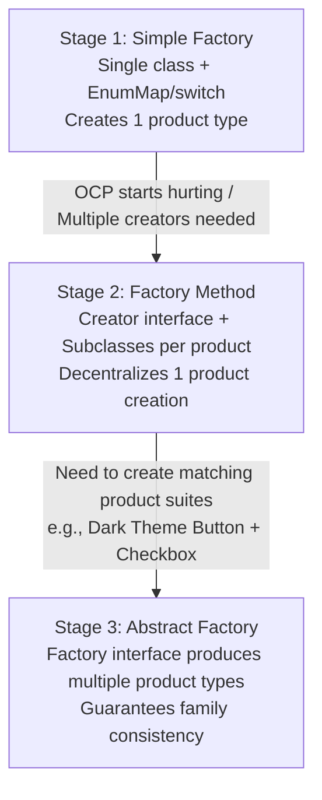

# ⚖️ Module 03: When to Use vs. When to Upgrade

[🏠 Back to Master Guide](./README.md) &nbsp; | &nbsp; [Previous: 🛡️ Modern Supplier & EnumMap](./02-MODERN_SUPPLIER_AND_ENUMMAP_FACTORY.md) &nbsp; | &nbsp; [Next: 🎙️ Interview Playbook](./04-INTERVIEW_PLAYBOOK_AND_ARTICULATION.md)

---

## 🎯 Executive Overview

A senior engineer avoids premature over-engineering as vigorously as they avoid anti-patterns. Implementing a full GoF Factory Method with dozens of creator subclasses for a small, 3-option enum is an anti-pattern (violating **YAGNI: You Aren't Gonna Need It**).

This module outlines the **Definitive Decision Rubric**:
1. When Simple Factory is **100% the right tool**.
2. The **Breaking Points** that trigger an architectural upgrade.
3. The exact **3-Stage Evolutionary Path** from Simple Factory $\rightarrow$ Factory Method $\rightarrow$ Abstract Factory.

---

## 🟢 1. When Simple Factory Is 100% The Right Tool

Stay with a **Simple Factory** if:
* You have a **small, fixed set of products** (2 to 4 types) that rarely change (e.g. `PaymentMode: CREDIT_CARD, UPI, NET_BANKING`).
* Object instantiation is straightforward without complex multi-step dependencies.
* A single team or module owns the creation logic.
* You do not need dynamic third-party plugin discovery at runtime.

> [!TIP]
> **The Pragmatic Rule:** Start simple. Use a Simple Factory until the switch statement causes operational friction.

---

## 🚨 2. The 3 Breaking Points: When to Upgrade

```
                        ┌──────────────────────────────────────────────┐
                        │      The 3 Architecture Breaking Points      │
                        └──────────────────────┬───────────────────────┘
                                               │
         ┌─────────────────────────────────────┼─────────────────────────────────────┐
         ▼                                     ▼                                     ▼
  【 Breaking Point 1 】                【 Breaking Point 2 】                【 Breaking Point 3 】
  Merge Conflicts & Multi-Team Ownership Multi-Step Subclass Variation        Family Invariant Requirements
  Multiple teams constantly edit the    Different products require complex,   You need to create matching
  same centralized factory file.        polymorphic lifecycle workflows.      SUITES of related products.
         │                                     │                                     │
         ▼                                     ▼                                     ▼
  Upgrade to FACTORY METHOD             Upgrade to FACTORY METHOD             Upgrade to ABSTRACT FACTORY
```

---

## 📈 3. The 3-Stage Evolutionary Upgrade Path



### Comparative Summary:

| Feature | Simple Factory | Factory Method | Abstract Factory |
|---|---|---|---|
| **Pattern Type** | Programming Idiom | Official GoF Pattern | Official GoF Pattern |
| **Number of Products** | 1 product | 1 product | **Family of related products** |
| **Polymorphism Mechanism** | Centralized method | Subclass inheritance | Object composition |
| **Extensibility Strategy** | Modify switch or call `register()` | Add new Creator subclass | Add new ConcreteFactory subclass |

---

## 🔑 Key Takeaways for Interviews

1. Demonstrate **engineering maturity** by stating: *"I start with a Simple Factory to keep code simple (YAGNI), and upgrade to Factory Method only when new product additions cause merge conflicts across teams."*
2. Clearly explain the progression: **Simple Factory** (centralized single product) $\rightarrow$ **Factory Method** (decentralized single product) $\rightarrow$ **Abstract Factory** (decentralized product suite).
