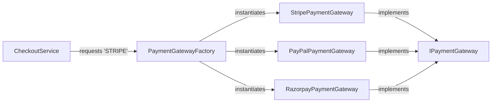

# 💼 Simple Factory Case Studies — In Production Systems

[🏠 Back to Master Guide](./README.md) &nbsp; | &nbsp; [Previous: 🌍 Cross-Language Patterns](./05-CROSS_LANGUAGE_PATTERNS.md) &nbsp; | &nbsp; [Java Code Benchmarks](./JAVA/README.md)

---

## 🎯 Executive Overview

This document demonstrates two production-grade architectures utilizing the **Simple Factory** programming idiom:
1. **Case Study 1:** Multi-Provider Payment Gateway Selector.
2. **Case Study 2:** Multi-Format Document Exporter.

---

## 🏢 Case Study 1: Multi-Provider Payment Gateway Selector



### Complete Java Implementation:

```java
// 1. Product Interface
public interface IPaymentGateway {
    void processPayment(double amount);
}

// 2. Concrete Products
public class StripePaymentGateway implements IPaymentGateway {
    public void processPayment(double amount) { System.out.println("Processing $" + amount + " via Stripe 💳"); }
}

public class PayPalPaymentGateway implements IPaymentGateway {
    public void processPayment(double amount) { System.out.println("Processing $" + amount + " via PayPal 🅿️"); }
}

public class RazorpayPaymentGateway implements IPaymentGateway {
    public void processPayment(double amount) { System.out.println("Processing $" + amount + " via Razorpay ⚡"); }
}

// 3. Enum Definition
public enum PaymentMode { STRIPE, PAYPAL, RAZORPAY }

// 4. Production Simple Factory (EnumMap + Supplier)
public class PaymentGatewayFactory {
    private static final Map<PaymentMode, Supplier<IPaymentGateway>> registry = new EnumMap<>(PaymentMode.class);

    static {
        registry.put(PaymentMode.STRIPE, StripePaymentGateway::new);
        registry.put(PaymentMode.PAYPAL, PayPalPaymentGateway::new);
        registry.put(PaymentMode.RAZORPAY, RazorpayPaymentGateway::new);
    }

    public static IPaymentGateway getGateway(PaymentMode mode) {
        Supplier<IPaymentGateway> supplier = registry.get(mode);
        if (supplier == null) {
            throw new IllegalArgumentException("Unsupported payment mode: " + mode);
        }
        return supplier.get();
    }
}
```

---

## 🏢 Case Study 2: Multi-Format Document Exporter

```java
public enum ExportFormat { PDF, CSV, JSON }

public class DocumentExporterFactory {
    public static DocumentExporter getExporter(ExportFormat format) {
        switch (format) {
            case PDF:  return new PdfExporter();
            case CSV:  return new CsvExporter();
            case JSON: return new JsonExporter();
            default:   throw new IllegalArgumentException("Unknown format: " + format);
        }
    }
}
```

### Why Simple Factory Is Perfect Here:
* The formats (PDF, CSV, JSON) are fixed and mature.
* It is unlikely that 5 different teams will need to add new document exporters simultaneously.
* Using Simple Factory keeps the codebase clean, lean, and avoids premature over-engineering.
