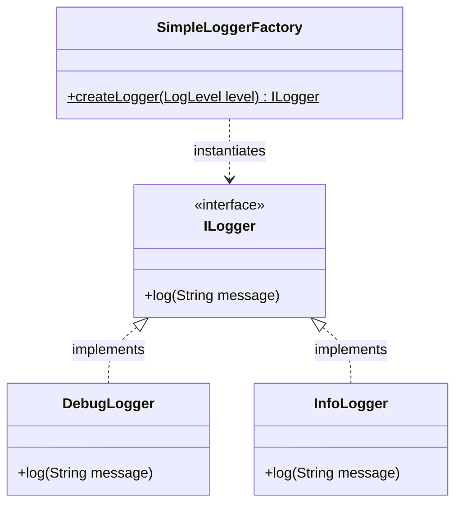
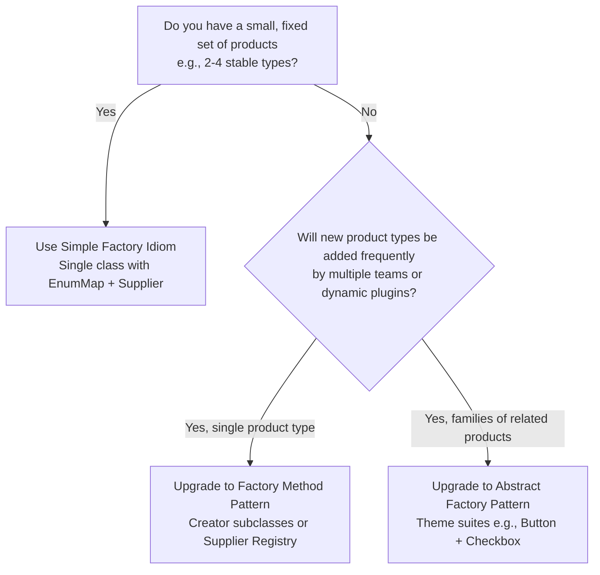

# 🏭 Simple Factory Design Pattern — The Architectural Master Guide

> **Authoritative Guide for Senior Engineers & Technical Interview Prep**  
> *A comprehensive deep-dive into the centralized creational idiom, OCP trade-offs, high-performance EnumMap suppliers, and the 3-stage factory upgrade path.*

---

## 📑 Table of Contents

1. [Executive Summary & Core Intent](#-executive-summary--core-intent)
2. [Mental Models for Fast Intuition](#-mental-models-for-fast-intuition)
3. [Architecture Blueprint & Class Hierarchy](#-architecture-blueprint--class-hierarchy)
4. [Architecture Decision Framework](#-architecture-decision-framework)
5. [Modular Deep-Dive Reading Tracks](#-modular-deep-dive-reading-tracks)
6. [L4/Senior Interview Articulation Flashcards](#-l4senior-interview-articulation-flashcards)
7. [Cross-Repository Interlinking](#-cross-repository-interlinking)

---

## 🧭 Executive Summary & Core Intent

The **Simple Factory** (also known as the **Static Factory Idiom**) is a centralized creational pattern that encapsulates object instantiation logic inside a single class or static method based on given input parameters (such as an Enum, String, or Configuration flag).

Unlike **Factory Method** or **Abstract Factory**, Simple Factory is **not an official Gang of Four (GoF) design pattern**—it is a widely adopted programming idiom.



---

## 🧠 Mental Models for Fast Intuition

```
  ┌───────────────────────────────────────────────┬───────────────────────────────────────────────┐
  │           1. The Vending Machine              │          2. The Pizza Order Counter           │
  ├───────────────────────────────────────────────┼───────────────────────────────────────────────┤
  │ You press Button A1 ➡️ Vending machine        │ A single cashier standing behind a counter    │
  │ dispenses Chips. You press Button B2 ➡️       │ with a menu (`OrderPizza("Cheese")`,          │
  │ dispenses Soda. You don't care how internal   │ `OrderPizza("Pepperoni")`). It's not a full   │
  │ motors work; the machine (Simple Factory)     │ factory hierarchy—just one central point      │
  │ takes your input and dispenses the product.   │ encapsulating the `new` logic.                │
  └───────────────────────────────────────────────┴───────────────────────────────────────────────┘
```

---

## 🌳 Architecture Decision Framework



---

## 🗂️ Modular Deep-Dive Reading Tracks

For targeted interview prep and production mastery, navigate to the specialized sub-modules below:

```
                                📂 SIMPLE FACTORY MASTER VAULT
                                              │
         ┌───────────────────┬────────────────┼───────────────────┬───────────────────┐
         ▼                   ▼                ▼                   ▼                   ▼
   ⚡ [Module 01]       🛡️ [Module 02]    ⚖️ [Module 03]      🎙️ [Module 04]     🌍 [Module 05]
    Anatomy & OCP       Modern EnumMap    When to Use vs      Interview          Cross-Language
      Violation          & Supplier Lambdas  Upgrade Rubric      Playbook           Patterns
```

* ⚡ **[01. Anatomy, Mechanics & The OCP Violation Paradox](./01-ANATOMY_AND_OCP_VIOLATION.md)**:
  * Structural mechanics and why Simple Factory is an idiom, not a GoF pattern.
  * The SRP Win vs. OCP Violation architectural paradox.
  * Concrete examples of multi-team merge conflicts in enterprise codebases.

* 🛡️ **[02. Modern Supplier Lambdas & High-Performance EnumMap Factory](./02-MODERN_SUPPLIER_AND_ENUMMAP_FACTORY.md)**:
  * Replacing naive `switch-case` with `EnumMap<Type, Supplier<Product>>`.
  * $O(1)$ array-index lookup speed via `enum.ordinal()`.
  * Constructor references (`Class::new`) and dynamic registration hooks.

* ⚖️ **[03. When to Use vs. When to Upgrade](./03-WHEN_TO_USE_VS_WHEN_TO_UPGRADE.md)**:
  * The Pragmatic YAGNI Rubric: When Simple Factory is 100% the right choice.
  * The 3 Breaking Points triggering an upgrade.
  * The complete 3-stage evolutionary path (Simple Factory $\rightarrow$ Factory Method $\rightarrow$ Abstract Factory).

* 🎙️ **[04. L4/Senior Interview Playbook & Articulation](./04-INTERVIEW_PLAYBOOK_AND_ARTICULATION.md)**:
  * **5 Verbatim 30-Second Interview Scripts** for high-stakes hiring loops.
  * Rapid-fire 1-sentence FAANG answers and common interviewer traps.
  * Candidate self-assessment rubric.

* 🌍 **[05. Cross-Language Implementations](./05-CROSS_LANGUAGE_PATTERNS.md)**:
  * C++ static factory methods, Go constructor factory functions, TypeScript discriminated unions, Python dictionary dispatch.

* 💼 **[Case Studies: Production Systems](./CASE_STUDY.md)**:
  * **Multi-Provider Payment Gateway Selector** (Stripe vs PayPal vs Razorpay).
  * **Document Report Exporter** (PDF vs CSV vs JSON).

* ☕ **[Java Runnable Source Code](./JAVA/README.md)**:
  * Complete before-and-after evolutionary runnable Java suite.

---

## 🎙️ L4/Senior Interview Articulation Flashcards

> [!TIP]
> Deliver these concise, high-impact statements during your technical interviews to immediately signal Senior (L4/L5) proficiency.

```
┌───────────────────────────────────────────────┬───────────────────────────────────────────────┐
│ Question                                      │ 30-Second Verbatim Senior Articulation        │
├───────────────────────────────────────────────┼───────────────────────────────────────────────┤
│ "What is a Simple Factory and is it a GoF     │ 'Simple Factory is a creational idiom, not an │
│  pattern?"                                    │  official GoF pattern. It encapsulates object │
│                                               │  creation in a single static class, satisfying│
│                                               │  SRP by decoupling callers from constructors.'│
├───────────────────────────────────────────────┼───────────────────────────────────────────────┤
│ "Why does naive Simple Factory violate OCP?"  │ 'Because adding a new product requires opening│
│                                               │  and editing the centralized switch statement.│
│                                               │  We fix this in Java using a dynamic Supplier │
│                                               │  registry: EnumMap<Type, Supplier<Product>>.' │
├───────────────────────────────────────────────┼───────────────────────────────────────────────┤
│ "When should you use Simple Factory instead of│ 'When we have a small, fixed set of products  │
│  Factory Method?"                             │  (2-4 stable types) maintained by one team.   │
│                                               │  Defaulting to Factory Method would be        │
│                                               │  premature over-engineering violating YAGNI.' │
├───────────────────────────────────────────────┼───────────────────────────────────────────────┤
│ "What is the trigger to upgrade to Factory    │ 'Collaborative merge conflicts. When multiple │
│  Method?"                                     │  feature teams must constantly modify the     │
│                                               │  same centralized factory file, we refactor to│
│                                               │  decentralized Creator subclasses.'           │
└───────────────────────────────────────────────┴───────────────────────────────────────────────┘
```

---

## 🔗 Cross-Repository Interlinking

* **[Single Responsibility Principle (SRP)](../../00-SOLID_Principles/01-Single_Responsibility/README.md)**: Encapsulating construction away from client domain logic.
* **[Open/Closed Principle (OCP)](../../00-SOLID_Principles/02-Open_Closed/README.md)**: Analyzing the OCP limitation of centralized switch logic.
* **[Factory Method Design Pattern](../02-Factory%20Method%20Design%20Pattern/README.md)**: The official GoF pattern upgrade path.
* **[Abstract Factory Design Pattern](../03-Abstract%20Factory%20Design%20Pattern/README.md)**: When product suites must be instantiated.

---

## 🧠 Tracker Integration

* **Trigger Phrases:** *"Centralized creation helper"*, *"Static factory idiom"*, *"Switch-based object creation"*.
* **Confuses With:** 
  * **Factory Method:** (Factory Method uses polymorphic subclasses to create objects; Simple Factory is a single class with centralized conditional logic).
  * **Static Factory Method:** (Static factory methods like `List.of()` or `Optional.of()` are named constructors on the product class itself).
* **Anti-Freeze Starter Code:** 
  ```java
  public class PaymentFactory {
      public static PaymentGateway create(PaymentType type) {
          switch(type) {
              case STRIPE: return new StripeGateway();
              case PAYPAL: return new PayPalGateway();
              default: throw new IllegalArgumentException("Unknown: " + type);
          }
      }
  }
  ```
