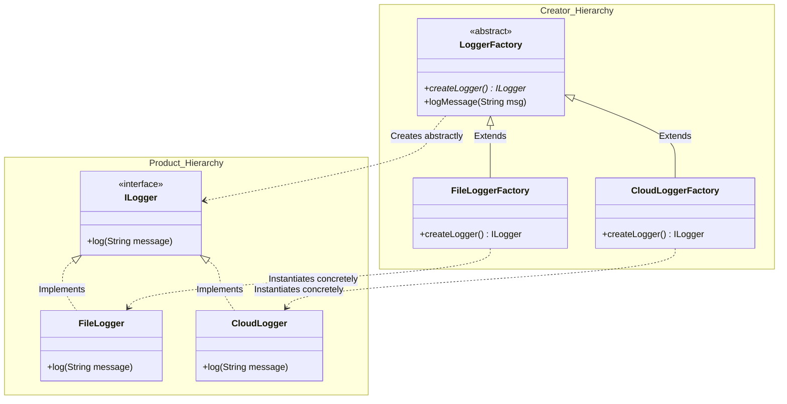

# ⚡ Module 01: Parallel Hierarchies & Dependency Inversion (DIP)

[🏠 Back to Master Guide](./README.md) &nbsp; | &nbsp; [Next: 🛡️ Factory Registry & Reflection](./02-FACTORY_REGISTRY_AND_REFLECTION.md)

---

## 🎯 Executive Overview

The **Factory Method Design Pattern** (also known as the **Virtual Constructor**) defines an interface for creating an object, but defers the actual instantiation to subclasses.

At a senior engineering level, Factory Method solves the **Dependency Inversion Principle (DIP)** paradox: high-level business frameworks should not depend on concrete low-level product classes. Instead, both should depend on abstractions.

---

## 🏛️ 1. The Two Parallel Hierarchies

The Factory Method pattern operates through two synchronized inheritance trees:



### Why Two Hierarchies?
* **Decoupling Creation from Usage:** The abstract `LoggerFactory` contains the core business workflow (`logMessage()`). It calls the abstract factory method `createLogger()` without knowing whether the logger writes to a local file, AWS CloudWatch, or a console stream.
* **Open/Closed Principle (OCP):** Adding a new logger (`KafkaLogger`) requires creating `KafkaLogger` and `KafkaLoggerFactory` without touching any existing production code.

---

## 🔄 2. How Factory Method Enforces Dependency Inversion (DIP)

### ❌ The Direct Coupling Violation (Without Factory Method):
```java
public class OrderService {
    public void processOrder(Order order) {
        // High-level service is tightly coupled to concrete Low-level FileLogger!
        FileLogger logger = new FileLogger("/var/log/orders.log");
        logger.log("Order processed: " + order.getId());
    }
}
```

```
[ High-Level: OrderService ] ────────(Direct Dependency)────────► [ Low-Level: FileLogger ]
```

---

### ✅ Inverted Dependencies (With Factory Method):
```java
public abstract class OrderProcessor {
    // Abstract Factory Method
    protected abstract ILogger createLogger();

    public void processOrder(Order order) {
        // High-level business flow depends strictly on abstraction!
        ILogger logger = createLogger();
        logger.log("Order processed: " + order.getId());
    }
}

public class CloudOrderProcessor extends OrderProcessor {
    @Override
    protected ILogger createLogger() {
        return new CloudWatchLogger("us-east-1"); // Injected concrete subtype
    }
}
```

```
[ High-Level: OrderProcessor ] ──► [ Abstraction: ILogger ] ◄── [ Low-Level: CloudWatchLogger ]
```

---

## 🔍 3. GoF Factory Method vs. Static Factory Methods

A frequent interview point is clarifying the difference between the **GoF Factory Method Pattern** and Java's **Static Factory Methods**:

```
  ┌───────────────────────────────────────────────┬───────────────────────────────────────────────┐
  │           GoF Factory Method Pattern          │          Static Factory Method (Idiom)        │
  ├───────────────────────────────────────────────┼───────────────────────────────────────────────┤
  │ • Mechanism: Relies on **Inheritance and      │ • Mechanism: Relies on **static methods**     │
  │   Polymorphic Subclasses** to override        │   inside the class (e.g. `List.of()`,         │
  │   object instantiation.                       │   `Optional.of()`, `Integer.valueOf()`).      │
  │ • Purpose: Extensible framework design.       │ • Purpose: Clean named constructors, caching  │
  │ • Subclassing: Requires creator subclasses.   │   singletons, or returning subtypes.          │
  └───────────────────────────────────────────────┴───────────────────────────────────────────────┘
```

```java
// Static Factory Method Example (Effective Java Item 1):
public class ComplexNumber {
    private final double real;
    private final double imaginary;

    private ComplexNumber(double r, double i) { this.real = r; this.imaginary = i; }

    // Named factory methods clarify intent:
    public static ComplexNumber fromCartesian(double real, double imaginary) {
        return new ComplexNumber(real, imaginary);
    }

    public static ComplexNumber fromPolar(double rho, double theta) {
        return new ComplexNumber(rho * Math.cos(theta), rho * Math.sin(theta));
    }
}
```

---

## 🔑 Key Takeaways for Interviews

1. Articulate that Factory Method consists of **two parallel hierarchies**: the Product hierarchy and the Creator hierarchy.
2. Explain how Factory Method satisfies the **Dependency Inversion Principle (DIP)** by decoupling high-level workflows from concrete product instantiation.
3. Distinguish between the **GoF polymorphic Factory Method pattern** (creator inheritance) and **Static Factory Methods** (named static constructors like `Optional.of()`).
