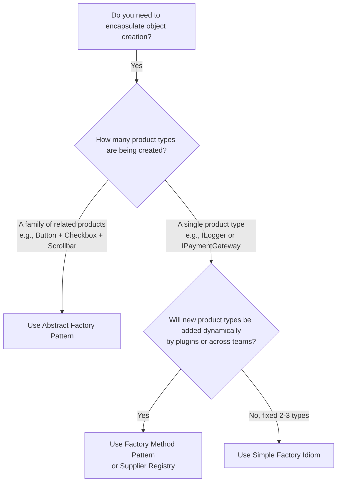

# ⚖️ Module 03: The Factory Triad Comparison

[🏠 Back to Master Guide](./README.md) &nbsp; | &nbsp; [Previous: 🛡️ Factory Registry & Reflection](./02-FACTORY_REGISTRY_AND_REFLECTION.md) &nbsp; | &nbsp; [Next: 🎙️ Interview Playbook](./04-INTERVIEW_PLAYBOOK_AND_ARTICULATION.md)

---

## 🎯 Executive Overview

In technical interviews, one of the most common line-of-questioning is distinguishing the **Factory Triad**:
1. **Simple Factory (Idiom)**
2. **Factory Method (GoF Creational Pattern)**
3. **Abstract Factory (GoF Creational Pattern)**

This guide provides an architectural comparison matrix, structural diagrams, and a definitive decision framework.

---

## 🥊 1. The Factory Triad Comparison Matrix

```
  ┌─────────────────────────────┬─────────────────────────────┬─────────────────────────────┐
  │       Simple Factory        │       Factory Method        │      Abstract Factory       │
  ├─────────────────────────────┼─────────────────────────────┼─────────────────────────────┤
  │ • NOT an official GoF       │ • Official GoF Pattern.     │ • Official GoF Pattern.     │
  │   pattern; a coding idiom.  │                             │                             │
  │ • Creates ONE product via a │ • Creates ONE product via   │ • Creates a SUITE of related│
  │   centralized `switch`/`if`.│   polymorphic subclasses.   │   products without classes. │
  │ • Violates OCP when adding  │ • Satisfies OCP (add new    │ • Satisfies OCP for new     │
  │   new product types.        │   creator subclass).        │   families; violates for new│
  │                             │                             │   product categories.       │
  │ • Single centralized class. │ • Two parallel hierarchies. │ • Factory produces multiple │
  │                             │                             │   distinct product types.   │
  └─────────────────────────────┴─────────────────────────────┴─────────────────────────────┘
```

---

## 📐 2. Visual Structural Comparison

```mermaid
graph TD
    subgraph Simple Factory (Single Class)
        SF[SimpleLoggerFactory] -->|switch: 'DEBUG'| P1[DebugLogger]
        SF -->|switch: 'INFO'| P2[InfoLogger]
    end

    subgraph Factory Method (Single Product via Inheritance)
        Creator[LoggerFactory Interface] --> ConcreteCreator1[FileLoggerFactory]
        Creator --> ConcreteCreator2[CloudLoggerFactory]
        ConcreteCreator1 -->|creates| FileProduct[FileLogger]
        ConcreteCreator2 -->|creates| CloudProduct[CloudLogger]
    end

    subgraph Abstract Factory (Family of Related Products)
        AF[UIAbstractFactory] --> WinFactory[WindowsUIFactory]
        AF --> MacFactory[MacUIFactory]
        WinFactory -->|creates| WinBtn[WindowsButton]
        WinFactory -->|creates| WinChk[WindowsCheckbox]
        MacFactory -->|creates| MacBtn[MacButton]
        MacFactory -->|creates| MacChk[MacCheckbox]
    end
```

---

## 🌳 3. Architectural Decision Framework



---

## 🔑 Key Takeaways for Interviews

1. **Simple Factory:** Single class with `switch-case`; violates OCP.
2. **Factory Method:** Relies on **inheritance**; each factory subclass produces **one** product.
3. **Abstract Factory:** Relies on **object composition**; each factory produces a **family of complementary products** (e.g. DarkTheme Button, Checkbox, TextField).
