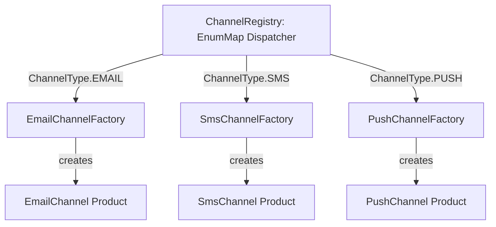

# 💼 Factory Method Case Studies — In Production Systems

[🏠 Back to Master Guide](./README.md) &nbsp; | &nbsp; [Previous: 🌍 Cross-Language Patterns](./05-CROSS_LANGUAGE_PATTERNS.md) &nbsp; | &nbsp; [Java Code Benchmarks](./JAVA/README.md)

---

## 🎯 Executive Overview

This document illustrates how the Factory Method pattern appears inside larger production-grade system architectures, frequently working in tandem with the **Singleton**, **Builder**, and **Strategy** patterns.

---

## 🏢 Case Study 1: Multi-Channel Notification Dispatcher
**Source Code Reference:** [`07-Combined-Patterns/01-notification-system`](../../07-Combined-Patterns/01-notification-system/README.md)



### The OCP Win:
Adding a brand new channel (e.g. `WhatsAppChannel`):
1. Create `WhatsAppChannel.java` (Implements `INotificationChannel`).
2. Create `WhatsAppChannelFactory.java` (Implements `IChannelFactory`).
3. Register into `ChannelRegistry` at startup.
4. **Zero modifications** to existing email, SMS, or push codebase!

---

## 🏢 Case Study 2: Spring Framework `FactoryBean<T>`

Spring's `org.springframework.beans.factory.FactoryBean<T>` is the quintessential enterprise implementation of the Factory Method pattern:

```java
public interface FactoryBean<T> {
    T getObject() throws Exception; // ⭐ Factory Method
    Class<?> getObjectType();
    default boolean isSingleton() { return true; }
}
```

* **How it works:** When a bean definition implements `FactoryBean`, Spring does not inject the factory itself; it executes `getObject()` and injects the resulting product into client components.
* **Real-World Examples:** `ProxyFactoryBean` (Spring AOP), `LocalSessionFactoryBean` (Hibernate integration), and `Jackson2ObjectMapperFactoryBean`.
