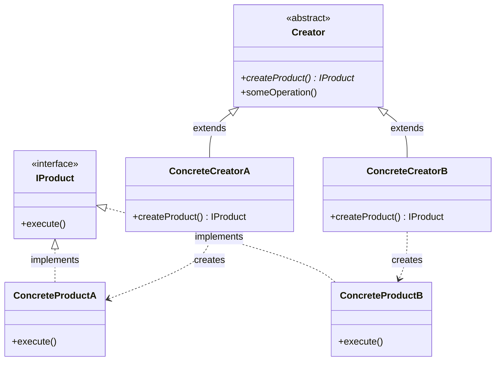
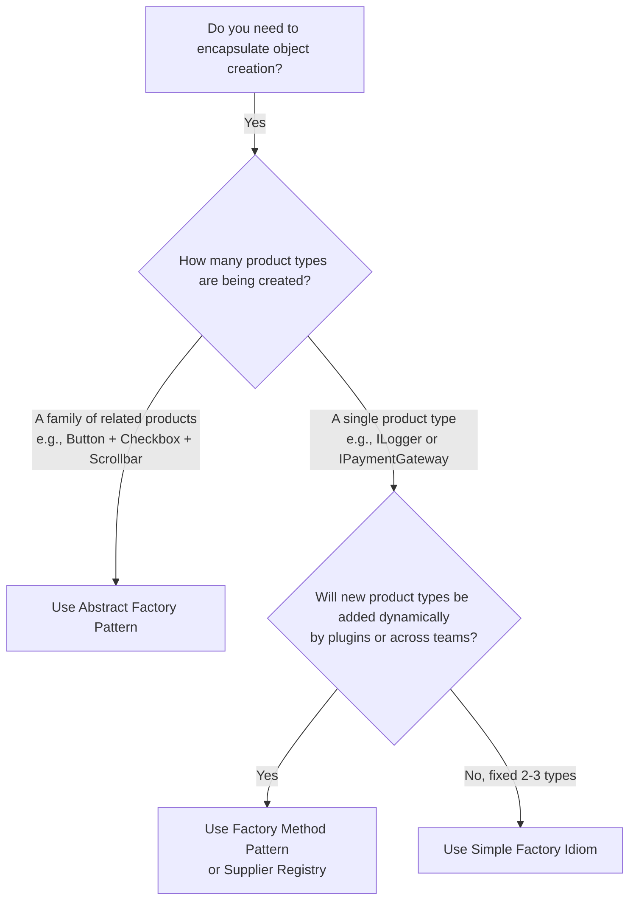

# 🏭 Factory Method Design Pattern — The Architectural Master Guide

> **Authoritative Guide for Senior Engineers & Technical Interview Prep**  
> *A comprehensive deep-dive into the virtual constructor pattern, parallel hierarchies, dependency inversion, and dynamic supplier registries.*

---

## 📑 Table of Contents

1. [Executive Summary & Core Intent](#-executive-summary--core-intent)
2. [Mental Models for Fast Intuition](#-mental-models-for-fast-intuition)
3. [Architecture Blueprint & Parallel Hierarchies](#-architecture-blueprint--parallel-hierarchies)
4. [Architecture Decision Framework](#-architecture-decision-framework)
5. [Modular Deep-Dive Reading Tracks](#-modular-deep-dive-reading-tracks)
6. [L4/Senior Interview Articulation Flashcards](#-l4senior-interview-articulation-flashcards)
7. [Cross-Repository Interlinking](#-cross-repository-interlinking)

---

## 🧭 Executive Summary & Core Intent

The **Factory Method Pattern** (also known as the **Virtual Constructor**) is a creational design pattern that provides an interface for creating objects in a superclass, but allows subclasses to alter the type of objects that will be created.

It solves the primary flaw of Simple Factory (violating the **Open/Closed Principle**) and enforces the **Dependency Inversion Principle (DIP)** by ensuring high-level workflows depend only on abstract product interfaces rather than concrete classes.



---

## 🧠 Mental Models for Fast Intuition

```
  ┌───────────────────────────────────────────────┬───────────────────────────────────────────────┐
  │      1. The Specialty Restaurant Kitchen      │         2. The Bank Loan Approval Desk        │
  ├───────────────────────────────────────────────┼───────────────────────────────────────────────┤
  │ • Simple Factory: One overwhelmed head chef   │ • `MortgageLoanFactory`: Creates `Mortgage`   │
  │   with a 50-item menu. Adding Tacos forces    │   (verifies property deed and deed valuation).│
  │   the head chef to learn a new recipe.        │ • `AutoLoanFactory`: Creates `AutoLoan`       │
  │ • Factory Method: Specialized stations!       │   (verifies vehicle VIN and registration).    │
  │   `SushiChef` makes Sushi; `PizzaChef` makes  │ • The core `LoanProcessor` just calls         │
  │   Pizza. Adding Tacos means hiring a          │   `factory.createLoan()` — it doesn't care    │
  │   `TacoChef` without disturbing other chefs.  │   which loan type is being approved!          │
  └───────────────────────────────────────────────┴───────────────────────────────────────────────┘
```

---

## 🌳 Architecture Decision Framework



---

## 🗂️ Modular Deep-Dive Reading Tracks

For targeted interview prep and production mastery, navigate to the specialized sub-modules below:

```
                                📂 FACTORY METHOD MASTER VAULT
                                              │
         ┌───────────────────┬────────────────┼───────────────────┬───────────────────┐
         ▼                   ▼                ▼                   ▼                   ▼
   ⚡ [Module 01]       🛡️ [Module 02]    ⚖️ [Module 03]      🎙️ [Module 04]     🌍 [Module 05]
    Parallel Hierarchies Factory Registry   Factory Triad       Interview          Cross-Language
      & DIP Inversion    & Supplier Lambdas  Comparison          Playbook           Patterns
```

* ⚡ **[01. Parallel Hierarchies & Dependency Inversion (DIP)](./01-PARALLEL_HIERARCHIES_AND_DIP.md)**:
  * Deconstructing the Product and Creator parallel inheritance trees.
  * Inverting high-level service dependencies to abstractions.
  * GoF polymorphic Factory Method vs. Java Static Factory Methods (`Optional.of()`).

* 🛡️ **[02. Factory Registry, Suppliers & Reflection](./02-FACTORY_REGISTRY_AND_REFLECTION.md)**:
  * Eliminating the "Class Explosion" problem ($2N$ classes).
  * Modern Java 8+ `Map<String, Supplier<Product>>` dynamic registry.
  * Plugin discovery via Java `ServiceLoader` SPI and JDBC `DriverManager`.

* ⚖️ **[03. The Factory Triad Comparison](./03-FACTORY_METHOD_VS_SIMPLE_FACTORY_VS_ABSTRACT_FACTORY.md)**:
  * Complete comparison matrix: Simple Factory vs. Factory Method vs. Abstract Factory.
  * Structural diagrams and decision trees.

* 🎙️ **[04. L4/Senior Interview Playbook & Articulation](./04-INTERVIEW_PLAYBOOK_AND_ARTICULATION.md)**:
  * **5 Verbatim 30-Second Interview Scripts** for high-stakes hiring loops.
  * Rapid-fire 1-sentence FAANG answers and common interviewer traps.
  * Candidate self-assessment rubric.

* 🌍 **[05. Cross-Language Implementations](./05-CROSS_LANGUAGE_PATTERNS.md)**:
  * C++ `std::unique_ptr`, Go constructor factory functions, TypeScript discriminated registries, Python `@classmethod`.

* 💼 **[Case Studies: Production Systems](./CASE_STUDY.md)**:
  * Multi-Channel Notification Dispatcher (`IChannelFactory`).
  * Spring Framework `FactoryBean<T>` (`getObject()`).

* ☕ **[Java Runnable Source Code](./JAVA/README.md)**:
  * Complete before-and-after evolutionary runnable Java suite.

---

## 🎙️ L4/Senior Interview Articulation Flashcards

> [!TIP]
> Deliver these concise, high-impact statements during your technical interviews to immediately signal Senior (L4/L5) proficiency.

```
┌───────────────────────────────────────────────┬───────────────────────────────────────────────┐
│ Question                                      │ 30-Second Verbatim Senior Articulation        │
├───────────────────────────────────────────────┼───────────────────────────────────────────────┤
│ "Why is Factory Method preferred over Simple  │ 'Simple Factory uses switch-case logic, which │
│  Factory?"                                    │  violates the Open/Closed Principle. Factory  │
│                                               │  Method decentralizes creation into creator   │
│                                               │  subclasses, allowing us to add new products  │
│                                               │  without touching any existing source code.'  │
├───────────────────────────────────────────────┼───────────────────────────────────────────────┤
│ "What is the difference between Factory Method│ 'Factory Method uses inheritance to create a  │
│  and Abstract Factory?"                       │  single product; Abstract Factory uses object │
│                                               │  composition to produce an entire suite of    │
│                                               │  related, compatible products without coupling│
│                                               │  clients to concrete classes.'                │
├───────────────────────────────────────────────┼───────────────────────────────────────────────┤
│ "How do you solve Class Explosion in Factory  │ 'In modern Java, we avoid creating 2N creator │
│  Method?"                                     │  subclasses by using a dynamic Supplier Map:  │
│                                               │  Map<String, Supplier<Product>>. Products     │
│                                               │  register constructor references (Class::new) │
│                                               │  maintaining OCP with zero boilerplate.'      │
├───────────────────────────────────────────────┼───────────────────────────────────────────────┤
│ "How does Spring implement Factory Method?"   │ 'Spring provides the FactoryBean<T> interface.│
│                                               │  When Spring encounters a FactoryBean, it     │
│                                               │  calls getObject() to dynamically construct   │
│                                               │  and inject complex beans like AOP proxies.'  │
└───────────────────────────────────────────────┴───────────────────────────────────────────────┘
```

---

## 🔗 Cross-Repository Interlinking

* **[Open/Closed Principle (OCP)](../../00-SOLID_Principles/02-Open_Closed/README.md)**: Extensibility without modifying existing factory code.
* **[Dependency Inversion Principle (DIP)](../../00-SOLID_Principles/05-Dependency_Inversion/README.md)**: High-level modules depending on product abstractions.
* **[Abstract Factory Design Pattern](../03-Abstract%20Factory%20Design%20Pattern/README.md)**: Scaling from single products to product suites.
* **[Singleton Design Pattern](../06-Singleton%20Design%20Pattern/README.md)**: Factory instances commonly implemented as Singletons.

---

## 🧠 Tracker Integration

* **Trigger Phrases:** *"Virtual Constructor"*, *"Decouple object creation from business workflow"*, *"Parallel creator/product hierarchies"*.
* **Confuses With:** 
  * **Simple Factory:** (Simple Factory is a single class with a switch statement; Factory Method uses polymorphic subclasses).
  * **Abstract Factory:** (Factory Method creates 1 product; Abstract Factory creates a family of related products).
* **Anti-Freeze Starter Code:** 
  ```java
  public interface Product { void use(); }
  public abstract class Creator {
      public abstract Product createProduct();
      public void execute() {
          Product p = createProduct();
          p.use();
      }
  }
  ```
