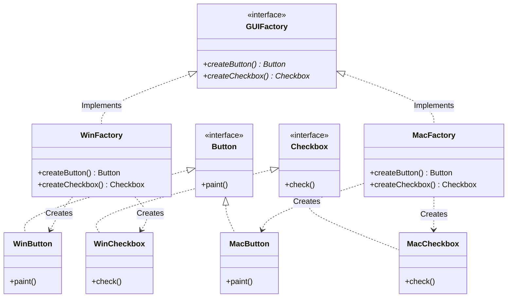

# ⚡ Module 01: Product Families, Consistency & The 2D Extensibility Matrix

[🏠 Back to Master Guide](./README.md) &nbsp; | &nbsp; [Next: ⚖️ Abstract Factory vs. Builder vs. Factory Method](./02-ABSTRACT_FACTORY_VS_FACTORY_METHOD_VS_BUILDER.md)

---

## 🎯 Executive Overview

The **Abstract Factory Pattern** (also known as the **Factory of Factories**) provides an interface for creating **families of related or dependent objects** without specifying their concrete classes.

Its primary architectural guarantee is **Product Compatibility**: ensuring that client code only uses products belonging to the **same family**, preventing fatal runtime mismatches (such as rendering a Windows Button inside a Mac Window).

---

## 🏛️ 1. The Product Matrix Concept

```
                              ┌────────────────────────────────────────────────────────┐
                              │                 THE 2D PRODUCT MATRIX                  │
                              └───────────────────────────┬────────────────────────────┘
                                                          │
                   ┌──────────────────────────────────────┴──────────────────────────────────────┐
                   ▼                                                                             ▼
          【 Product: Button 】                                                         【 Product: Checkbox 】
    ┌───────────────────────────────┐                                             ┌───────────────────────────────┐
    │ • WinButton (Family 1)        │                                             │ • WinCheckbox (Family 1)      │
    │ • MacButton (Family 2)        │                                             │ • MacCheckbox (Family 2)      │
    └───────────────────────────────┘                                             └───────────────────────────────┘
```



---

## ⚠️ 2. The 2D Extensibility Matrix (Senior Architectural Trade-off)

The Abstract Factory pattern presents a famous architectural asymmetry:

```
                            ┌──────────────────────────────────────────────┐
                            │      The 2D Extensibility Matrix Paradox     │
                            └──────────────────────┬───────────────────────┘
                                                   │
             ┌─────────────────────────────────────┴─────────────────────────────────────┐
             ▼                                                                           ▼
  【 Adding a NEW Family (e.g. LinuxFactory) 】                         【 Adding a NEW Product (e.g. Scrollbar) 】
  • ✅ 100% Open/Closed Compliant                                       • ❌ Violates Open/Closed Principle
  • Create `LinuxButton`, `LinuxCheckbox`,                               • Must modify the `GUIFactory` interface
    and `LinuxFactory`.                                                    (`createScrollbar()`).
  • ZERO existing code modified!                                         • Forces ALL existing factory subclasses
                                                                           (WinFactory, MacFactory) to be rewritten!
```

> [!IMPORTANT]
> **Key Senior Insight:** Abstract Factory is exceptional when your **product categories are stable** (e.g., UI always has Button + Checkbox) but **new families/themes are frequently added** (e.g., Dark Theme, Light Theme, High Contrast Theme). If new product types are added frequently, Abstract Factory becomes a maintenance liability.

---

## 💻 3. Java Implementation: Complete Isolation

```java
// 1. Abstract Products
public interface Button { void render(); }
public interface Checkbox { void render(); }

// 2. Concrete Family A (Dark Theme)
public class DarkButton implements Button {
    public void render() { System.out.println("Rendering Dark Button ⬛"); }
}
public class DarkCheckbox implements Checkbox {
    public void render() { System.out.println("Rendering Dark Checkbox ⬛"); }
}

// 3. Concrete Family B (Light Theme)
public class LightButton implements Button {
    public void render() { System.out.println("Rendering Light Button ⬜"); }
}
public class LightCheckbox implements Checkbox {
    public void render() { System.out.println("Rendering Light Checkbox ⬜"); }
}

// 4. Abstract Factory Contract
public interface UIFactory {
    Button createButton();
    Checkbox createCheckbox();
}

// 5. Concrete Factories
public class DarkUIFactory implements UIFactory {
    public Button createButton() { return new DarkButton(); }
    public Checkbox createCheckbox() { return new DarkCheckbox(); }
}

public class LightUIFactory implements UIFactory {
    public Button createButton() { return new LightButton(); }
    public Checkbox createCheckbox() { return new LightCheckbox(); }
}

// 6. Client Code: 100% Decoupled from Concrete Families
public class Application {
    private final Button button;
    private final Checkbox checkbox;

    public Application(UIFactory factory) { // Injected factory!
        this.button = factory.createButton();
        this.checkbox = factory.createCheckbox();
    }

    public void renderUI() {
        button.render();
        checkbox.render();
    }
}
```

---

## 🔑 Key Takeaways for Interviews

1. Articulate the **Core Invariant**: Abstract Factory guarantees that all instantiated products belong to the **same compatible family**.
2. Explain the **2D Extensibility Matrix**: Adding a new family is easy and OCP-compliant; adding a new product category requires modifying the abstract factory interface and all subclasses.
3. Contrast with Factory Method: Factory Method creates **one** product via inheritance; Abstract Factory creates a **suite of products** via composition.
