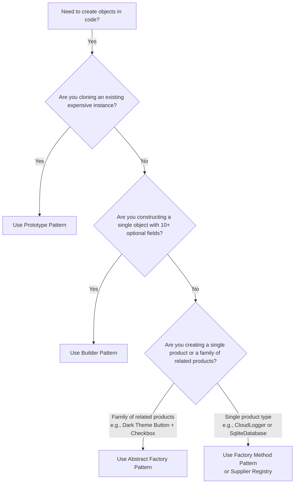

# ⚖️ Module 02: Abstract Factory vs. Factory Method vs. Builder vs. Prototype

[🏠 Back to Master Guide](./README.md) &nbsp; | &nbsp; [Previous: ⚡ Product Families](./01-PRODUCT_FAMILIES_AND_COMPATIBILITY.md) &nbsp; | &nbsp; [Next: 🏛️ Enterprise Use Cases & Spring](./03-ENTERPRISE_USE_CASES_AND_SPRING.md)

---

## 🎯 Executive Overview

Candidates frequently confuse the **Creational Pattern Family**:
* **Factory Method:** Creates **one** product via inheritance.
* **Abstract Factory:** Creates **families of related products** via composition.
* **Builder:** Constructs a **complex, multi-attribute single object** step-by-step.
* **Prototype:** Creates new objects by **cloning existing instances** (bypassing constructors).

This guide provides a definitive comparison matrix.

---

## 🥊 1. Abstract Factory vs. Factory Method vs. Builder

```
  ┌─────────────────────────────┬─────────────────────────────┬─────────────────────────────┐
  │       Factory Method        │      Abstract Factory       │           Builder           │
  ├─────────────────────────────┼─────────────────────────────┼─────────────────────────────┤
  │ • Produces a **single       │ • Produces a **suite of     │ • Constructs a **single     │
  │   product** type.           │   related products**.       │   complex object** in steps.│
  │ • Focuses on **creating one │ • Focuses on **family       │ • Focuses on **custom       │
  │   subtype dynamically**.    │   compatibility**.          │   step-by-step assembly**.  │
  │ • Relies on **Inheritance** │ • Relies on **Object        │ • Relies on **Method        │
  │   (Subclasses override).    │   Composition** (Interface).│   Chaining (Fluent API)**.  │
  │ • Return: `ILogger`         │ • Return: `Button, Checkbox`│ • Return: `HttpRequest`     │
  └─────────────────────────────┴─────────────────────────────┴─────────────────────────────┘
```

---

## 📊 2. Creational Design Pattern Comparison Matrix

| Pattern | Number of Products Created | Creation Mechanism | Key Focus | Primary Trigger Phrase |
|---|:---:|---|---|---|
| **Simple Factory** | 1 | Static method + `switch` | Centralized creation | *"Quick factory for fixed enum types"* |
| **Factory Method** | 1 | Polymorphic Subclasses | Extensible creation | *"Virtual constructor, single product"* |
| **Abstract Factory** | **Family (N products)** | Interface Composition | Family compatibility | *"Suite of related/dependent products"* |
| **Builder** | 1 Complex | Step-by-step Method Chaining | Telescoping constructor elimination | *"Complex configuration with many optional fields"* |
| **Prototype** | 1 Cloned Copy | Binary / Bitwise Memory Cloning | Expensive construction avoidance | *"Clone existing pre-computed object"* |
| **Singleton** | Exactly 1 Globally | Private ctor + static instance | Resource sharing & Single access | *"Only one instance allowed in memory"* |

---

## 🌳 3. Architectural Decision Framework



---

## 🔑 Key Takeaways for Interviews

1. If asked: *"When to choose Abstract Factory over Builder?"*, your hook is:  
   **"Abstract Factory produces a family of simple, compatible products; Builder constructs a single complex object step-by-step with many configuration parameters."**
2. If asked: *"When to choose Abstract Factory over Factory Method?"*, your hook is:  
   **"Factory Method creates one product via subclass inheritance; Abstract Factory creates multiple related products via interface composition."**
