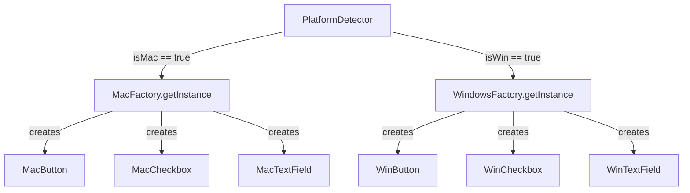
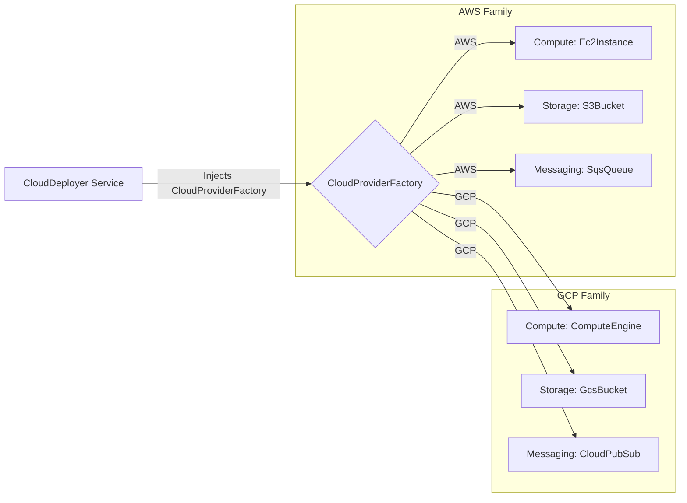

# 💼 Abstract Factory Case Studies — In Production Systems

[🏠 Back to Master Guide](./README.md) &nbsp; | &nbsp; [Previous: 🌍 Cross-Language Patterns](./05-CROSS_LANGUAGE_PATTERNS.md) &nbsp; | &nbsp; [Java Code Benchmarks](./JAVA/README.md)

---

## 🎯 Executive Overview

This document demonstrates two enterprise production architectures utilizing the **Abstract Factory Pattern**:
1. **Case Study 1:** Cross-Platform UI Widget Toolkit (Singleton + Abstract Factory).
2. **Case Study 2:** Multi-Cloud Infrastructure Resource Provisioner (AWS vs GCP vs Azure).

---

## 🏢 Case Study 1: Cross-Platform UI Widget Toolkit

### Key Architectural Insight:
* The host OS platform is determined **once on boot**.
* The concrete Abstract Factory (`MacFactory` / `WindowsFactory`) is implemented as a **Singleton** to avoid repeated OS environment detection.
* Downstream UI renderers receive the `GUIFactory` interface and instantiate compatible widgets with zero platform-specific `if-else` branching.

---

## 🏢 Case Study 2: Multi-Cloud Infrastructure Resource Provisioner

### Complete Implementation Benefit:
Swapping from AWS to GCP requires changing **exactly one configuration line** (`new GcpCloudFactory()`), guaranteeing that all compute, storage, and queue resources instantiated belong strictly to the GCP ecosystem.
