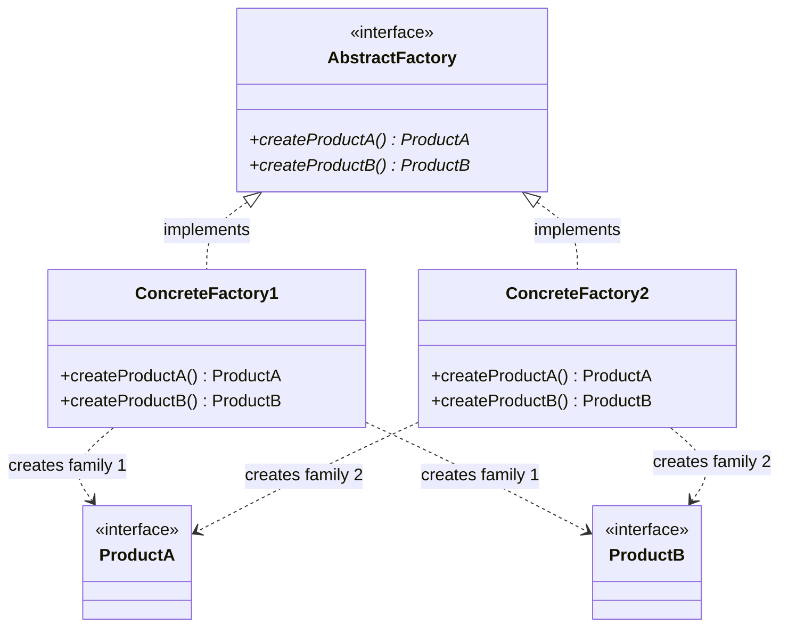
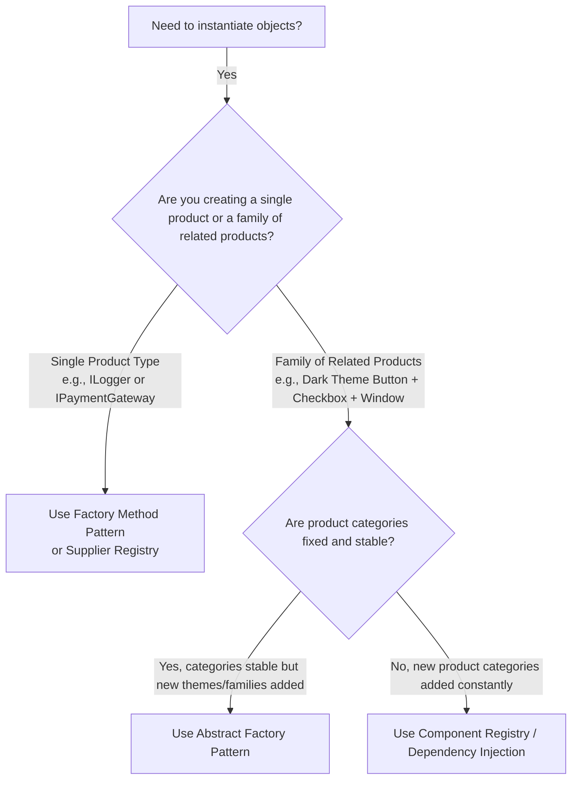

# 🏛️ Abstract Factory Design Pattern — The Architectural Master Guide

> **Authoritative Guide for Senior Engineers & Technical Interview Prep**  
> *A comprehensive deep-dive into product families, compile-time consistency invariants, the 2D extensibility matrix, and multi-cloud architectures.*

---

## 📑 Table of Contents

1. [Executive Summary & Core Intent](#-executive-summary--core-intent)
2. [Mental Models for Fast Intuition](#-mental-models-for-fast-intuition)
3. [Architecture Blueprint & The Product Matrix](#-architecture-blueprint--the-product-matrix)
4. [Architecture Decision Framework](#-architecture-decision-framework)
5. [Modular Deep-Dive Reading Tracks](#-modular-deep-dive-reading-tracks)
6. [L4/Senior Interview Articulation Flashcards](#-l4senior-interview-articulation-flashcards)
7. [Cross-Repository Interlinking](#-cross-repository-interlinking)

---

## 🧭 Executive Summary & Core Intent

The **Abstract Factory Pattern** (also known as the **Factory of Factories**) is a creational design pattern that provides an interface for creating **families of related or dependent objects** without specifying their concrete classes.

Its primary architectural guarantee is **Family Invariant Consistency**: ensuring that client code only instantiates products from the **same compatible product suite** (e.g. Dark Theme Button + Checkbox, or AWS S3 + EC2), mathematically preventing fatal cross-family mismatches at compile time.



---

## 🧠 Mental Models for Fast Intuition

```
  ┌───────────────────────────────────────────────┬───────────────────────────────────────────────┐
  │           1. The Furniture Showroom           │           2. The Cross-Platform OS            │
  ├───────────────────────────────────────────────┼───────────────────────────────────────────────┤
  │ • Family A (Victorian): Victorian Chair +     │ • Family 1 (Windows): Windows Button +        │
  │   Victorian Sofa + Victorian Coffee Table.    │   Windows Checkbox + Windows Scrollbar.       │
  │ • Family B (Modern): Modern Chair + Modern    │ • Family 2 (macOS): macOS Button +            │
  │   Sofa + Modern Coffee Table.                 │   macOS Checkbox + macOS Scrollbar.           │
  │ Invariant: A customer buying Victorian must   │ Invariant: Mixing a macOS Button inside a     │
  │ NEVER receive a Modern Sofa by accident!      │ Windows UI layout looks visually broken!      │
  └───────────────────────────────────────────────┴───────────────────────────────────────────────┘
```

---

## 🌳 Architecture Decision Framework



---

## 🗂️ Modular Deep-Dive Reading Tracks

For targeted interview prep and production mastery, navigate to the specialized sub-modules below:

```
                               📂 ABSTRACT FACTORY MASTER VAULT
                                              │
         ┌───────────────────┬────────────────┼───────────────────┬───────────────────┐
         ▼                   ▼                ▼                   ▼                   ▼
   ⚡ [Module 01]       ⚖️ [Module 02]    🏛️ [Module 03]      🎙️ [Module 04]     🌍 [Module 05]
    Product Families     Creational Trio   Enterprise Use      Interview          Cross-Language
    & 2D Matrix Trade-off (Factory vs Builder) Cases & Hibernate  Playbook           Patterns
```

* ⚡ **[01. Product Families & The 2D Extensibility Matrix](./01-PRODUCT_FAMILIES_AND_COMPATIBILITY.md)**:
  * The Product Matrix concept and compile-time compatibility guarantees.
  * The **2D Extensibility Trade-Off Paradox**: Adding a new family is OCP-compliant; adding a new product category violates OCP.
  * Complete decoupled Java UI implementation.

* ⚖️ **[02. Abstract Factory vs. Factory Method vs. Builder](./02-ABSTRACT_FACTORY_VS_FACTORY_METHOD_VS_BUILDER.md)**:
  * Complete comparison matrix across all 5 creational patterns (Simple Factory, Factory Method, Abstract Factory, Builder, Prototype).
  * Decision framework: When to pick Abstract Factory vs. Builder vs. Factory Method.

* 🏛️ **[03. Enterprise Use Cases & Multi-Cloud Architecture](./03-ENTERPRISE_USE_CASES_AND_SPRING.md)**:
  * Hibernate ORM `DialectFactory` (PostgreSQL vs Oracle SQL families).
  * Multi-Cloud Provisioning SDK (AWS vs GCP vs Azure compute and storage).
  * Spring Dependency Injection as the Meta-Abstract Factory.

* 🎙️ **[04. L4/Senior Interview Playbook & Articulation](./04-INTERVIEW_PLAYBOOK_AND_ARTICULATION.md)**:
  * **5 Verbatim 30-Second Interview Scripts** for high-stakes hiring loops.
  * Rapid-fire 1-sentence FAANG answers and common interviewer traps.
  * Candidate self-assessment rubric.

* 🌍 **[05. Cross-Language Implementations](./05-CROSS_LANGUAGE_PATTERNS.md)**:
  * C++ `std::unique_ptr` smart suites, Go multi-method structural interfaces, TypeScript theme engines, and Python ABC.

* 💼 **[Case Studies: Production Systems](./CASE_STUDY.md)**:
  * **Cross-Platform UI Rendering Engine** (Singleton + Abstract Factory).
  * **Multi-Cloud Infrastructure Resource Provisioner** (AWS vs GCP vs Azure).

* ☕ **[Java Runnable Source Code](./JAVA/README.md)**:
  * Complete runnable Java demonstration suite.

---

## 🎙️ L4/Senior Interview Articulation Flashcards

> [!TIP]
> Deliver these concise, high-impact statements during your technical interviews to immediately signal Senior (L4/L5) proficiency.

```
┌───────────────────────────────────────────────┬───────────────────────────────────────────────┐
│ Question                                      │ 30-Second Verbatim Senior Articulation        │
├───────────────────────────────────────────────┼───────────────────────────────────────────────┤
│ "What core architectural guarantee does       │ 'Abstract Factory provides an interface to    │
│  Abstract Factory make?"                      │  create families of related objects without   │
│                                               │  specifying concrete classes. It guarantees   │
│                                               │  family compatibility, mathematically         │
│                                               │  preventing incompatible product mixing.'     │
├───────────────────────────────────────────────┼───────────────────────────────────────────────┤
│ "What is the 2D Extensibility Trade-Off in    │ 'Adding a new product family is 100% OCP      │
│  Abstract Factory?"                           │  compliant (just add new factory subclasses). │
│                                               │  However, adding a new product category       │
│                                               │  violates OCP because it forces modifying     │
│                                               │  the root factory interface and all classes.' │
├───────────────────────────────────────────────┼───────────────────────────────────────────────┤
│ "When should you choose Builder over Abstract │ 'Choose Abstract Factory when creating a      │
│  Factory?"                                    │  suite of simple, related products belonging  │
│                                               │  to a common theme; choose Builder when       │
│                                               │  constructing a single complex object with    │
│                                               │  dozens of optional fields step-by-step.'     │
├───────────────────────────────────────────────┼───────────────────────────────────────────────┤
│ "Where does Hibernate use Abstract Factory?"  │ 'Hibernate uses DialectFactory to instantiate │
│                                               │  matching SQL limit handlers, lock strategies,│
│                                               │  and type descriptors strictly for the active │
│                                               │  connected database (PostgreSQL vs Oracle).'  │
└───────────────────────────────────────────────┴───────────────────────────────────────────────┘
```

---

## 🔗 Cross-Repository Interlinking

* **[Factory Method Design Pattern](../02-Factory%20Method%20Design%20Pattern/README.md)**: Single-product inheritance-based creation.
* **[Builder Design Pattern](../04-Builder%20Design%20Pattern/README.md)**: Step-by-step assembly of single complex objects.
* **[Singleton Design Pattern](../06-Singleton%20Design%20Pattern/README.md)**: Abstract Factory instances commonly cached as Singletons.
* **[Open/Closed Principle (OCP)](../../00-SOLID_Principles/02-Open_Closed/README.md)**: Family extensibility analysis.

---

## 🧠 Tracker Integration

* **Trigger Phrases:** *"Factory of factories"*, *"Family of related products"*, *"Cross-platform UI kit"*, *"Multi-cloud provider abstraction"*.
* **Confuses With:** 
  * **Factory Method:** (Factory Method creates 1 product via inheritance; Abstract Factory creates multiple related products via composition).
  * **Builder:** (Builder constructs a single complex object step-by-step; Abstract Factory produces a suite of distinct product objects).
* **Anti-Freeze Starter Code:** 
  ```java
  public interface GUIFactory {
      Button createButton();
      Checkbox createCheckbox();
  }
  public class WinFactory implements GUIFactory {
      public Button createButton() { return new WinButton(); }
      public Checkbox createCheckbox() { return new WinCheckbox(); }
  }
  ```
