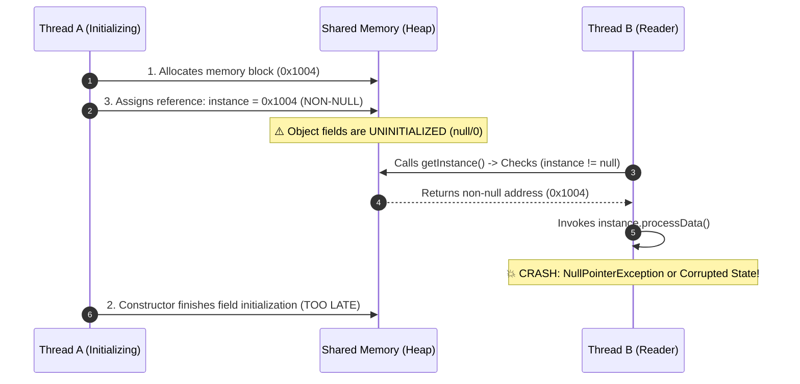

# ⚡ Module 01: Concurrency, JMM & Memory Barriers Deep Dive

[🏠 Back to Master Guide](./README.md) &nbsp; | &nbsp; [Next: 🛡️ Breaking & Defending](./02-BREAKING_AND_DEFENDING_SINGLETON.md)

---

## 🎯 Executive Overview

Implementing a thread-safe Singleton sounds deceptively simple. However, at enterprise scale and high concurrency, naive implementations trigger **subtle, non-deterministic bugs** caused by **CPU hardware caches** and **compiler instruction reordering**.

This deep dive deconstructs:
1. The **3-step assembly breakdown** of object creation.
2. How out-of-order execution produces **partially-constructed object reads**.
3. How `volatile` and CPU **hardware memory barriers** enforce thread safety.
4. Why the **Bill Pugh Holder** idiom achieves lock-free thread safety via the JVM ClassLoader specification.

---

## 🔬 1. The 3-Step Instruction Reordering Trap

When a thread executes:
```java
instance = new Stage2DoubleChecked();
```

This single line of Java code is compiled into **3 distinct sub-operations** in bytecode and assembly:

```
Step 1: mem = allocate(sizeof(Stage2DoubleChecked));  // 1. Allocate heap memory for object
Step 2: ctorSingleton(mem);                          // 2. Execute constructor to initialize fields
Step 3: instance = mem;                              // 3. Assign memory address to reference variable
```

### The CPU Reordering Failure Sequence (Without `volatile`)

Under compiler optimizations and CPU out-of-order execution, steps 2 and 3 can be reordered into **`1 -> 3 -> 2`**:



> [!CAUTION]
> **The Danger:** Thread B observes that `instance` is not null and attempts to use the object **before** Thread A's constructor has finished initializing the object's internal fields. This is one of the hardest race conditions to reproduce in unit tests because it only occurs under specific CPU cache timing under high load.

---

## 🛡️ 2. How `volatile` Fixes Instruction Reordering

In the Java Memory Model (JMM, post-JSR-133):
1. **Happens-Before Relationship:** A write to a `volatile` field *happens-before* every subsequent read of that same field across any thread.
2. **Hardware Memory Barriers (Fences):**
   * **`StoreStore` Barrier:** Inserted between Step 2 (constructor) and Step 3 (publishing `instance`). This forces Step 2 to strictly complete before Step 3 can execute.
   * **`StoreLoad` Barrier:** Inserted immediately after Step 3. Flushes CPU store buffers to ensure all CPU core caches see the updated address immediately.
   * **`LoadLoad` / `LoadStore` Barrier:** Emitted on the reader side, invalidating stale local CPU cache lines and forcing a fresh read from main memory.

```
       ┌──────────────────────────────────────────────┐
       │ Step 1: Allocate Memory                      │
       │ Step 2: Run Constructor (Initialize fields)  │
       └──────────────────────────────────────────────┘
  ══════════════════════════════════════════════════════════  ◄─── [StoreStore Barrier] (Blocks Reordering)
       ┌──────────────────────────────────────────────┐
       │ Step 3: Publish reference (instance = mem)   │
       └──────────────────────────────────────────────┘
  ══════════════════════════════════════════════════════════  ◄─── [StoreLoad Barrier] (Flushes CPU Cache)
```

---

## 🏛️ 3. Double-Checked Locking (DCL) Breakdown

```java
public class Stage2DoubleChecked {
    // 1. volatile is MANDATORY to emit memory barriers
    private static volatile Stage2DoubleChecked instance;

    // 2. Private constructor prevents direct instantiation
    private Stage2DoubleChecked() {}

    public static Stage2DoubleChecked getInstance() {
        // First Check: Fast-path (lock-free) for 99.99% of calls after boot
        if (instance == null) {
            synchronized (Stage2DoubleChecked.class) {
                // Second Check: Guarded path inside critical section
                if (instance == null) {
                    instance = new Stage2DoubleChecked();
                }
            }
        }
        return instance;
    }
}
```

### Why are two checks required?
* **First Check (`if (instance == null)`):** Bypasses the expensive `synchronized` block once the instance is initialized, avoiding lock contention for subsequent reads.
* **Second Check (Inside `synchronized` block):** If Thread A and Thread B reach the first check simultaneously when `instance == null`, both enter the `if` branch. Thread A acquires the lock first and creates the object. When Thread B subsequently acquires the lock, the second check detects that `instance` is now non-null and prevents creating a duplicate object.

---

## ⭐ 4. The Bill Pugh Singleton Holder Idiom (Lock-Free ClassLoader Magic)

While Double-Checked Locking works, the **Bill Pugh Holder Idiom** is widely regarded as the most elegant class-based singleton in Java:

```java
public class Stage3BillPugh {
    // Private constructor
    private Stage3BillPugh() {}

    // Static nested class is NOT loaded into memory when Stage3BillPugh is loaded
    private static class InstanceHolder {
        private static final Stage3BillPugh INSTANCE = new Stage3BillPugh();
    }

    public static Stage3BillPugh getInstance() {
        return InstanceHolder.INSTANCE; // Triggered ONLY on explicit call
    }
}
```

### How does the JVM guarantee thread safety without locks?
* **Lazy Loading:** The nested helper class `InstanceHolder` is not loaded into memory when `Stage3BillPugh` is first loaded by the ClassLoader.
* **Atomic Initialization:** Under the **Java Language Specification (JLS §12.4.2)**, class initialization is strictly atomic and synchronized internally by the JVM.
* **Zero Synchronization Overhead:** When `getInstance()` is called for the first time, the JVM loads `InstanceHolder` and initializes `INSTANCE` atomically. All subsequent calls directly return `InstanceHolder.INSTANCE` with **zero locking overhead**.

---

## 📊 Summary: Concurrency Evolution Matrix

| Stage | Implementation | Thread Safety | Performance on Concurrent Reads | Implementation Complexity |
|---|---|:---:|:---:|:---:|
| **Stage 1a** | Naive Lazy | ❌ Thread-Unsafe (Race Condition) | 🟢 Fast (Broken) | Very Low |
| **Stage 1b** | `synchronized getInstance()` | ✅ Thread-Safe | 🔴 Extreme Bottleneck (Serial execution) | Low |
| **Stage 2** | Double-Checked Locking + `volatile` | ✅ Thread-Safe | 🟢 Fast (Lock-free reads) | High (Requires `volatile`) |
| **Stage 3** | **Bill Pugh Holder Idiom** | ✅ Thread-Safe | 🟢 Fast (Lock-free ClassLoader) | **Low & Clean** |
| **Stage 4** | **Enum Singleton** | ✅ Thread-Safe | 🟢 Fast (JVM Native) | **Lowest** |

---

## 🔑 Key Takeaways for Interviews

1. Always explain the **`1 -> 3 -> 2`** sequence when asked why `volatile` is needed in Double-Checked Locking.
2. Emphasize that `volatile` provides **visibility** and **ordering guarantees** through CPU memory barriers, not mutual exclusion.
3. Recommend the **Bill Pugh Holder idiom** or **Enum Singleton** over manual Double-Checked Locking in Java due to clean, lock-free ClassLoader guarantees.
