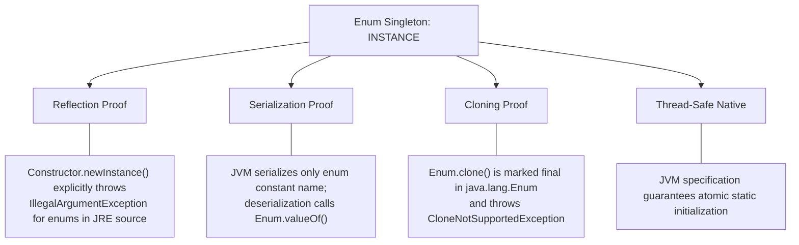

# 🛡️ Module 02: Breaking & Defending the Singleton Pattern

[🏠 Back to Master Guide](./README.md) &nbsp; | &nbsp; [Previous: ⚡ Concurrency & JMM](./01-DEEP_DIVE_CONCURRENCY_JMM.md) &nbsp; | &nbsp; [Next: 🏛️ SOLID & Distributed Reality](./03-SOLID_AND_ANTI_PATTERN_DEBATE.md)

---

## 🎯 Executive Overview

In senior-level interviews, candidates are evaluated on whether they can break assumptions. While standard classes with private constructors appear secure, there are **three major vectors** that can violate the single-instance invariant in standard Java:

1. **Reflection Attacks**
2. **Serialization Attacks**
3. **Cloning Attacks**

This guide explores the exact code exploits for each attack, the defense mechanisms for class-based singletons, and why **Joshua Bloch's Enum Singleton** is natively invulnerable.

---

## 💥 Attack Vector 1: The Java Reflection Attack

### The Exploit
Java Reflection allows callers to access private members and toggle constructor accessibility at runtime using `Constructor.setAccessible(true)`.

```java
// ⚠️ Attacker Code:
Constructor<Stage3BillPugh> constructor = Stage3BillPugh.class.getDeclaredConstructor();
constructor.setAccessible(true); // Bypasses 'private' access modifier!

Stage3BillPugh instance1 = Stage3BillPugh.getInstance();
Stage3BillPugh instance2 = constructor.newInstance(); // Second instance created in heap!

System.out.println(instance1 == instance2); // ❌ Evaluates to FALSE
```

### The Defense: Constructor State Guard
Inside the private constructor, check if an instance already exists in memory. If so, throw an `IllegalStateException`:

```java
public class SecureSingleton {
    private static volatile SecureSingleton instance;

    private SecureSingleton() {
        // 🛡️ Reflection Defense Guard
        if (instance != null) {
            throw new IllegalStateException("Security Violation: Instance already created. Use getInstance()!");
        }
    }

    public static SecureSingleton getInstance() {
        if (instance == null) {
            synchronized (SecureSingleton.class) {
                if (instance == null) instance = new SecureSingleton();
            }
        }
        return instance;
    }
}
```

---

## 💥 Attack Vector 2: The Serialization Attack

### The Exploit
When a Singleton class implements `Serializable`, serializing the instance to disk/network and deserializing it invokes Java's object stream reflection mechanism, which instantiates a **new object copy** without invoking the constructor.

```java
// 1. Serialize existing instance to a byte stream
ObjectOutput out = new ObjectOutputStream(new FileOutputStream("singleton.ser"));
out.writeObject(instance1);
out.close();

// 2. Deserialize from byte stream
ObjectInput in = new ObjectInputStream(new FileInputStream("singleton.ser"));
Stage3BillPugh instance2 = (Stage3BillPugh) in.readObject(); // Instantiates a NEW duplicate!
in.close();

System.out.println(instance1 == instance2); // ❌ Evaluates to FALSE
```

### The Defense: The `readResolve()` Hook
The JVM serialization mechanism provides a special lifecycle hook: `readResolve()`. When declared, the JVM discards the newly deserialized object and replaces it with the return value of `readResolve()`:

```java
public class SerializableSingleton implements Serializable {
    private static final long serialVersionUID = 1L;

    private SerializableSingleton() {}

    private static class Holder {
        private static final SerializableSingleton INSTANCE = new SerializableSingleton();
    }

    public static SerializableSingleton getInstance() {
        return Holder.INSTANCE;
    }

    // 🛡️ Serialization Defense: Return the cached singleton instance
    protected Object readResolve() {
        return getInstance();
    }
}
```

---

## 💥 Attack Vector 3: The Cloning Attack

### The Exploit
If a Singleton class extends a base class or library that implements `Cloneable`, invoking `super.clone()` performs a shallow bitwise copy of the object in heap memory, bypassing the constructor entirely.

```java
// ⚠️ Attacker invokes clone on an existing instance:
PaymentGateway clonedInstance = (PaymentGateway) instance1.clone(); // ❌ Creates duplicate instance!
```

### The Defense: Override `clone()` with Exception
Explicitly override `clone()` to throw `CloneNotSupportedException`:

```java
public class NonCloneableSingleton implements Cloneable {

    // 🛡️ Option A: Hard Exception (Recommended)
    @Override
    protected Object clone() throws CloneNotSupportedException {
        throw new CloneNotSupportedException("Singleton instances cannot be cloned.");
    }

    // 🛡️ Option B: Alternative (Return existing instance)
    // @Override
    // protected Object clone() {
    //     return getInstance();
    // }
}
```

---

## 👑 The Ultimate Defense: Enum Singleton (Joshua Bloch)

In *Effective Java* (Item 3), Joshua Bloch states:
> *"A single-element enum type is the best way to implement a singleton."*

```java
public enum Stage4EnumSingleton {
    INSTANCE;

    private final DatabaseConfig config = new DatabaseConfig();

    public void processTransaction(double amount) {
        System.out.println("Processing transaction of $" + amount);
    }
}
```

### Why Enums Are Mathematically Invulnerable:



---

## 🧹 Edge Case: Can a Singleton Be Garbage Collected?

* **Standard Applications:** **No**. A static variable is referenced by its `Class` object, which is referenced by the application `ClassLoader`. Since the ClassLoader is a **GC Root**, the singleton instance remains in memory for the lifetime of the application.
* **Modular Environments (Tomcat / OSGi):** When an entire web application is undeployed or an OSGi bundle is unloaded, the ClassLoader itself is dereferenced and destroyed, allowing its loaded classes and static singletons to be garbage collected as expected.

---

## 🔑 Key Takeaways for Interviews

1. Name the **3 attack vectors**: Reflection, Serialization, and Cloning.
2. Provide the 3 corresponding defenses: **Constructor Guard**, **`readResolve()` hook**, and **`CloneNotSupportedException`**.
3. State that the **Enum Singleton** natively prevents all 3 attacks with zero boilerplate.
