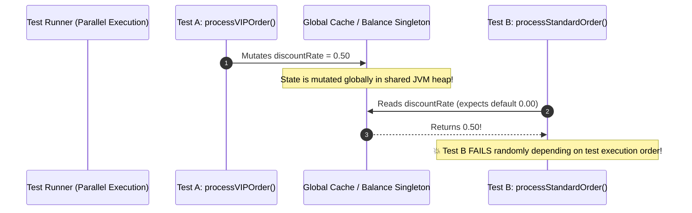

# 🏛️ Module 03: SOLID Violations, Anti-Patterns & Distributed Systems

[🏠 Back to Master Guide](./README.md) &nbsp; | &nbsp; [Previous: 🛡️ Breaking & Defending](./02-BREAKING_AND_DEFENDING_SINGLETON.md) &nbsp; | &nbsp; [Next: 🎙️ Interview Playbook](./04-INTERVIEW_PLAYBOOK_AND_ARTICULATION.md)

---

## 🎯 Executive Overview

In modern software engineering, the classic Singleton pattern is frequently characterized as an **Anti-Pattern**. Senior engineers and interviewers look beyond the mechanics of `getInstance()` to evaluate your understanding of **system architecture**, **testability**, and **distributed consistency**.

This document analyzes:
1. Why Singleton violates fundamental **SOLID principles**.
2. How hardcoded singletons cause **unit test pollution (state bleed)**.
3. How **Dependency Injection (DI)** solves these architectural issues.
4. The **Distributed System Boundary**: Why in-memory singletons fail in multi-pod Kubernetes clusters.

---

## 🧩 1. Singleton vs. SOLID Principles

```
                  ┌──────────────────────────────────────────────┐
                  │          The SOLID Architectural Paradox     │
                  └──────────────────────┬───────────────────────┘
                                         │
         ┌───────────────────────────────┼───────────────────────────────┐
         ▼                               ▼                               ▼
  ❌ SRP Violation                ❌ OCP Violation                ❌ DIP Violation
  Manages own lifecycle           Hardcodes concrete class;       Depends on concrete
  AND domain business logic.      cannot swap implementations.   class, not abstractions.
```

### Detailed Breakdown:
* **Single Responsibility Principle (SRP): ❌ Violates**
  A class should have only one reason to change. A classic Singleton manages both **its own lifecycle/access control** and **its core business logic**.
* **Open/Closed Principle (OCP): ❌ Violates**
  Direct calls like `PaymentGateway.getInstance()` couple clients to a concrete implementation. You cannot introduce a `MockPaymentGateway` or `StripeV2PaymentGateway` without modifying client source code.
* **Liskov Substitution Principle (LSP): ⚠️ Difficult**
  Because `getInstance()` is static, it cannot be overridden polymorphically in subclasses. Private constructors also make subclassing impossible.
* **Interface Segregation Principle (ISP): ✅ Unaffected**
  Singleton does not inherently force bloated interfaces on clients.
* **Dependency Inversion Principle (DIP): ❌ Violates**
  High-level business services depend directly on low-level concrete singletons rather than relying on injected abstract interfaces.

---

## 🧪 2. Unit Testing Hell & State Pollution

The primary practical failure of manual singletons in enterprise codebases is **Test Pollution**:



### ❌ The Problem: Tight Coupling to Global State
```java
public class OrderService {
    public void checkout(double amount) {
        // Untestable: Cannot mock Stripe, triggers real network/database call in test!
        StripePaymentGateway.getInstance().charge(amount);
    }
}
```

### ✅ The Solution: Interface-Based Constructor Injection
```java
// 1. Decouple via Interface
public interface PaymentGateway {
    void charge(double amount);
}

// 2. Concrete Singleton managed externally
public class StripePaymentGateway implements PaymentGateway {
    public void charge(double amount) { /* Real network call */ }
}

// 3. Service depends on abstraction
public class OrderService {
    private final PaymentGateway paymentGateway;

    public OrderService(PaymentGateway paymentGateway) { // Injected via constructor!
        this.paymentGateway = paymentGateway;
    }

    public void checkout(double amount) {
        paymentGateway.charge(amount);
    }
}
```

**Testing with Complete Isolation:**
```java
@Test
void testCheckoutSuccess() {
    PaymentGateway mockGateway = Mockito.mock(PaymentGateway.class);
    OrderService service = new OrderService(mockGateway); // Injects mock!
    service.checkout(100.0);
    Mockito.verify(mockGateway).charge(100.0); // Zero global state side-effects
}
```

---

## ⚖️ 3. Manual Singleton Pattern vs. Spring Container Singleton Scope

| Architectural Dimension | Manual Singleton Pattern (`getInstance()`) | Spring Container Singleton Scope (`@Bean` / `@Service`) |
|---|---|---|
| **Lifecycle Management** | Hardcoded internally within class | Managed externally by Spring `ApplicationContext` |
| **Constructor Visibility** | `private` | `public` (Enables straightforward mocking and instantiation) |
| **Storage Registry** | `private static` variable in Metaspace | `ConcurrentHashMap<String, Object>` in bean container |
| **Test Mockability** | ❌ Complex / Requires bytecode manipulation | ✅ Trivial (Pass Mockito mock via constructor) |
| **Scope Flexibility** | Strictly locked to 1 instance | Easily modified to `@Scope("prototype")` or `@Scope("request")` |

---

## 🌐 4. The Distributed Boundary Pitfall (JVM vs Multi-Pod Cluster)

> [!WARNING]
> **The Distributed Illusion:** An in-memory Singleton guarantees uniqueness **only within a single JVM process / container**.

In modern cloud-native architectures deployed on Kubernetes with 10 pods:

```
                               ┌────────────────────────────────┐
                               │     Load Balancer (Ingress)    │
                               └───────────────┬────────────────┘
                                               │
             ┌─────────────────────────────────┼─────────────────────────────────┐
             ▼                                 ▼                                 ▼
    ┌─────────────────┐               ┌─────────────────┐               ┌─────────────────┐
    │  Pod 1 (JVM 1)  │               │  Pod 2 (JVM 2)  │               │  Pod 3 (JVM 3)  │
    │ ┌─────────────┐ │               │ ┌─────────────┐ │               │ ┌─────────────┐ │
    │ │ Singleton A │ │               │ │ Singleton B │ │               │ │ Singleton C │ │
    │ └─────────────┘ │               │ └─────────────┘ │               │ └─────────────┘ │
    └─────────────────┘               └─────────────────┘               └─────────────────┘
```

If your singleton holds **mutable state** across requests:
* **Global Rate Limiter (e.g. 100 req/sec):** Each of the 10 pods allows 100 req/sec, allowing **1,000 req/sec** total and crashing downstream services.
* **Order Sequence Generator:** Multiple pods generate duplicate order sequence IDs, corrupting database records.

### System Decision Framework:

| System Component | In-Memory Singleton (JVM Scope) | Distributed Architecture (Cluster Scope) |
|---|:---:|:---:|
| **Immutable Application Config** | ✅ Optimal (Zero network overhead) | ❌ Unnecessary network hops |
| **Database Connection Pool (HikariCP)** | ✅ Optimal (Dedicated pool per container) | ❌ Database handles physical connections |
| **Cluster-Wide Rate Limiting** | ❌ Fails (Multiplies across pods) | ✅ **Redis + Lua Token Bucket** |
| **Cluster-Wide Sequence IDs** | ❌ Fails (Collisions across nodes) | ✅ **Twitter Snowflake / DB Sequence / UUIDv7** |
| **Leader-Only Scheduled Cron** | ❌ Fails (All pods execute task) | ✅ **ShedLock / Redis Redlock / ZooKeeper** |

---

## 🔑 Key Takeaways for Interviews

1. Articulate that **Singleton = Hidden Global State** which compromises testability and violates SRP/DIP.
2. Explain how **Dependency Injection** achieves the resource benefits of a single instance without the SOLID violations.
3. Clearly distinguish between **process-level uniqueness (JVM)** and **distributed cluster-level uniqueness (Kubernetes/Redis)**.
