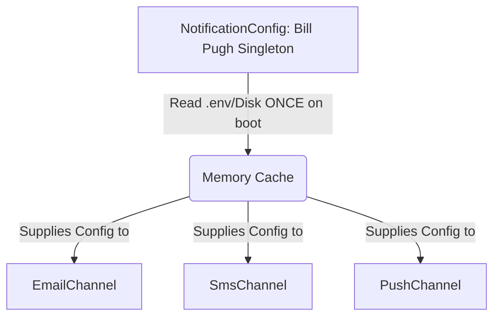

# 💼 Singleton Case Studies — In Production Systems

[🏠 Back to Master Guide](./README.md) &nbsp; | &nbsp; [Previous: 🌍 Cross-Language Patterns](./05-CROSS_LANGUAGE_PATTERNS.md) &nbsp; | &nbsp; [Java Code Benchmarks](./JAVA/README.md)

---

## 🎯 Executive Overview

This document illustrates how the Singleton pattern is composed inside larger, production-grade system architectures, frequently working in tandem with the **Object Pool** and **Factory Method** design patterns.

---

## 🏢 Case Study 1: Notification System Configuration Registry
**Source Code Reference:** [`07-Combined-Patterns/01-notification-system`](../../07-Combined-Patterns/01-notification-system/README.md)

### Architectural Composition:


**Role of Singleton:**
* Holds: `smtpHost`, `smsApiKey`, and `pushServiceUrl`.
* Consumed by: `EmailChannel`, `SmsChannel`, and `PushChannel`.
* Guarantees: Configuration parsing (disk I/O and JSON parsing) occurs **strictly once** across all channel types.

> [!TIP]
> **Key Interview Insight:** Singleton is not merely about having "one instance." It is about ensuring **one expensive initialization is shared across the entire system**. Reading configuration files from disk takes ~100ms; serving it from an in-memory singleton takes **0.0001ms**.

---
```
NotificationConfig (Bill Pugh Singleton)
  └── Holds: smtpHost, smsApiKey, pushServiceUrl
  └── Consumed by: EmailChannel, SmsChannel, PushChannel
  └── Ensures: Config is read from environment exactly ONCE across all 3 channel types
```

**The key insight for interviews:**
> The Singleton pattern is not just about "one instance." It's about **one expensive initialization shared across the system**. Config reading (disk/network) is expensive — that's exactly what Singleton is designed for.

**Patterns it works with:** Factory Method (factories are also singletons internally), Builder (channels use config during construction).

---

## Case Study 2: High-Performance Database Connection Pool (HikariCP Style)

**Role of Singleton here:**
```
DatabaseConnectionPool (Bill Pugh Singleton)
  ├── Holds: BlockingQueue<PooledConnection> (Max Pool Size = 10)
  ├── Factory Method: Creates physical TCP sockets ONCE on startup
  ├── Consumed by: 1,000+ Concurrent HTTP Worker Threads
  └── Ensures: High-cost TCP Handshake + TLS + Auth done ONCE on boot
```

### 🏛️ The System Architecture & Code

In production frameworks like Spring Boot, creating a physical TCP database connection takes ~100ms (TCP 3-way handshake + TLS negotiation + PostgreSQL auth). 

By wrapping the pool in a **Singleton**, the application initializes 10 connection sockets on startup **ONCE**. When 1,000 concurrent HTTP requests come in, worker threads acquire an existing connection in **0.001ms**, execute their SQL query, and return the connection to the pool.

```java
import java.util.concurrent.ArrayBlockingQueue;
import java.util.concurrent.BlockingQueue;
import java.util.concurrent.TimeUnit;

/**
 * 🏭 Case Study 2: High-Performance Singleton Database Connection Pool
 * Combined Patterns: Singleton (Access) + Object Pool (Leasing) + Factory Method (Creation)
 */
public class DatabaseConnectionPool {

    private static final int POOL_SIZE = 5;
    private final BlockingQueue<Connection> pool;

    // 🔒 Private Constructor: Initializes the TCP connections ONCE on boot
    private DatabaseConnectionPool() {
        System.out.println("🚀 [BOOT] Initializing DatabaseConnectionPool Singleton...");
        pool = new ArrayBlockingQueue<>(POOL_SIZE);
        for (int i = 1; i <= POOL_SIZE; i++) {
            pool.add(createPhysicalConnection("CONN-00" + i)); // Factory method
        }
        System.out.println("✅ [BOOT] Pre-warmed " + POOL_SIZE + " physical DB connections.");
    }

    // ⭐ Bill Pugh Singleton Holder: Thread-safe & Lock-Free lazy loading
    private static class PoolHolder {
        private static final DatabaseConnectionPool INSTANCE = new DatabaseConnectionPool();
    }

    public static DatabaseConnectionPool getInstance() {
        return PoolHolder.INSTANCE;
    }

    // 🛠️ Factory Method: Physical TCP Connection Creation
    private Connection createPhysicalConnection(String id) {
        return new Connection(id);
    }

    // 🟢 Lease Connection (Thread-safe blocking queue)
    public Connection acquireConnection(long timeoutMs) throws InterruptedException {
        Connection conn = pool.poll(timeoutMs, TimeUnit.MILLISECONDS);
        if (conn == null) {
            throw new RuntimeException("Timeout waiting for DB connection from pool!");
        }
        System.out.println("🔑 [LEASE] " + Thread.currentThread().getName() + " leased " + conn.getId());
        return conn;
    }

    // 🔴 Return Connection back to Pool
    public void releaseConnection(Connection conn) {
        if (conn != null) {
            pool.offer(conn);
            System.out.println("♻️ [RELEASE] " + conn.getId() + " returned to pool.");
        }
    }

    // Dummy Connection Object
    public static class Connection {
        private final String id;
        public Connection(String id) { this.id = id; }
        public String getId() { return id; }
        public void executeQuery(String sql) {
            System.out.println("   ⚡ Executing on [" + id + "]: " + sql);
        }
    }
}
```

---

### 🔑 The Key Insights for Interviews (FAANG / Tier-1 MNCs)

1. **Why Singleton + Object Pool?**
   * **Singleton** guarantees there is only **ONE connection pool** across the entire JVM. If 50 different services called `new DatabaseConnectionPool()`, you would create 50 separate pools, opening 500 TCP sockets and crashing the Database max connection limit!
   * **Object Pool** handles the concurrency leasing of connections (`acquireConnection()` / `releaseConnection()`).

2. **How HikariCP works in Spring Boot:**
   * Spring configures `HikariDataSource` as a **Singleton Bean**.
   * It uses `ArrayBlockingQueue` or lock-free `ConcurrentBag` internally to serve thousands of web requests with zero thread-blocking lock contention.

3. **Combined Patterns in this Case Study:**
   * **Singleton Pattern**: Guarantees a single global point of access to the pool.
   * **Factory Method Pattern**: Encapsulates the creation logic of individual `Connection` objects.
   * **Object Pool Pattern**: Manages acquiring, reusing, and releasing active connections.

---

---

## 📚 See Also
- [Individual Pattern README](../README.md)
- [Full Combined Patterns Index](../../07-Combined-Patterns/README.md)
