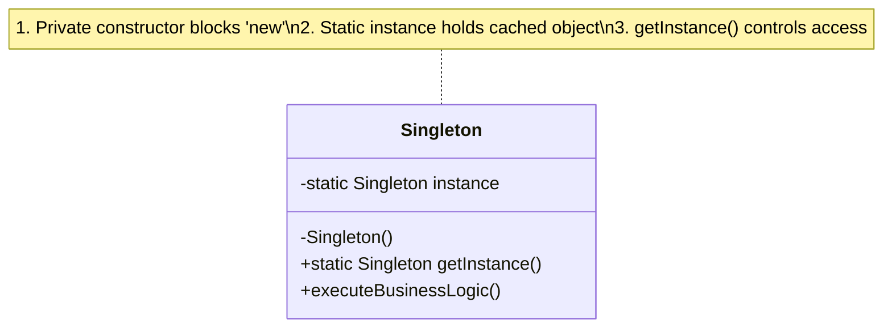
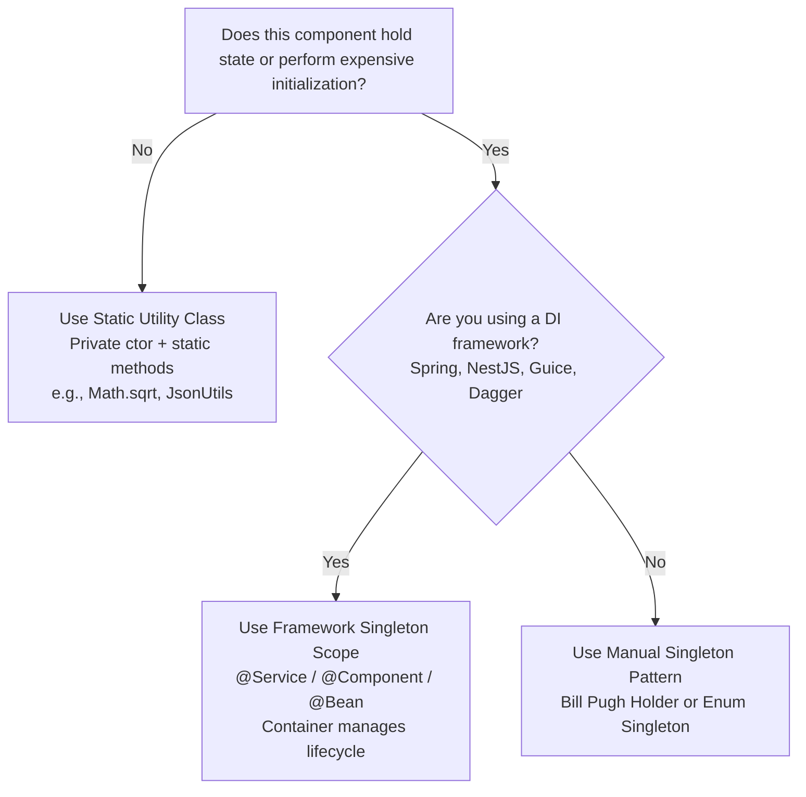
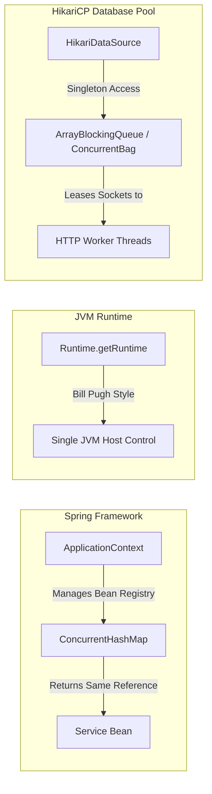

# 🔒 Singleton Design Pattern — The Architectural Master Guide

> **Authoritative Guide for Senior Engineers & Technical Interview Prep**  
> *A comprehensive deep-dive into object lifecycle guarantees, low-level JVM memory barriers, anti-pattern trade-offs, and production systems.*

---

## 📑 Table of Contents

1. [Executive Summary & Formal Invariant](#-executive-summary--formal-invariant)
2. [Mental Models for Fast Intuition](#-mental-models-for-fast-intuition)
3. [Architecture Decision Framework](#-architecture-decision-framework)
4. [The 4 Evolutionary Stages in Java](#-the-4-evolutionary-stages-in-java)
5. [Modular Deep-Dive Reading Tracks](#-modular-deep-dive-reading-tracks)
6. [L4/Senior Interview Articulation Flashcards](#-l4senior-interview-articulation-flashcards)
7. [Real-World Production Case Studies](#-real-world-production-case-studies)
8. [Cross-Repository Interlinking](#-cross-repository-interlinking)

---

## 🧭 Executive Summary & Formal Invariant

A **Singleton** is a creational design pattern that guarantees a class has **exactly one instance** in memory within a given process/ClassLoader lifecycle and provides a **single global point of access** to that instance.



### The Invariant (Must Always Hold)
```java
assert PaymentGateway.getInstance() == PaymentGateway.getInstance(); // Reference equality: MUST ALWAYS BE TRUE
```

---

## 🧠 Mental Models for Fast Intuition

```
  ┌───────────────────────────────────────────────┬───────────────────────────────────────────────┐
  │         1. The Kitchen Wall Clock             │        2. The Disk ConfigManager              │
  ├───────────────────────────────────────────────┼───────────────────────────────────────────────┤
  │ • Normal Objects (`new`): Cookies baked in an │ • Without Singleton: Calling `new Config()`   │
  │   oven. Every cookie has its own unique       │   re-reads `.env`/JSON from disk 1,000 times   │
  │   toppings, shape, and state.                 │   for 1,000 requests (~100ms penalty each).   │
  │ • Static Singleton: The Wall Clock. Exactly   │ • With Singleton: `getInstance()` parses the  │
  │   ONE clock is hung on the wall, shared by    │   file ONCE on boot and serves the cached     │
  │   every cookie and baker in the kitchen.      │   memory reference in 0.0001ms.               │
  └───────────────────────────────────────────────┴───────────────────────────────────────────────┘
```

---

## 🌳 Architecture Decision Framework

When deciding between a **Manual Singleton**, **Dependency Injection**, or a **Static Utility Class**, follow this decision flow:



---

## 🔬 The 4 Evolutionary Stages in Java

The table below traces the architectural evolution from naive implementation to production-grade resilience:

```
[ Stage 1a: Naive Lazy ] ──► [ Stage 1b: Synchronized ] ──► [ Stage 2: Double-Checked ] ──► [ Stage 3: Bill Pugh ] ──► [ Stage 4: Enum ]
   (❌ Race condition)           (❌ 100x bottleneck)          (✅ Needs volatile!)           (⭐ Lock-free & Clean)      (👑 100% Unhackable)
```

| Stage | Mechanism | Thread-Safe? | Read Overhead | Protection Against Attacks | Production Verdict |
|---|---|:---:|:---:|:---:|---|
| **1a. Naive Lazy** | `if (instance == null) instance = new()` | ❌ No | 🟢 Zero | ❌ Vulnerable | ❌ **Never use** (Race condition) |
| **1b. Synchronized** | `public static synchronized getInstance()` | ✅ Yes | 🔴 Extreme (every read locks) | ❌ Vulnerable | ❌ **Avoid** (Severe CPU bottleneck) |
| **2. Double-Checked** | Outer null check + `synchronized` + inner null check | ✅ Yes (with `volatile`) | 🟢 Zero (after boot) | ⚠️ Reflection/SerDe vulnerable | ⚠️ **Valid** (If dynamic parameters needed) |
| **3. Bill Pugh** | Static inner Holder class | ✅ Yes (ClassLoader) | 🟢 Zero (lock-free) | ⚠️ Reflection/SerDe vulnerable | ⭐ **Recommended** (Best class-based) |
| **4. Enum Singleton** | `public enum Singleton { INSTANCE; }` | ✅ Yes (JVM Spec) | 🟢 Zero | 👑 100% Unhackable | 👑 **Gold Standard** (Joshua Bloch) |

---

## 🗂️ Modular Deep-Dive Reading Tracks

For targeted preparation, navigate to the specialized deep-dive modules below:

```
                                  📂 SINGLETON MASTER VAULT
                                              │
         ┌───────────────────┬────────────────┼───────────────────┬───────────────────┐
         ▼                   ▼                ▼                   ▼                   ▼
   ⚡ [Module 01]       🛡️ [Module 02]    🏛️ [Module 03]      🎙️ [Module 04]     🌍 [Module 05]
    Concurrency &       Breaking &        SOLID Debate &       Interview          Cross-Language
      JMM Fences         Defenses        Distributed K8s       Playbook            Patterns
```

* ⚡ **[01. Concurrency, JMM & Memory Barriers](./01-DEEP_DIVE_CONCURRENCY_JMM.md)**:
  * Deconstructs the `1 -> 3 -> 2` CPU instruction reordering sequence.
  * Explains `StoreStore` / `StoreLoad` hardware memory barriers emitted by `volatile`.
  * Analyzes JVM ClassLoader atomicity under JLS §12.4.2.

* 🛡️ **[02. Breaking & Defending the Singleton](./02-BREAKING_AND_DEFENDING_SINGLETON.md)**:
  * Complete guide to breaking singletons via **Reflection**, **Serialization**, and **Cloning**.
  * Explains constructor guards, `readResolve()`, and `CloneNotSupportedException`.
  * Details why `java.lang.Enum` is natively immune to all three attacks.

* 🏛️ **[03. SOLID Violations, Anti-Patterns & Distributed Reality](./03-SOLID_AND_ANTI_PATTERN_DEBATE.md)**:
  * Why classic singletons violate SRP, OCP, and DIP.
  * How singletons cause unit test pollution and how Dependency Injection solves it.
  * **The Multi-Pod Kubernetes Trap:** In-memory singletons vs distributed state (Redis Lua / Redlock / ZooKeeper).

* 🎙️ **[04. L4/Senior Interview Playbook & Articulation](./04-INTERVIEW_PLAYBOOK_AND_ARTICULATION.md)**:
  * **5 Verbatim 30-Second Interview Scripts** for high-stakes hiring loops.
  * Rapid-fire 1-sentence FAANG answers and common interviewer traps.
  * Self-assessment candidate rubric.

* 🌍 **[05. Cross-Language Implementations](./05-CROSS_LANGUAGE_PATTERNS.md)**:
  * Modern C++11 **Meyers' Singleton** (Magic Statics with deleted copy/move operators).
  * Go idiomatic **`sync.Once`**.
  * TypeScript / Node.js **Promise Memoization** for async initialization.
  * Python thread-safe `__new__` with `threading.Lock`.

* 💼 **[Case Studies: In The Wild](./CASE_STUDY.md)**:
  * **HikariCP High-Performance DB Pool:** Singleton access + Object Pool leasing + Factory Method creation.
  * **Notification System Config:** Multi-channel configuration registry.

* ☕ **[Java Runnable Benchmarks](./JAVA/README.md)**:
  * Runnable multi-threaded Java test suite benchmarking all 4 stages.

---

## 🎙️ L4/Senior Interview Articulation Flashcards

> [!TIP]
> Deliver these concise, high-impact statements during your technical interviews to immediately signal Senior (L4/L5) proficiency.

```
┌───────────────────────────────────────────────┬───────────────────────────────────────────────┐
│ Question                                      │ 30-Second Verbatim Senior Articulation        │
├───────────────────────────────────────────────┼───────────────────────────────────────────────┤
│ "Why is volatile required in Double-Checked   │ 'Because object creation is not atomic. The   │
│  Locking?"                                    │  CPU decomposes it into: 1) allocate memory, │
│                                               │  2) run constructor, 3) publish reference.    │
│                                               │  Without volatile, out-of-order execution     │
│                                               │  can reorder this to 1 -> 3 -> 2, exposing an │
│                                               │  uninitialized object. volatile adds memory   │
│                                               │  barriers guaranteeing constructor completion │
│                                               │  happens-before reference publication.'       │
├───────────────────────────────────────────────┼───────────────────────────────────────────────┤
│ "How can you break a singleton, and how do   │ 'Via Reflection (setAccessible), Serialization│
│  you defend it?"                              │  (deserializing copies), and Cloning. We      │
│                                               │  defend using constructor state guards, the   │
│                                               │  readResolve() hook, and overriding clone().  │
│                                               │  Alternatively, an Enum Singleton natively     │
│                                               │  neutralizes all three by JVM specification.' │
├───────────────────────────────────────────────┼───────────────────────────────────────────────┤
│ "Why is Singleton considered an Anti-Pattern  │ 'It introduces hidden global state, violates  │
│  in modern software design?"                  │  SRP by coupling lifecycle with logic, and    │
│                                               │  breaks DIP by coupling callers to concrete   │
│                                               │  classes. This causes severe test pollution.  │
│                                               │  Modern systems use DI containers where beans │
│                                               │  have Singleton Scope and are injected via    │
│                                               │  interfaces.'                                 │
├───────────────────────────────────────────────┼───────────────────────────────────────────────┤
│ "How does a Singleton behave across multiple  │ 'An in-memory singleton only guarantees       │
│  Kubernetes Pods?"                            │  uniqueness within a single JVM process. In a │
│                                               │  cluster of 10 pods, 10 distinct singletons   │
│                                               │  exist. For cluster-wide state like rate      │
│                                               │  limits or cron locks, we must use distributed│
│                                               │  coordination via Redis or ZooKeeper.'        │
└───────────────────────────────────────────────┴───────────────────────────────────────────────┘
```

---

## 🏢 Real-World Production Case Studies



---

## 🔗 Cross-Repository Interlinking

* **[Dependency Inversion Principle (DIP)](../../00-SOLID_Principles/05-Dependency_Inversion/README.md)**: How to invert dependencies to decouple singleton implementations from caller code.
* **[Constructors & Object Lifecycle](../../00-Foundations/01-OOP_Basics/03-Constructors/README.md)**: Deep dive into private constructors and bytecode instantiation.
* **[Static & Access Modifiers](../../00-Foundations/01-OOP_Basics/04-Static_and_Access_Modifiers/README.md)**: Memory allocation difference between Heap and Metaspace static references.
* **[HLD Caching Architecture](../../../hld/04-Caching-Deep-Dive/01-Cache-Fundamentals.md)**: Transitioning from local single-node in-memory caches to distributed multi-node Redis clusters.

---

## 🧠 Tracker Integration

* **Trigger Phrases:** *"Only one instance allowed"*, *"Global access point to shared resource"*, *"Shared state manager across threads"*.
* **Confuses With:** 
  * **Static Utility Classes:** (Singletons are stateful objects implementing interfaces; static classes are stateless namespaces of functions).
  * **Dependency Injection Singleton Scope:** (DI manages the single instance externally; Pattern manages it internally).
* **Anti-Freeze Starter Code:** 
  ```java
  public class Manager {
      private static volatile Manager instance;
      private Manager() {}
      public static Manager getInstance() {
          if (instance == null) {
              synchronized (Manager.class) {
                  if (instance == null) instance = new Manager();
              }
          }
          return instance;
      }
  }
  ```
