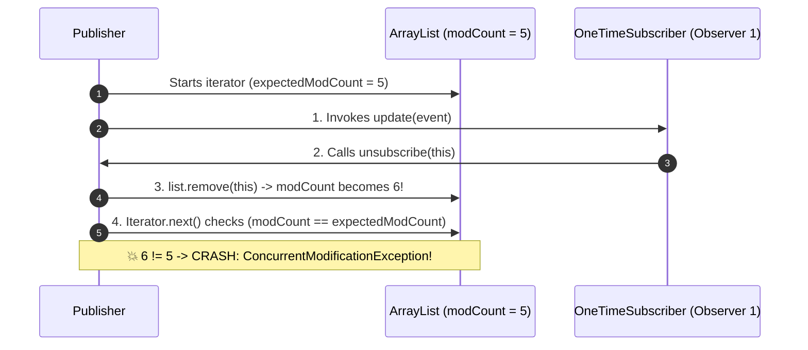

# ⚡ Module 01: Concurrency, Thread Safety & Failure Isolation in Observer

[🏠 Back to Master Guide](./README.md) &nbsp; | &nbsp; [Next: 🛡️ Memory Leaks & Lapsed Listener](./02-MEMORY_LEAKS_AND_LAPSED_LISTENER.md)

---

## 🎯 Executive Overview

In production systems, naive implementations of the Observer Pattern suffer from three catastrophic concurrency flaws:
1. **`ConcurrentModificationException` on Self-Unsubscription**: An observer unregisters itself during its own `update()` callback.
2. **Head-of-Line Blocking & Slow Observer Starvation**: One slow observer (e.g. 3-second SMTP email call) freezes the publisher and starves all other observers.
3. **Cascading Failure on Unhandled Exceptions**: If Observer 1 throws an unhandled `RuntimeException`, the notification loop terminates, and Observers 2 & 3 never receive the event.

This guide explores the low-level concurrency mechanics and production solutions for each problem.

---

## 💥 Flaw 1: The `ConcurrentModificationException` Trap

### The Root Cause:
If an observer is designed to receive only one event and immediately unsubscribe (e.g., a one-time OTP listener or single-shot task), calling `publisher.unsubscribe(this)` *inside* its `update()` method mutates the list while the publisher's `for-each` loop is active:

```java
// ❌ Publisher code:
public void notifyObservers(Event event) {
    for (Observer o : observers) { // Uses internal Iterator under the hood
        o.update(event);           // 💥 If observer calls unsubscribe(this), modCount changes!
    }                              // -> Throws ConcurrentModificationException!
}
```



---

### The 2 Production Solutions:

#### Solution A: Snapshot Copy on Notification (Iterate over Clone)
Take a snapshot of the list before beginning iteration:

```java
public class SnapshotPublisher implements Publisher {
    private final List<Observer> observers = new ArrayList<>();

    public synchronized void subscribe(Observer o) { observers.add(o); }
    public synchronized void unsubscribe(Observer o) { observers.remove(o); }

    public void notifyObservers(Event event) {
        List<Observer> snapshot;
        // 🔒 Synchronize ONLY during the snapshot copy, NOT during observer invocation!
        synchronized (this) {
            snapshot = new ArrayList<>(this.observers);
        }

        // Iterate over the immutable snapshot safely
        for (Observer o : snapshot) {
            o.update(event);
        }
    }
}
```

#### Solution B: `CopyOnWriteArrayList` (Lock-Free Read / Copy on Write)
Ideal when **reads vastly outnumber writes** (99% notifications, 1% subscriptions):

```java
import java.util.concurrent.CopyOnWriteArrayList;

public class CopyOnWritePublisher implements Publisher {
    // Lock-free reads; mutations create a fresh backing array copy
    private final List<Observer> observers = new CopyOnWriteArrayList<>();

    public void subscribe(Observer o) { observers.addIfAbsent(o); }
    public void unsubscribe(Observer o) { observers.remove(o); }

    public void notifyObservers(Event event) {
        // Safe lock-free iteration: Iterates over the array snapshot at loop entry time
        for (Observer o : observers) {
            o.update(event); // Safe even if observer calls unsubscribe(this)!
        }
    }
}
```

---

## 💥 Flaw 2: Head-of-Line Blocking & Slow Observer Starvation

### The Problem:
In a synchronous notification loop, execution is sequential. If `EmailObserver` takes 3 seconds to complete an HTTP/SMTP call, all downstream observers (`MobileAppObserver`, `LogisticsObserver`) are delayed by 3 seconds, and the main thread that triggered the state change is blocked.

```
       Synchronous Publisher Execution Timeline
══════════════════════════════════════════════════════════════════════════════► Time
[ State Change ] ──► [ EmailObserver: 3000ms ⏳ ] ──► [ MobileApp: 2ms ] ──► [ DB Log: 5ms ]
                      ▲
                      └─ 🔴 Entire application thread is frozen for 3+ seconds!
```

---

### The Production Solution: Asynchronous Worker Thread Pool

Decouple the notification dispatch from the execution of the observer logic using a bounded `ExecutorService` or `CompletableFuture`:

```java
import java.util.concurrent.ExecutorService;
import java.util.concurrent.Executors;
import java.util.concurrent.CopyOnWriteArrayList;

public class AsyncPublisher {
    private final List<Observer> observers = new CopyOnWriteArrayList<>();
    
    // Bounded thread pool for observer notifications
    private final ExecutorService executor = Executors.newFixedThreadPool(10);

    public void notifyObserversAsync(Event event) {
        for (Observer o : observers) {
            executor.submit(() -> {
                try {
                    o.update(event);
                } catch (Exception e) {
                    System.err.println("❌ Observer failed: " + e.getMessage());
                }
            });
        }
    }
}
```

---

## 💥 Flaw 3: Cascading Failure on Unhandled Exceptions

### The Problem:
If `Observer 1` throws a `NullPointerException` or unhandled `RuntimeException`, the unhandled exception propagates up the stack, immediately aborting the `for` loop. `Observer 2` and `Observer 3` **never receive the event**.

### The Production Solution: Fault-Isolated Notification Loop

```java
public void notifyObserversSafely(Event event) {
    for (Observer o : observers) {
        try {
            o.update(event);
        } catch (Throwable t) {
            // 🛡️ Fault Isolation: Log and continue so other observers still execute!
            System.err.println("⚠️ [Fault Isolation] Error executing observer " 
                + o.getClass().getSimpleName() + ": " + t.getMessage());
            // Optionally route to Dead Letter Queue / Metrics counter
        }
    }
}
```

---

## 📊 Summary: Thread-Safety Strategy Comparison

| Strategy | Memory Overhead | Notification Speed | Self-Unsubscribe Safe? | Best For |
|---|:---:|:---:|:---:|---|
| **Synchronous `ArrayList`** | 🟢 Lowest | 🔴 Slow (blocking) | ❌ Crashes with `CME` | Simple single-threaded scripts |
| **`synchronized` Snapshot Copy** | 🟡 Creates array per notify | 🟡 Medium | ✅ 100% Safe | Medium concurrency / balanced read-write |
| **`CopyOnWriteArrayList`** | 🟡 Creates array on sub/unsub | 🟢 Ultra Fast Reads | ✅ 100% Safe | High-frequency events with rare sub/unsub |
| **Async `ExecutorService` Pool** | 🔴 Thread pool memory | 🟢 Non-blocking fire-and-forget | ✅ 100% Safe | Slow observers (Email, Webhooks, Push) |

---

## 🔑 Key Takeaways for Interviews

1. Always highlight the **`ConcurrentModificationException` trap** when asked how to build a thread-safe observer list.
2. Articulate why **`CopyOnWriteArrayList`** is the standard Java collection for Observer pattern implementations.
3. Emphasize **Fault Isolation (`try-catch` inside the dispatch loop)** so a failing subscriber cannot crash the entire notification pipeline.
