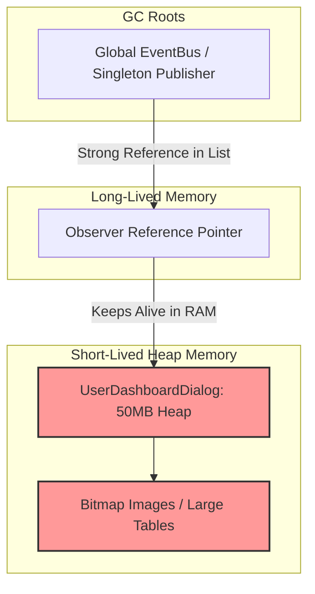

# 🛡️ Module 02: Memory Leaks & The Lapsed Listener Problem

[🏠 Back to Master Guide](./README.md) &nbsp; | &nbsp; [Previous: ⚡ Concurrency & Thread Safety](./01-CONCURRENCY_AND_THREAD_SAFETY.md) &nbsp; | &nbsp; [Next: 🧭 Push vs. Pull & Filtering](./03-PUSH_VS_PULL_AND_FILTERING.md)

---

## 🎯 Executive Overview

In garbage-collected runtimes (Java, C#, Go, JavaScript), one of the most common causes of **silent, catastrophic memory leaks** is the **Lapsed Listener Problem**.

This occurs when a **long-lived publisher** (e.g. a Singleton EventBus or Global Service) holds a **strong reference** to a **short-lived subscriber** (e.g. a UI Window, Dialog, or Web Request handler). Even when the user closes the window, the Garbage Collector cannot reclaim its memory because an active GC Root path exists through the Publisher.

---

## 🔬 1. The Anatomy of a Lapsed Listener Memory Leak



### The Scenario:
1. A user opens a temporary `OrderDetailsDialog` (which consumes 20 MB of RAM).
2. During initialization, the dialog subscribes: `GlobalStockMarket.getInstance().subscribe(this);`.
3. The user closes the dialog. The UI dereferences the dialog window (`dialog = null`).
4. **The Bug:** `GlobalStockMarket` still holds `this` inside its `List<StockObserver>`.
5. **Result:** The 20 MB dialog is **never garbage collected**. Opening and closing the dialog 50 times leaks 1 GB of RAM until the JVM crashes with `OutOfMemoryError: Java heap space`.

---

## 🛡️ 2. Defense Strategy 1: The `Subscription` Token Pattern (Explicit Cleanup)

Instead of a `void subscribe(Observer o)` method, return a **`Subscription`** or **`AutoCloseable`** token that encapsulates the unsubscription logic:

```java
public interface Subscription extends AutoCloseable {
    void unsubscribe();

    @Override
    default void close() {
        unsubscribe();
    }
}
```

### Publisher Implementation:
```java
public class EventBus {
    private final List<Observer> observers = new CopyOnWriteArrayList<>();

    public Subscription register(Observer observer) {
        observers.add(observer);
        // Returns a closure/lambda token to clean up
        return () -> observers.remove(observer);
    }
}
```

### Usage with Try-With-Resources:
```java
// Automatic cleanup when exiting scope!
try (Subscription sub = eventBus.register(new TemporaryReportObserver())) {
    runReportGeneration();
} // 🧼 sub.close() automatically called here — zero memory leak!
```

---

## 🛡️ 3. Defense Strategy 2: Weak References (`WeakHashMap` / `WeakReference`)

If subscribers cannot be trusted to reliably call `unsubscribe()`, the Publisher can hold **Weak References**.

* **Strong Reference (`Observer o`):** Prevents the Garbage Collector from freeing the object.
* **Weak Reference (`WeakReference<Observer>`):** Allows the Garbage Collector to reclaim the object as soon as no *other* strong references point to it.

```java
import java.lang.ref.WeakReference;
import java.util.Iterator;
import java.util.List;
import java.util.concurrent.CopyOnWriteArrayList;

public class WeakObserverPublisher {
    // Holds WeakReferences to observers
    private final List<WeakReference<Observer>> observerRefs = new CopyOnWriteArrayList<>();

    public void subscribe(Observer observer) {
        observerRefs.add(new WeakReference<>(observer));
    }

    public void notifyObservers(Event event) {
        Iterator<WeakReference<Observer>> iterator = observerRefs.iterator();
        while (iterator.hasNext()) {
            WeakReference<Observer> ref = iterator.next();
            Observer observer = ref.get(); // Retrieves referent if still alive
            
            if (observer != null) {
                observer.update(event);
            } else {
                // 🧹 Garbage collected! Clean up dead weak reference
                observerRefs.remove(ref);
            }
        }
    }
}
```

> [!NOTE]
> Alternatively, Java provides a concurrent weak set using:  
> `Set<Observer> observers = Collections.newSetFromMap(new ConcurrentHashMap<Observer, Boolean>());` with a weak key map.

---

## 🛡️ 4. Defense Strategy 3: Lifecycle-Bound Observers (Android / Frameworks)

In modern UI and component frameworks (e.g. Android `LiveData`, React `useEffect`, or RxJS `takeUntil`):
* Subscriptions are bound to a **Lifecycle Owner** (e.g. Component Mount/Unmount or Activity Pause/Destroy).
* The framework automatically invokes unsubscription when the lifecycle owner enters the `DESTROYED` state.

```typescript
// React useEffect auto-cleanup pattern
useEffect(() => {
    const subscription = stockMarket.subscribe((price) => setPrice(price));
    
    // Cleanup function: executed when component unmounts!
    return () => subscription.unsubscribe();
}, []);
```

---

## 📊 Summary: Memory Leak Defense Comparison

| Approach | Developer Responsibility | GC Safety | Performance Overhead | Best Use Case |
|---|:---:|:---:|:---:|---|
| **Manual `unsubscribe()`** | 🔴 High (Must remember) | ❌ High risk of leak | 🟢 None | Simple, predictable lifecycles |
| **`Subscription` Token** | 🟡 Medium (`AutoCloseable`) | 🟡 Moderate | 🟢 None | Scoped operations, Java 7+ `try-with-resources` |
| **`WeakReference` List** | 🟢 Zero (Automatic GC) | 🟢 100% Leak-Proof | 🟡 Minor `ref.get()` check | Long-lived Singleton global event buses |
| **Lifecycle-Bound Hook** | 🟢 Zero (Framework managed) | 🟢 100% Leak-Proof | 🟢 Negligible | UI components (Android / React / Vue) |

---

## 🔑 Key Takeaways for Interviews

1. Define the **Lapsed Listener Problem** clearly: *"When a long-lived publisher holds a strong reference preventing a short-lived subscriber from being garbage collected."*
2. Propose the **`Subscription` token** (`AutoCloseable`) for explicit lifecycle boundaries.
3. Propose **`WeakReference`** for global event buses to guarantee memory reclamation even if clients forget to unsubscribe.
