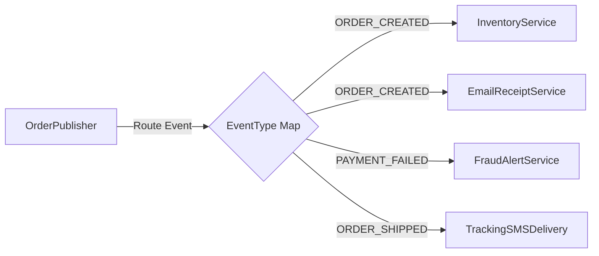

# 🧭 Module 03: Push vs. Pull Models & Topic Filtering

[🏠 Back to Master Guide](./README.md) &nbsp; | &nbsp; [Previous: 🛡️ Memory Leaks & Lapsed Listener](./02-MEMORY_LEAKS_AND_LAPSED_LISTENER.md) &nbsp; | &nbsp; [Next: 🌐 Distributed Pub/Sub & Scale](./04-DISTRIBUTED_PUBSUB_AND_SCALE.md)

---

## 🎯 Executive Overview

Two architectural decisions govern the communication contract of the Observer Pattern:
1. **Push vs. Pull Data Delivery**: Does the Publisher broadcast full event data, or does it merely send a lightweight notification ping, requiring Subscribers to query the data they need?
2. **Subscription Filtering (Topic-Based vs. Predicate-Based)**: How do we prevent every subscriber from being flooded with irrelevant events?

This guide evaluates the architectural trade-offs and code designs for both dimensions.

---

## ⚖️ 1. Push Model vs. Pull Model

```
                    ┌──────────────────────────────────────────────┐
                    │            Push Model vs. Pull Model         │
                    └──────────────────────┬───────────────────────┘
                                           │
             ┌─────────────────────────────┴─────────────────────────────┐
             ▼                                                           ▼
       【 PUSH MODEL 】                                            【 PULL MODEL 】
  Publisher passes full data payload                          Publisher passes only reference/ID;
  directly in update(payload).                                Subscriber calls publisher.getters().
```

### Comparative Trade-off Analysis:

| Architectural Dimension | Push Model (`update(Data payload)`) | Pull Model (`update(Publisher pub)`) |
|---|---|---|
| **Data Coupling** | 🟢 Low (Subscriber does not depend on Publisher class) | 🔴 High (Subscriber depends on Publisher interface/getters) |
| **Network & CPU Efficiency** | 🔴 Low if payload is heavy and observers only need 1 field | 🟢 High (Observers pull only the specific fields they require) |
| **Interface Brittleness** | 🔴 High (Adding new fields changes method signature) | 🟢 Low (Getters can be added to Publisher without breaking interface) |
| **Best Used When** | Lightweight event payloads (e.g. `price: 150.0`, `status: SHIPPED`) | Large, complex state objects (e.g. 50MB Game World State or Video Frame) |

---

### Code Comparison:

#### Push Model Implementation:
```java
// Observer receives data directly
public interface OrderObserver {
    void onOrderStatusChanged(String orderId, String newStatus, long timestamp);
}
```

#### Pull Model Implementation:
```java
// Observer receives a reference to the Subject and queries what it needs
public interface OrderObserver {
    void onOrderUpdated(OrderSubject subject);
}

public class EmailNotificationService implements OrderObserver {
    @Override
    public void onOrderUpdated(OrderSubject subject) {
        // Pulls only the email address and status, ignoring tracking numbers or billing history
        String email = subject.getCustomerEmail();
        String status = subject.getStatus();
        sendEmail(email, "Your order is now " + status);
    }
}
```

---

## 🎯 2. Topic-Based Subscription Routing

In enterprise systems, broadcasting every event to a single global list creates severe CPU overhead. **Topic-Based Routing** organizes subscribers by event category using a `Map<EventType, List<Observer>>`:



### Production Implementation:
```java
import java.util.*;
import java.util.concurrent.*;

public class TopicEventBus {
    public enum EventType { ORDER_CREATED, PAYMENT_FAILED, ORDER_SHIPPED }

    // Map each EventType to its own thread-safe subscriber list
    private final Map<EventType, List<Observer>> topicSubscribers = new ConcurrentHashMap<>();

    public void subscribe(EventType type, Observer observer) {
        topicSubscribers.computeIfAbsent(type, k -> new CopyOnWriteArrayList<>()).add(observer);
    }

    public void unsubscribe(EventType type, Observer observer) {
        List<Observer> subs = topicSubscribers.get(type);
        if (subs != null) subs.remove(observer);
    }

    public void publish(EventType type, Object data) {
        List<Observer> subs = topicSubscribers.get(type);
        if (subs != null) {
            for (Observer s : subs) {
                s.update(type, data);
            }
        }
    }
}
```

---

## 🔍 3. Predicate-Based (Filter) Subscriptions

Subscribers can register with a **`Predicate<Event>`** so notifications only fire when specific business conditions are satisfied:

```java
import java.util.List;
import java.util.concurrent.CopyOnWriteArrayList;
import java.util.function.Predicate;

public class FilteredStockPublisher {
    private record SubscriptionEntry(StockObserver observer, Predicate<Double> filter) {}

    private final List<SubscriptionEntry> subscriptions = new CopyOnWriteArrayList<>();

    // Subscribe with a custom price predicate (e.g. price > $500.0)
    public void subscribe(StockObserver observer, Predicate<Double> priceCondition) {
        subscriptions.add(new SubscriptionEntry(observer, priceCondition));
    }

    public void onPriceChange(double newPrice) {
        for (SubscriptionEntry sub : subscriptions) {
            if (sub.filter().test(newPrice)) { // Evaluates filter before invoking update!
                sub.observer().onPriceAlert(newPrice);
            }
        }
    }
}
```

---

## ⚠️ 4. Re-Entrancy & Cyclic Loop Prevention

### The Bug:
If `Observer A`'s `update()` method triggers a state change on `Publisher B`, which in turn triggers a state change on `Publisher A`, the system enters an **infinite recursive loop**, resulting in `StackOverflowError`.

```
[ Publisher A ] ──► notifies ──► [ Observer B ]
      ▲                                │
      └────── mutates state of ────────┘  (💥 Infinite Recursion!)
```

### The Solution: Re-entrancy Guards / Event Queues
1. **ThreadLocal Re-entrancy Flag:** Prevent the publisher from re-notifying if a notification is already in-flight on the same thread.
2. **Event Queue / Message Loop:** Rather than invoking observers synchronously, enqueue events into an internal `BlockingQueue` processed sequentially by a single event loop thread.

---

## 🔑 Key Takeaways for Interviews

1. Articulate the **Push vs. Pull trade-off**: Push minimizes coupling to the Publisher; Pull avoids transmitting heavy payloads when observers need only a few fields.
2. Demonstrate how to implement **Topic-Based Routing** using `ConcurrentHashMap<EventType, List<Observer>>`.
3. Mention **Re-entrancy guards** when asked about cascading event storms and recursive notification loops.
