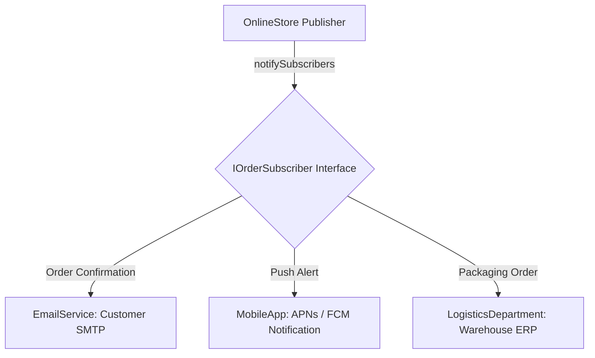
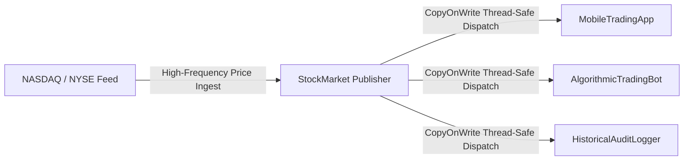

# 💼 Observer Case Studies — In Production Systems

[🏠 Back to Master Guide](./README.md) &nbsp; | &nbsp; [Previous: 🌍 Cross-Language Patterns](./06-CROSS_LANGUAGE_PATTERNS.md) &nbsp; | &nbsp; [Java Code Benchmarks](./JAVA/README.md)

---

## 🎯 Executive Overview

This document illustrates how the Observer pattern functions inside production systems across two primary architectures:
1. **Case Study 1:** E-Commerce Order Lifecycle Notification Dispatcher.
2. **Case Study 2:** High-Throughput Thread-Safe Real-Time Stock Market Ticker.

---

## 🏢 Case Study 1: E-Commerce Order Lifecycle Notification Dispatcher



### Problem Statement:
When a customer completes a payment, multiple independent downstream systems must react immediately:
* The customer needs an **email receipt**.
* The mobile app needs a **push notification**.
* The warehouse needs to **print packing slips**.

### The Architecture:
* **`IOrderPublisher`:** Declares registration and notification contracts.
* **`OnlineStore` (Publisher):** Holds an in-memory list of subscribers. When order status transitions from `PAYMENT_PENDING` to `PAYMENT_SUCCESS`, it iterates through all registered subscribers.
* **Decoupling Benefit:** Adding a new `FraudDetectionSubscriber` or `AnalyticsSubscriber` requires **zero code changes** to `OnlineStore` (**Open/Closed Principle**).

---

## 🏢 Case Study 2: High-Throughput Thread-Safe Stock Market Ticker



### Production Implementation (Java):
```java
package publisher;

import subscriber.StockObserver;
import java.util.List;
import java.util.concurrent.CopyOnWriteArrayList;

public class StockMarket implements StockPublisher {
    private final String ticker;
    private double price;
    
    // ⭐ Thread-safe collection allows lock-free high-frequency reads
    private final List<StockObserver> observers = new CopyOnWriteArrayList<>();

    public StockMarket(String ticker, double initialPrice) {
        this.ticker = ticker;
        this.price = initialPrice;
    }

    @Override
    public void register(StockObserver o) { 
        observers.addIfAbsent(o); 
    }

    @Override
    public void unregister(StockObserver o) { 
        observers.remove(o); 
    }

    @Override
    public void notifyObservers() {
        for (StockObserver o : observers) {
            try {
                o.onPriceChange(ticker, price);
            } catch (Exception e) {
                System.err.println("Error notifying observer: " + e.getMessage());
            }
        }
    }

    public void updatePrice(double newPrice) {
        this.price = newPrice;
        notifyObservers();
    }
}
```

### Why `CopyOnWriteArrayList` in High-Frequency Trading:
1. Price updates occur thousands of times per second (heavy read traffic on the subscriber list).
2. Users subscribe and unsubscribe infrequently (rare write traffic).
3. `CopyOnWriteArrayList` ensures that calling `unregister()` while an iteration is in flight will **never** throw a `ConcurrentModificationException`.
