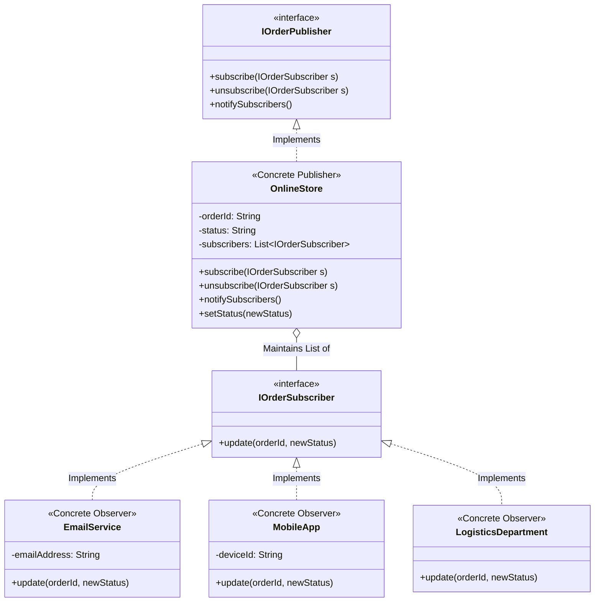
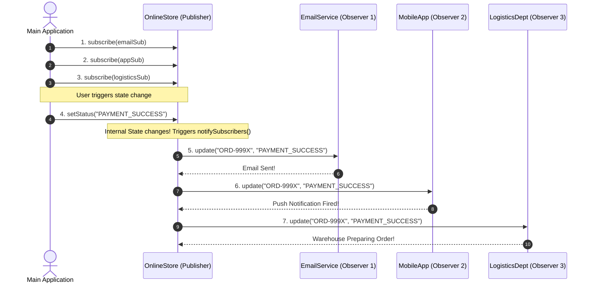

# 📡 Observer Pattern — Java Implementation Guide

## 📁 Clean Package Structure

```
JAVA/
├── Main.java                          ← Master Integration Demo (Run this)
├── publisher/                         ← Publisher (Subject) Package
│   ├── IOrderPublisher.java           ← E-Commerce Subject Interface
│   ├── OnlineStore.java               ← Concrete E-Commerce Publisher
│   ├── StockPublisher.java            ← Stock Ticker Subject Interface
│   └── StockMarket.java               ← SDE-2 Thread-Safe Stock Publisher
└── subscriber/                        ← Subscriber (Observer) Package
    ├── IOrderSubscriber.java          ← E-Commerce Observer Interface
    ├── EmailService.java              ← Subscriber 1: Email Notifications
    ├── MobileApp.java                 ← Subscriber 2: Push Notifications
    ├── LogisticsDepartment.java       ← Subscriber 3: Warehouse Tracking
    └── StockObserver.java             ← Subscriber 4: Stock Price Observer
```

---

## 📐 Architectural UML Diagrams

### 1. Class UML Diagram (Static Relationships)



---

### 2. Sequence UML Diagram (Runtime Execution Flow)



---

## ▶️ How to Compile & Run

Navigate to the `JAVA/` directory and run:

```bash
cd "03-Behavioral/02-Observer Design Pattern/JAVA/"
javac publisher/*.java subscriber/*.java Main.java
java Main
```

---

## 🧠 Core Java & OOP Concepts Deep Dive

### 1. The `final` Reference Keyword (`private final List<IOrderSubscriber> subscribers;`)
* **Unshakable Reference Pointer:** The `final` keyword means the `subscribers` variable reference can **never be re-assigned** to a new list object (e.g. `this.subscribers = new ArrayList<>()` is prohibited after construction).
* **Mutable Collection Contents:** The pointer is locked, but the items *inside* the list can still be added/removed (`subscribers.add(...)`, `subscribers.remove(...)`) as observers subscribe and unsubscribe dynamically.

---

### 2. Polymorphism via Interface Lists (`List<IOrderSubscriber>`)
* **The Power Strip Metaphor:** `IOrderSubscriber` is a common interface contract (`void update(...)`).
* `List<IOrderSubscriber>` acts like a **Power Strip**. Because `EmailService`, `MobileApp`, and `LogisticsDepartment` all implement `IOrderSubscriber`, Java allows all 3 completely different classes to sit together in the exact same list!
```java
// All 3 different classes fit into the exact same List<IOrderSubscriber>
subscribers.add(new EmailService("alice@example.com"));
subscribers.add(new MobileApp("iPhone_14"));
subscribers.add(new LogisticsDepartment());
```
* **Open/Closed Principle (OCP):** The `OnlineStore` publisher can notify 100 different subscriber types without modifying a single line of `OnlineStore.java`.

---

### 3. Constructor & `this` Keyword Scoping
* **Constructor (`public OnlineStore(String orderId)`):** Special initialization block that executes when `new OnlineStore(...)` is called.
* **The `this` Keyword:** Points explicitly to *the current object instance*.
  * `this.orderId` ➔ Refers to the class field on the current instance.
  * `orderId` ➔ Refers to the incoming constructor parameter string.
  * `this.orderId = orderId;` ➔ Assigns the parameter value to the instance variable.

---

### 4. Memory Management: Java Garbage Collection vs. C++ Destructors
* **No Manual Destructors in Java:** Unlike C++ where developers write explicit destructors (`~OnlineStore()`), Java manages memory automatically using an **Automatic Garbage Collector (GC)**.
* **Object Lifecycle:** When an `OnlineStore` or subscriber object is no longer referenced in code (e.g. `store = null`), the Garbage Collector automatically reclaims its RAM memory.
* **External Resource Cleanup:** For active database connections or open files, Java uses `AutoCloseable` and `close()` methods with `try-with-resources` blocks.

---

## 💡 Good to Know & Production Best Practices

### 1. Deprecated `java.util.Observer` & Modern Replacements
* **Legacy Trap:** Java historically provided `java.util.Observer` and `java.util.Observable`. **These were DEPRECATED in Java 9!**
  * *Why?* `Observable` was a class (not an interface), breaking composition (`extends Observable` consumed a class inheritance slot!). It was also not thread-safe.
* **Modern Standard Java Replacement:** 
  1. **`java.util.concurrent.Flow` API (Java 9+ Reactive Streams):** Uses `Flow.Publisher`, `Flow.Subscriber`, `Flow.Subscription`, and `Flow.Processor`.
  2. **`java.beans.PropertyChangeListener` & `PropertyChangeSupport`:** Standard bean event handling.

### 2. Real-World Enterprise Framework Implementations
* **Spring Framework:** `@EventListener` and `ApplicationEventPublisher` (In-memory Spring event bus).
* **Android Development:** `LiveData`, RxJava (`Observable.subscribe()`), and Kotlin `StateFlow` / `SharedFlow`.
* **Distributed Microservices:** Kafka Consumer Groups, RabbitMQ Topic Exchanges, Redis Pub/Sub, AWS SNS Topics.

### 3. Critical Production Pitfalls & Anti-Patterns
* ⚠️ **The Slow Observer Blocking Problem:** In synchronous `notifySubscribers()`, if `EmailService` blocks for 5 seconds waiting for a network SMTP response, all downstream observers (`MobileApp`, `LogisticsDepartment`) are frozen!
  * *Fix:* Execute notifications asynchronously using a Thread Pool (`ExecutorService`) or Spring `@Async`.
* ⚠️ **Re-Entrant Notification Infinite Loop:** If an Observer's `update()` method calls `publisher.setStatus()`, it re-triggers `notifySubscribers()`, causing an infinite recursion crash (`StackOverflowError`).
* ⚠️ **Order Non-Determinism:** Never write code that assumes Observer A will always execute before Observer B. Subscriber execution order should always be treated as arbitrary.

### 4. Hybrid Design Pattern: Singleton + Observer (Global Event Bus)
* **The Multi-Instance Bug:** If a Publisher is instantiated using `new OnlineStore()` in multiple places, Subscriber A might subscribe to `instance1`, while state changes happen on `instance2`. Subscriber A will never receive notifications!
* **The Solution:** In central event managers (like Spring's `ApplicationEventPublisher` or global event buses), the **Publisher is made a Thread-Safe Singleton**. This guarantees that all subscribers listen to a single global **Source of Truth**.


---

## 🎯 What This Codebase Demonstrates

1. **Decoupled One-to-Many Communication:** Publishers emit state updates without hardcoding concrete subscriber dependencies (**Open/Closed Principle**).
2. **Dynamic Subscription Management:** Register and unregister subscribers at runtime via `subscribe()` and `unsubscribe()`.
3. **Thread Safety under Concurrency:** Uses `CopyOnWriteArrayList` in `StockMarket.java` to prevent `ConcurrentModificationException` during high-frequency concurrent price updates.
