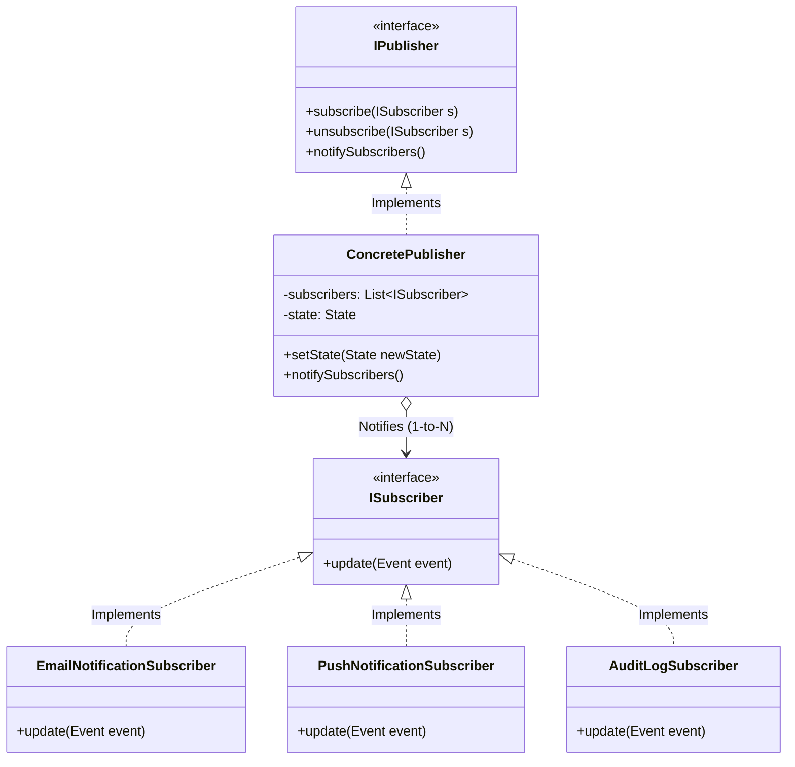
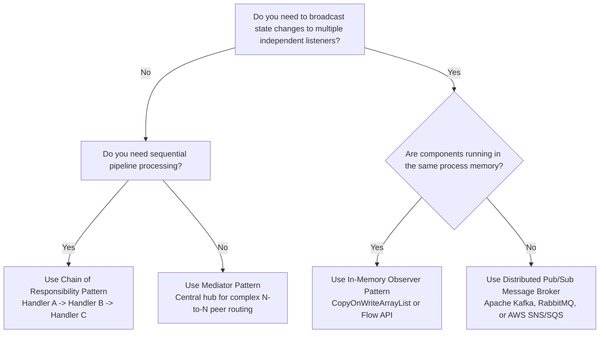

# 📡 Observer Design Pattern — The Architectural Master Guide

> **Authoritative Guide for Senior Engineers & Technical Interview Prep**  
> *A comprehensive deep-dive into event-driven architecture, thread-safe dispatching, memory leak prevention (Lapsed Listener), and distributed scale.*

---

## 📑 Table of Contents

1. [Executive Summary & Core Intent](#-executive-summary--core-intent)
2. [Mental Models for Fast Intuition](#-mental-models-for-fast-intuition)
3. [Architecture Blueprint & Class Hierarchy](#-architecture-blueprint--class-hierarchy)
4. [Architecture Decision Framework](#-architecture-decision-framework)
5. [Modular Deep-Dive Reading Tracks](#-modular-deep-dive-reading-tracks)
6. [L4/Senior Interview Articulation Flashcards](#-l4senior-interview-articulation-flashcards)
7. [Cross-Repository Interlinking](#-cross-repository-interlinking)

---

## 🧭 Executive Summary & Core Intent

The **Observer Pattern** is a behavioral design pattern that defines a **one-to-many dependency** between objects so that when one object (the **Publisher / Subject**) changes state, all its registered dependents (the **Subscribers / Observers**) are notified and updated automatically without tight coupling.



---

## 🧠 Mental Models for Fast Intuition

```
  ┌───────────────────────────────────────────────┬───────────────────────────────────────────────┐
  │      1. The YouTube Subscribe + Bell Icon     │       2. The Amazon Restock Notification      │
  ├───────────────────────────────────────────────┼───────────────────────────────────────────────┤
  │ • Polling (Anti-Pattern): Refreshing a        │ • Polling (Anti-Pattern): 10,000 users hitting│
  │   creator's channel every 5 minutes to see if │   the product page every second to check if   │
  │   a video dropped (wastes CPU/DB).            │   stock > 0 (crashes database).               │
  │ • Observer (Event-Driven): You click          │ • Observer (Event-Driven): Users register     │
  │   "Subscribe". When a video is published,     │   email in a notification list. When stock is │
  │   YouTube pushes alerts to all subscribers.   │   restocked, the system fires 10,000 emails.  │
  └───────────────────────────────────────────────┴───────────────────────────────────────────────┘
```

---

## 🌳 Architecture Decision Framework



---

## 🗂️ Modular Deep-Dive Reading Tracks

For targeted interview prep and production mastery, navigate to the specialized sub-modules below:

```
                                  📂 OBSERVER MASTER VAULT
                                              │
         ┌───────────────────┬────────────────┼───────────────────┬───────────────────┐
         ▼                   ▼                ▼                   ▼                   ▼
   ⚡ [Module 01]       🛡️ [Module 02]    🧭 [Module 03]      🌐 [Module 04]     🎙️ [Module 05]
    Concurrency &       Memory Leaks &    Push vs Pull &      Distributed PubSub  Interview
     Thread Safety     Lapsed Listener      Filtering         Kafka & Scale       Playbook
```

* ⚡ **[01. Concurrency, Thread Safety & Failure Isolation](./01-CONCURRENCY_AND_THREAD_SAFETY.md)**:
  * Deconstructs the `ConcurrentModificationException` caused by self-unsubscription.
  * Explains lock-free iteration via `CopyOnWriteArrayList` and snapshot cloning.
  * Details **Asynchronous Worker Thread Pools** to eliminate Head-of-Line blocking.

* 🛡️ **[02. Memory Leaks & The Lapsed Listener Problem](./02-MEMORY_LEAKS_AND_LAPSED_LISTENER.md)**:
  * Why long-lived publishers leak memory by holding strong references to short-lived UI dialogs.
  * Explains `WeakReference<Observer>` and concurrent weak sets.
  * Implements the **`Subscription` / `AutoCloseable` Token pattern** for clean lifecycle cleanup.

* 🧭 **[03. Push vs. Pull Models & Topic Filtering](./03-PUSH_VS_PULL_AND_FILTERING.md)**:
  * Full trade-off matrix: Push (low coupling, heavy payload) vs. Pull (high coupling, selective fetch).
  * **Topic-Based Routing** via `ConcurrentHashMap<EventType, List<Observer>>`.
  * Guarding against cyclic re-entrancy infinite loops.

* 🌐 **[04. Distributed Pub/Sub, Messaging & Scale](./04-DISTRIBUTED_PUBSUB_AND_SCALE.md)**:
  * Scaling from in-memory observer lists to **Apache Kafka, RabbitMQ, and Redis Pub/Sub**.
  * Partition keys and FIFO ordering guarantees.
  * **Reactive Streams Backpressure** (`Flow.Subscription.request(n)`) and Idempotent Consumers.

* 🎙️ **[05. L4/Senior Interview Playbook & Articulation](./05-INTERVIEW_PLAYBOOK_AND_ARTICULATION.md)**:
  * **5 Verbatim 30-Second Interview Scripts** for high-stakes hiring loops.
  * Rapid-fire 1-sentence FAANG answers and common interviewer traps.
  * Candidate self-assessment rubric.

* 🌍 **[06. Cross-Language Implementations](./06-CROSS_LANGUAGE_PATTERNS.md)**:
  * Modern C++17/20 using `std::weak_ptr` and `std::function`.
  * Go channels and concurrent goroutine fan-out.
  * TypeScript / Node.js `EventEmitter` and `AbortController` signal cleanup.
  * Python `weakref.WeakSet`.

* 💼 **[Case Studies: Production Systems](./CASE_STUDY.md)**:
  * **E-Commerce Order Notification System:** Multichannel order status dispatching.
  * **High-Throughput Stock Market Ticker:** High-frequency thread-safe price broadcast.

* ☕ **[Java Runnable Source Code](./JAVA/README.md)**:
  * Runnable multi-threaded Java demo files.

---

## 🎙️ L4/Senior Interview Articulation Flashcards

> [!TIP]
> Deliver these concise, high-impact statements during your technical interviews to immediately signal Senior (L4/L5) proficiency.

```
┌───────────────────────────────────────────────┬───────────────────────────────────────────────┐
│ Question                                      │ 30-Second Verbatim Senior Articulation        │
├───────────────────────────────────────────────┼───────────────────────────────────────────────┤
│ "What is the Lapsed Listener problem, and how │ 'It is a silent memory leak where a long-lived│
│  do you prevent it?"                          │  publisher holds a strong reference to a      │
│                                               │  short-lived subscriber, preventing GC. We    │
│                                               │  prevent it by returning an AutoCloseable     │
│                                               │  Subscription token, or storing WeakReference │
│                                               │  pointers inside the publisher list.'         │
├───────────────────────────────────────────────┼───────────────────────────────────────────────┤
│ "What concurrency bugs occur in naive         │ 'If an observer unsubscribes inside its own   │
│  observer loops?"                             │  callback, a ConcurrentModificationException  │
│                                               │  is thrown. In Java, we use                   │
│                                               │  CopyOnWriteArrayList for lock-free snapshot  │
│                                               │  iteration, and isolate callbacks in try-catch│
│                                               │  blocks so one failure does not abort others.'│
├───────────────────────────────────────────────┼───────────────────────────────────────────────┤
│ "How do you prevent slow observers from       │ 'In synchronous loops, a slow observer freezes│
│  blocking the publisher?"                     │  the publisher thread. We decouple dispatching│
│                                               │  by submitting notification tasks to a bounded│
│                                               │  ExecutorService thread pool for non-blocking │
│                                               │  fire-and-forget execution.'                  │
├───────────────────────────────────────────────┼───────────────────────────────────────────────┤
│ "How does Observer scale to distributed       │ 'In distributed systems, the pattern evolves  │
│  microservices?"                              │  into message brokers like Kafka. We use      │
│                                               │  partition keys to preserve FIFO ordering,    │
│                                               │  implement Reactive Streams backpressure to   │
│                                               │  control consumer flow, and enforce idempotent│
│                                               │  subscribers to handle at-least-once retries.'│
└───────────────────────────────────────────────┴───────────────────────────────────────────────┘
```

---

## 🔗 Cross-Repository Interlinking

* **[Open/Closed Principle (OCP)](../../00-SOLID_Principles/02-Open_Closed/README.md)**: Adding new subscribers requires zero code modification to existing publisher classes.
* **[Single Responsibility Principle (SRP)](../../00-SOLID_Principles/01-Single_Responsibility/README.md)**: Decouples core state management from notification dispatching.
* **[Singleton Design Pattern](../../01-Creational/06-Singleton%20Design%20Pattern/README.md)**: Frequently combined with Observer to build a **Global Event Bus**.
* **[Kafka vs. RabbitMQ Architecture](../../../hld/06-Message-Queues/08-Kafka-vs-RabbitMQ.md)**: Scaling in-memory observer lists into durable distributed partitions.
* **[Transactional Outbox Pattern](../../06-Addons/08-Transactional-Outbox/README.md)**: Reliability pattern for publishing database state changes to external event streams.

---

## 🧠 Tracker Integration

* **Trigger Phrases:** *"Notify multiple listeners on state change"*, *"Event-driven architecture"*, *"One-to-many decoupled broadcasting"*.
* **Confuses With:** 
  * **Mediator:** (Observer is one-to-many where publisher doesn't know listeners; Mediator is many-to-many through a central hub).
  * **Chain of Responsibility:** (Observer broadcasts to all listeners at once; CoR passes sequentially along a pipeline).
* **Anti-Freeze Starter Code:** 
  ```java
  public interface Observer { void update(Event event); }
  public class Subject {
      private final List<Observer> observers = new CopyOnWriteArrayList<>();
      public void subscribe(Observer o) { observers.addIfAbsent(o); }
      public void notify(Event event) { observers.forEach(o -> o.update(event)); }
  }
  ```
