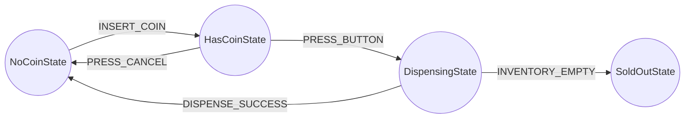

# 🧭 Module 02: Transition Management & State Tables

[🏠 Back to Master Guide](./README.md) &nbsp; | &nbsp; [Previous: ⚡ Concurrency & Atomic Transitions](./01-CONCURRENCY_AND_ATOMIC_TRANSITIONS.md) &nbsp; | &nbsp; [Next: ⚖️ State vs. Strategy vs. Command](./03-STATE_VS_STRATEGY_VS_COMMAND.md)

---

## 🎯 Executive Overview

One of the most heavily debated architectural questions in the **State Pattern** is:
> **"Who should be responsible for deciding and triggering state transitions?"**

There are **3 distinct architectural strategies**:
1. **Concrete States Manage Transitions** (Classic GoF).
2. **Context Manages Transitions** (Centralized).
3. **Transition Table Matrix / State Graph** (Senior Enterprise Architecture).

---

## 🥊 1. Comparison of the 3 Transition Strategies

```
                               ┌────────────────────────────────────────────────────────┐
                               │             The 3 State Transition Strategies          │
                               └───────────────────────────┬────────────────────────────┘
                                                           │
              ┌────────────────────────────────────────────┼────────────────────────────────────────────┐
              ▼                                            ▼                                            ▼
  【 1. State Subclasses Manage 】               【 2. Context Manages 】                     【 3. Transition Table Matrix 】
  • States instantiate next state.              • States return status; Context swaps state. • Decoupled graph: `(State, Event) -> NextState`.
  • High cohesion per state.                    • States are decoupled from each other.       • 100% data-driven; visualized via table.
  • Drawback: Circular class dependencies.      • Drawback: Context gets bloated if-else.    • ⭐ **Senior Standard for FSMs**.
```

---

## 🏛️ 2. Strategy 3: The State Transition Table Matrix (The Senior Standard)

Instead of hardcoding state transitions inside Java class logic, define an immutable **Transition Matrix**:



### Complete Java Implementation:

```java
import java.util.Map;
import java.util.Objects;
import java.util.concurrent.ConcurrentHashMap;

public class TransitionTableStateMachine {

    public enum State { NO_COIN, HAS_COIN, DISPENSING, SOLD_OUT }
    public enum Event { INSERT_COIN, PRESS_CANCEL, PRESS_BUTTON, DISPENSE_SUCCESS, OUT_OF_STOCK }

    private record TransitionKey(State fromState, Event event) {}

    // Immutable Transition Graph
    private static final Map<TransitionKey, State> transitionTable = new ConcurrentHashMap<>();

    static {
        transitionTable.put(new TransitionKey(State.NO_COIN, Event.INSERT_COIN), State.HAS_COIN);
        transitionTable.put(new TransitionKey(State.HAS_COIN, Event.PRESS_CANCEL), State.NO_COIN);
        transitionTable.put(new TransitionKey(State.HAS_COIN, Event.PRESS_BUTTON), State.DISPENSING);
        transitionTable.put(new TransitionKey(State.DISPENSING, Event.DISPENSE_SUCCESS), State.NO_COIN);
        transitionTable.put(new TransitionKey(State.DISPENSING, Event.OUT_OF_STOCK), State.SOLD_OUT);
    }

    private State currentState = State.NO_COIN;

    public synchronized void fireEvent(Event event) {
        TransitionKey key = new TransitionKey(currentState, event);
        State nextState = transitionTable.get(key);

        if (nextState == null) {
            throw new IllegalStateException("❌ Invalid State Transition: Cannot fire " + event + " while in " + currentState);
        }

        System.out.println("🔄 Transition: " + currentState + " ──(" + event + ")──► " + nextState);
        this.currentState = nextState;
    }
}
```

### Why the Transition Matrix Wins in Large Systems:
1. **Zero Circular Class Dependencies:** State classes do not need to know about or import other State classes.
2. **Deterministic & Graphable:** You can export the transition table directly to a Mermaid or Graphviz diagram.
3. **Guaranteed Illegal Transition Defense:** If an event is not in the map for the current state, it throws an `IllegalStateException` immediately.

---

## ⚡ 3. Java Enum-Based State Machine (Clean & High-Performance)

For state machines where state logic is compact, Java Enums with **abstract methods** provide an elegant, type-safe, and singleton-backed implementation:

```java
public enum OrderState {
    PENDING {
        @Override
        public OrderState next(OrderContext ctx) {
            System.out.println("Processing payment...");
            return PAID;
        }
    },
    PAID {
        @Override
        public OrderState next(OrderContext ctx) {
            System.out.println("Shipping order...");
            return SHIPPED;
        }
    },
    SHIPPED {
        @Override
        public OrderState next(OrderContext ctx) {
            System.out.println("Order already delivered.");
            return this;
        }
    };

    public abstract OrderState next(OrderContext ctx);
}
```

---

## 🔑 Key Takeaways for Interviews

1. Articulate the **3 transition approaches**: State-managed, Context-managed, and Transition Table.
2. Defend the **Transition Table Matrix** as the most scalable design because it eliminates circular class coupling and enforces strict transition validation.
3. Mention **Enum State Machines** as an optimal pattern when state instances are stateless Singletons.
