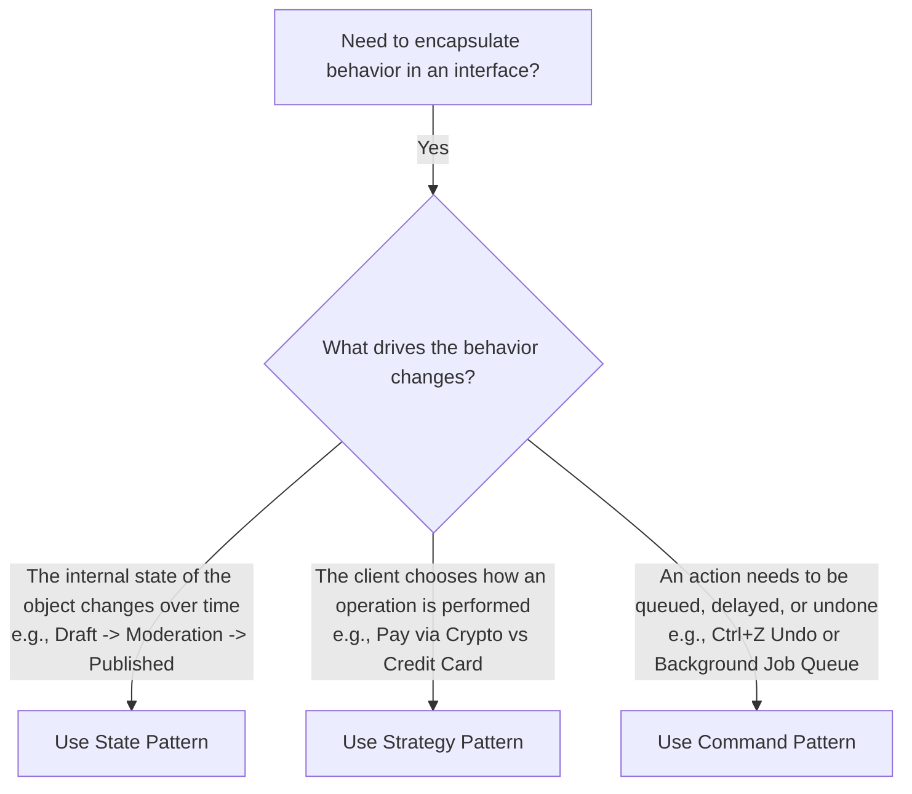

# ⚖️ Module 03: State vs. Strategy vs. Command

[🏠 Back to Master Guide](./README.md) &nbsp; | &nbsp; [Previous: 🧭 Transition Management](./02-TRANSITION_MANAGEMENT_AND_STATE_TABLES.md) &nbsp; | &nbsp; [Next: 🌐 Distributed FSM & Temporal](./04-DISTRIBUTED_FSM_AND_TEMPORAL.md)

---

## 🎯 Executive Overview

Because **State**, **Strategy**, and **Command** all rely on **composition and delegation to a single interface**, candidates frequently confuse them in design interviews.

This guide provides a definitive architectural comparison matrix and mental hooks to distinguish them.

---

## 🥊 1. The Behavioral Triad Comparison

```
  ┌─────────────────────────────┬─────────────────────────────┬─────────────────────────────┐
  │            State            │          Strategy           │           Command           │
  ├─────────────────────────────┼─────────────────────────────┼─────────────────────────────┤
  │ • Object **changes its      │ • Client **swaps an         │ • Encapsulates **an action  │
  │   behavior dynamically as   │   algorithm** independently │   with its parameters as a  │
  │   internal state changes**. │   from the context.         │   standalone object**.      │
  │ • States **know about each  │ • Strategies **know nothing │ • Commands can be **queued, │
  │   other** and drive         │   about each other**; pure  │   scheduled, logged, and    │
  │   state transitions.        │   isolated algorithms.      │   undone via undo()**.      │
  │ • Context state changes     │ • Injected once by client   │ • Passed to an invoker or   │
  │   automatically from within.│   during setup.             │   worker queue.             │
  └─────────────────────────────┴─────────────────────────────┴─────────────────────────────┘
```

---

## 📐 2. Structural & Behavioral Comparison Matrix

| Architectural Dimension | State Pattern | Strategy Pattern | Command Pattern |
|---|---|---|---|
| **Primary Intent** | Alter behavior when internal state changes (FSM) | Swap algorithms dynamically without modifying client | Encapsulate request as object for queuing & undo |
| **Who Drives Changes?** | States or Context internally at runtime | Client configures strategy from the outside | Client/Invoker executes command on demand |
| **Inter-Class Coupling** | States often reference other states or transition keys | Strategies are 100% independent and isolated | Commands know their Receiver; Invoker only knows Command |
| **Lifecycle** | Multi-state continuous evolution ($S_1 \rightarrow S_2 \rightarrow S_3$) | Single execution per algorithm | Enqueued, executed, stored in undo history |
| **Real Example** | Vending Machine, Order Lifecycle, TCP States | Payment Mode (Stripe/PayPal), Sorting Algorithms | Undo/Redo Stacks, Async Task Workers, Sagas |

---

## 🌳 3. Architectural Decision Framework



---

## 🔑 Key Takeaways for Interviews

1. If asked: *"How is State different from Strategy?"*, your hook is:  
   **"Strategy is configured by the client from the outside to swap HOW something is done; State changes automatically from the inside as the object evolves over time."**
2. If asked: *"How does State relate to Command?"*, your hook is:  
   **"A Command can act as the Event that triggers a transition in a State Machine."**
