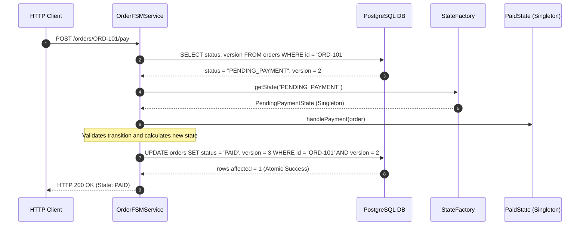

# 🌐 Module 04: Distributed State Machines & Temporal Workflows

[🏠 Back to Master Guide](./README.md) &nbsp; | &nbsp; [Previous: ⚖️ State vs. Strategy vs. Command](./03-STATE_VS_STRATEGY_VS_COMMAND.md) &nbsp; | &nbsp; [Next: 🎙️ Interview Playbook](./05-INTERVIEW_PLAYBOOK_AND_ARTICULATION.md)

---

## 🎯 Executive Overview

In cloud-native microservices, state machines cannot live solely in JVM heap memory. If a server pod restarts or crashes midway through an order lifecycle, an in-memory state pointer is lost forever.

This module deconstructs how the **State Pattern** evolves in distributed enterprise systems:
1. **Stateless Microservice FSM Pattern** (Database State + Spring Factory).
2. **Spring State Machine Framework**.
3. **Temporal.io / Cadence Durable Execution Workflows**.

---

## 💾 1. The Stateless Microservice FSM Architecture

In production REST/gRPC backends:
1. The **Context state string** (`"PENDING_PAYMENT"`) is persisted in PostgreSQL.
2. When an HTTP event arrives, the service loads the state string from the database.
3. A **State Factory** injects the corresponding stateless **State Singleton** to execute the transition.
4. The new state is persisted back to PostgreSQL with **Optimistic Locking (`version++`)**.

---

## ⏳ 2. Temporal.io / Cadence: Long-Running Durable Workflows

For state machines that take days or weeks to complete (e.g., a 30-day SaaS trial or a multi-step mortgage approval):
* **Temporal.io** stores the complete execution event history in a durable cluster.
* If a worker pod crashes while in `UnderwritingState`, a new worker pod wakes up, reads the event history, and automatically resumes execution in the exact same state with zero state loss.

---

## 🔑 Key Takeaways for Interviews

1. Articulate that **in-memory state machines are unsuitable for multi-pod distributed systems** without persistent state backends.
2. Explain the **Stateless FSM pattern**: load state from DB $\rightarrow$ resolve State Singleton via Factory $\rightarrow$ execute transition $\rightarrow$ save back with optimistic locking.
3. Cite **Temporal.io / Cadence** as modern workflow orchestration engines for durable, long-running state machines.
