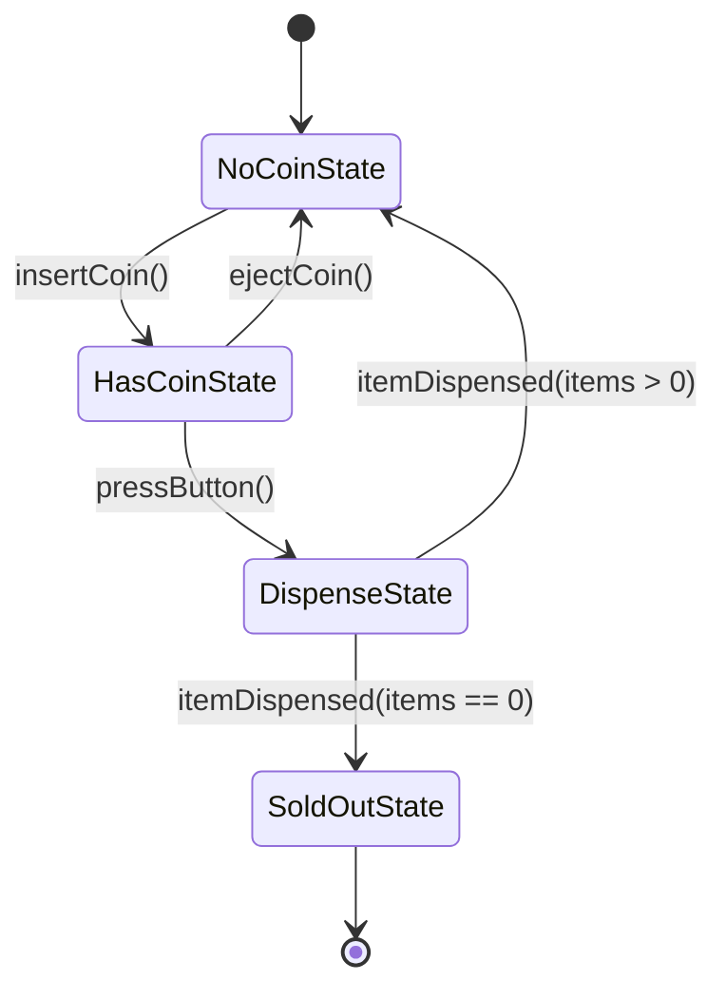
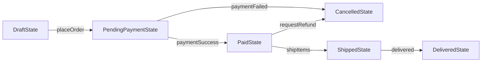

# 💼 State Pattern Case Studies — In Production Systems

[🏠 Back to Master Guide](./README.md) &nbsp; | &nbsp; [Previous: 🌍 Cross-Language Patterns](./06-CROSS_LANGUAGE_PATTERNS.md) &nbsp; | &nbsp; [Java Code Benchmarks](./JAVA/README.md)

---

## 🎯 Executive Overview

This document presents two production-grade architectures utilizing the **State Pattern**:
1. **Case Study 1:** High-Concurrency Vending Machine Finite State Machine.
2. **Case Study 2:** E-Commerce Order Fulfillment Lifecycle.

---

## 🏢 Case Study 1: High-Concurrency Vending Machine State Machine



### Complete Java Implementation:

```java
// 1. State Interface
public interface VendingMachineState {
    void insertCoin(VendingMachine machine, double amount);
    void ejectCoin(VendingMachine machine);
    void pressButton(VendingMachine machine);
    void dispense(VendingMachine machine);
}

// 2. Concrete State: NoCoinState (Stateless Singleton)
public class NoCoinState implements VendingMachineState {
    public static final NoCoinState INSTANCE = new NoCoinState();
    private NoCoinState() {}

    @Override
    public void insertCoin(VendingMachine machine, double amount) {
        System.out.println("🪙 Coin inserted: $" + amount);
        machine.setBalance(amount);
        machine.setState(HasCoinState.INSTANCE);
    }

    @Override
    public void ejectCoin(VendingMachine machine) {
        System.out.println("⚠️ No coin to eject.");
    }

    @Override
    public void pressButton(VendingMachine machine) {
        System.out.println("⚠️ Please insert a coin first.");
    }

    @Override
    public void dispense(VendingMachine machine) {
        System.out.println("⚠️ Payment required.");
    }
}

// 3. Concrete State: HasCoinState
public class HasCoinState implements VendingMachineState {
    public static final HasCoinState INSTANCE = new HasCoinState();
    private HasCoinState() {}

    @Override
    public void insertCoin(VendingMachine machine, double amount) {
        System.out.println("🪙 Additional coin inserted: $" + amount);
        machine.setBalance(machine.getBalance() + amount);
    }

    @Override
    public void ejectCoin(VendingMachine machine) {
        System.out.println("↩️ Refunding $" + machine.getBalance());
        machine.setBalance(0);
        machine.setState(NoCoinState.INSTANCE);
    }

    @Override
    public void pressButton(VendingMachine machine) {
        System.out.println("⚡ Button pressed. Verifying inventory...");
        machine.setState(DispenseState.INSTANCE);
        machine.dispense();
    }

    @Override
    public void dispense(VendingMachine machine) {
        System.out.println("⚠️ Press the button to dispense.");
    }
}

// 4. Concrete State: DispenseState
public class DispenseState implements VendingMachineState {
    public static final DispenseState INSTANCE = new DispenseState();
    private DispenseState() {}

    @Override
    public void insertCoin(VendingMachine machine, double amount) {
        System.out.println("⏳ Please wait, currently dispensing.");
    }

    @Override
    public void ejectCoin(VendingMachine machine) {
        System.out.println("⚠️ Cannot refund while dispensing.");
    }

    @Override
    public void pressButton(VendingMachine machine) {
        System.out.println("⏳ Already processing selection.");
    }

    @Override
    public void dispense(VendingMachine machine) {
        machine.decrementInventory();
        System.out.println("🥤 Item dispensed! Enjoy your drink.");
        machine.setBalance(0);
        
        if (machine.getInventoryCount() > 0) {
            machine.setState(NoCoinState.INSTANCE);
        } else {
            System.out.println("🛑 Machine is now SOLD OUT.");
            machine.setState(SoldOutState.INSTANCE);
        }
    }
}
```

---

## 🏢 Case Study 2: E-Commerce Order Fulfillment Lifecycle



### Production Insight:
* State transitions enforce **strict business rules** (e.g. an order cannot transition from `ShippedState` to `DraftState`).
* Each state encapsulates allowed actions while throwing `IllegalStateException` on disallowed operations.
