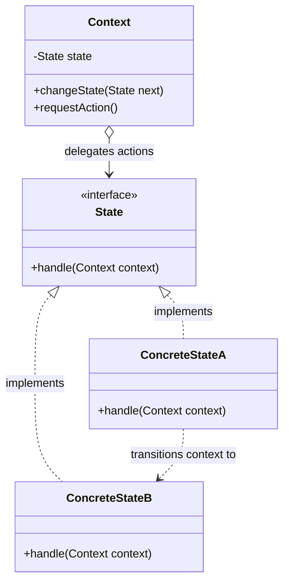
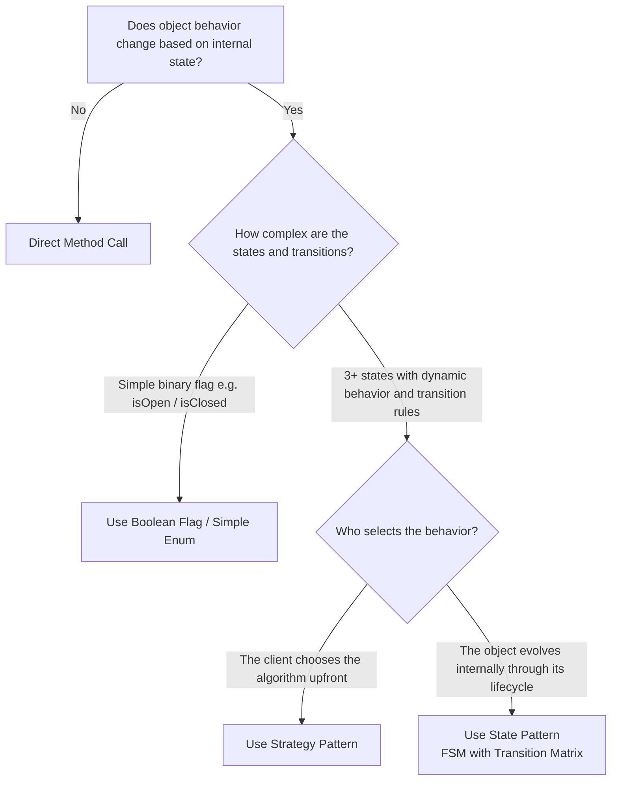

# 🚦 State Design Pattern — The Architectural Master Guide

> **Authoritative Guide for Senior Engineers & Technical Interview Prep**  
> *A comprehensive deep-dive into Finite State Machines (FSM), atomic lock-free transitions, transition matrices, and distributed microservice workflows.*

---

## 📑 Table of Contents

1. [Executive Summary & Core Intent](#-executive-summary--core-intent)
2. [Mental Models for Fast Intuition](#-mental-models-for-fast-intuition)
3. [Architecture Blueprint & Class Hierarchy](#-architecture-blueprint--class-hierarchy)
4. [Architecture Decision Framework](#-architecture-decision-framework)
5. [Modular Deep-Dive Reading Tracks](#-modular-deep-dive-reading-tracks)
6. [L4/Senior Interview Articulation Flashcards](#-l4senior-interview-articulation-flashcards)
7. [Cross-Repository Interlinking](#-cross-repository-interlinking)

---

## 🧭 Executive Summary & Core Intent

The **State Pattern** is a behavioral design pattern that allows an object (the **Context**) to alter its behavior when its internal state changes, making it appear as if the object changed its class.

It is the object-oriented realization of a **Finite State Machine (FSM)**. It replaces fragile, multi-thousand-line `switch(status)` and `if-else` blocks with cohesive, independent state classes, enforcing strict compile-time and runtime transition rules.



---

## 🧠 Mental Models for Fast Intuition

```
  ┌───────────────────────────────────────────────┬───────────────────────────────────────────────┐
  │           1. The Smartphone Screen            │             2. The Vending Machine            │
  ├───────────────────────────────────────────────┼───────────────────────────────────────────────┤
  │ Clicking the Power Button does completely     │ Pushing the "Dispense" button when:           │
  │ different things depending on state:          │ • `NoCoinState`: Displays "Insert Coin".      │
  │ • Screen is OFF: Turns screen ON.             │ • `HasCoinState`: Drops soda & resets state.  │
  │ • Screen is ON (Locked): Shows Lockscreen PIN.│ • `SoldOutState`: Displays "Out of Stock".    │
  │ • Screen is ON (Unlocked): Turns screen OFF.  │ The machine has NO nested IF statements—the   │
  │ Same button click ➔ completely different logic!│ state object controls behavior dynamically!   │
  └───────────────────────────────────────────────┴───────────────────────────────────────────────┘
```

---

## 🌳 Architecture Decision Framework



---

## 🗂️ Modular Deep-Dive Reading Tracks

For targeted interview prep and production mastery, navigate to the specialized sub-modules below:

```
                                    📂 STATE PATTERN MASTER VAULT
                                                 │
         ┌───────────────────┬───────────────────┼───────────────────┬───────────────────┐
         ▼                   ▼                   ▼                   ▼                   ▼
   ⚡ [Module 01]       🧭 [Module 02]       ⚖️ [Module 03]      🌐 [Module 04]     🎙️ [Module 05]
    Atomic Concurrency   Transition Matrix   State vs Strategy   Distributed FSM    Interview
    & Lock-Free CAS      & Enum FSM Tables     & Command         & Temporal DB       Playbook
```

* ⚡ **[01. Concurrency, Thread Safety & Atomic State Transitions](./01-CONCURRENCY_AND_ATOMIC_TRANSITIONS.md)**:
  * Multi-threaded race conditions during concurrent state transitions.
  * Lock-free atomic state machines using **`AtomicReference<State>` and CAS loops**.
  * Reentrant action synchronization and database optimistic locking (`version++`).

* 🧭 **[02. Transition Management & State Tables](./02-TRANSITION_MANAGEMENT_AND_STATE_TABLES.md)**:
  * Who manages transitions: State subclasses vs. Context vs. **Transition Matrix**.
  * Eliminating circular class dependencies using `Map<Pair<State, Event>, State>`.
  * High-performance Java Enum state machines with abstract methods.

* ⚖️ **[03. State vs. Strategy vs. Command](./03-STATE_VS_STRATEGY_VS_COMMAND.md)**:
  * Definitive comparison matrix on intent, lifecycle evolution, and coupling.
  * Why Strategy is configured from the outside, while State transitions from within.

* 🌐 **[04. Distributed State Machines & Temporal Workflows](./04-DISTRIBUTED_FSM_AND_TEMPORAL.md)**:
  * The **Stateless Microservice FSM Pattern** with database persistence.
  * Spring State Machine framework integration.
  * Long-running durable execution workflows with Temporal.io / Cadence.

* 🎙️ **[05. L4/Senior Interview Playbook & Articulation](./05-INTERVIEW_PLAYBOOK_AND_ARTICULATION.md)**:
  * **5 Verbatim 30-Second Interview Scripts** for high-stakes hiring loops.
  * Rapid-fire 1-sentence FAANG answers and common interviewer traps.
  * Candidate self-assessment rubric.

* 🌍 **[06. Cross-Language Implementations](./06-CROSS_LANGUAGE_PATTERNS.md)**:
  * C++ `std::unique_ptr` with `std::weak_ptr` cycle breaking, Go atomic state pointers, TypeScript discriminated union FSMs.

* 💼 **[Case Studies: Production Systems](./CASE_STUDY.md)**:
  * **High-Concurrency Vending Machine State Controller**.
  * **E-Commerce Order Fulfillment Lifecycle Engine**.

* ☕ **[Java Runnable Source Code](./JAVA/README.md)**:
  * Complete runnable Java demonstration suite.

---

## 🎙️ L4/Senior Interview Articulation Flashcards

> [!TIP]
> Deliver these concise, high-impact statements during your technical interviews to immediately signal Senior (L4/L5) proficiency.

```
┌───────────────────────────────────────────────┬───────────────────────────────────────────────┐
│ Question                                      │ 30-Second Verbatim Senior Articulation        │
├───────────────────────────────────────────────┼───────────────────────────────────────────────┤
│ "Why is the State Pattern preferred over      │ 'Switch statements violate OCP and SRP because│
│  switch-case state machines?"                 │  adding a new state forces changes across     │
│                                               │  every method in the context. State Pattern   │
│                                               │  encapsulates state logic into independent    │
│                                               │  classes, eliminating branching entirely.'    │
├───────────────────────────────────────────────┼───────────────────────────────────────────────┤
│ "How do you handle race conditions during     │ 'For in-memory state machines, we use         │
│  state transitions?"                          │  AtomicReference<State> with CAS loops for    │
│                                               │  lock-free atomic transitions. In distributed │
│                                               │  systems, we use database optimistic locking  │
│                                               │  with version numbers (version = version + 1).'│
├───────────────────────────────────────────────┼───────────────────────────────────────────────┤
│ "Who should manage state transitions?"        │ 'In senior architectures, a Transition Table  │
│                                               │  Matrix (Map<Pair<State, Event>, NextState>)  │
│                                               │  is preferred because it eliminates circular  │
│                                               │  dependencies and enforces deterministic FSM  │
│                                               │  validation with zero if-else branching.'     │
├───────────────────────────────────────────────┼───────────────────────────────────────────────┤
│ "What is the difference between State and     │ 'In Strategy, the client configures the       │
│  Strategy?"                                   │  algorithm from the outside; in State, the    │
│                                               │  object transitions automatically from within │
│                                               │  as it evolves through its lifecycle.'        │
└───────────────────────────────────────────────┴───────────────────────────────────────────────┘
```

---

## 🔗 Cross-Repository Interlinking

* **[Single Responsibility Principle (SRP)](../../00-SOLID_Principles/01-Single_Responsibility/README.md)**: Isolating state-specific behavior into dedicated classes.
* **[Open/Closed Principle (OCP)](../../00-SOLID_Principles/02-Open_Closed/README.md)**: Adding new lifecycle states without modifying context logic.
* **[Strategy Design Pattern](../01-Strategy%20Design%20Pattern/README.md)**: Structural comparison with algorithm swapping.
* **[Command Design Pattern](../05-Command%20Design%20Pattern/README.md)**: Using commands as triggering events in a state machine.

---

## 🧠 Tracker Integration

* **Trigger Phrases:** *"Finite state machine"*, *"Object behavior depends on state"*, *"Workflow status transitions"*, *"Eliminate state switch statements"*.
* **Confuses With:** 
  * **Strategy:** (Strategy is client-injected algorithms; State is self-evolving internal behavior).
* **Anti-Freeze Starter Code:** 
  ```java
  public interface State { void handle(Context context); }
  public class Context {
      private State state;
      public void setState(State s) { this.state = s; }
      public void request() { state.handle(this); }
  }
  ```
