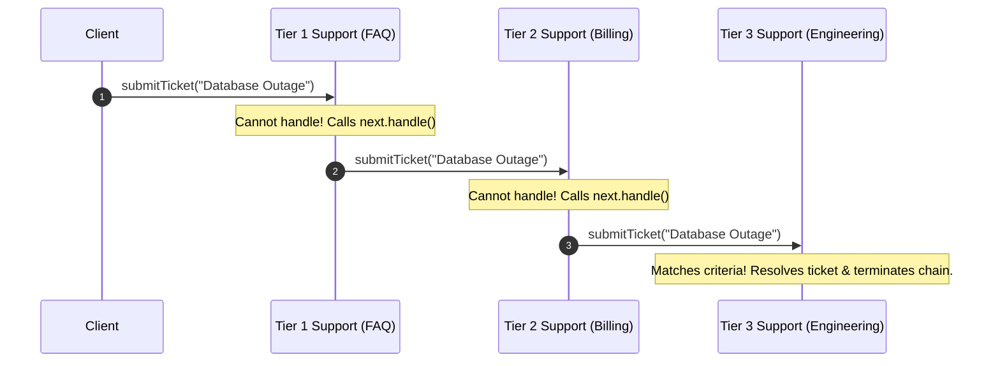
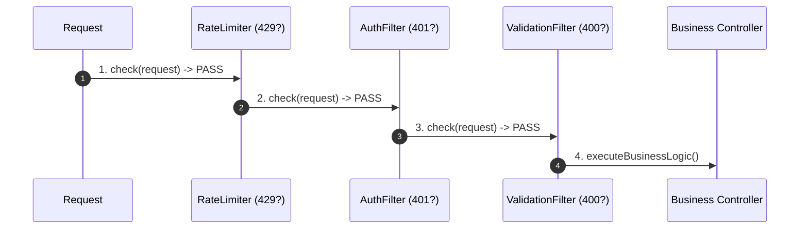

# ⚡ Module 01: Pipeline Architecture & Execution Models

[🏠 Back to Master Guide](./README.md) &nbsp; | &nbsp; [Next: 🏛️ Spring Security & Middleware Deep Dive](./02-SPRING_SECURITY_AND_MIDDLEWARE_DEEP_DIVE.md)

---

## 🎯 Executive Overview

The **Chain of Responsibility (CoR)** pattern is the foundational pattern behind request interceptors, middleware pipelines, and approval workflows. At a senior architecture level, CoR is implemented in two distinct execution modes:

1. **Pure CoR (Handling / Consuming Model)**: Only **one** handler in the chain consumes and processes the request (e.g., Tier 1 vs. Tier 2 vs. Tier 3 Customer Support). Once handled, the chain terminates.
2. **Pipeline / Filter CoR (Interception / Mutating Model)**: **Every** handler in the chain processes, validates, or mutates the request sequentially (e.g., Spring Security Filters, Express.js Middleware, API Gateways). Any handler has the authority to halt the pipeline early (e.g. returning HTTP 401/429).

---

## 🔬 1. The Two Fundamental Execution Models

```
                               ┌────────────────────────────────────────────────────────┐
                               │       The 2 Execution Models of Chain of Responsibility│
                               └───────────────────────────┬────────────────────────────┘
                                                           │
              ┌────────────────────────────────────────────┴────────────────────────────────────────────┐
              ▼                                                                                         ▼
  【 1. Handling Model (Classic GoF) 】                                                  【 2. Pipeline / Filter Model (Modern) 】
  • Exactly ONE handler accepts the request                                            • ALL handlers inspect / mutate the request
  • Subsequent handlers are SKIPPED                                                    • Request flows through entire pipeline sequentially
  • Example: OS Event Dispatcher / Support Escalation                                  • Example: Spring Security / Express.js Middleware
```

### Flow Comparison:

#### Handling Model (First Match Wins):


#### Pipeline Model (Interception & Cascading Execution):


---

## 🏛️ 2. Recursive Call Stack vs. Iterative Array Execution

### Execution Style A: Linked Nodes (Recursive)
Each handler holds a direct reference pointer (`next`) to the subsequent handler.

```java
public abstract class Handler {
    private Handler next;

    public Handler setNext(Handler next) {
        this.next = next;
        return next; // Enables fluent chaining: a.setNext(b).setNext(c);
    }

    public void handle(Request request) {
        if (canHandle(request)) {
            process(request);
        } else if (next != null) {
            next.handle(request); // ⚠️ Recursive stack frame allocation!
        } else {
            onUnhandled(request);
        }
    }

    protected abstract boolean canHandle(Request request);
    protected abstract void process(Request request);
    protected void onUnhandled(Request request) {
        throw new UnhandledRequestException("No handler found for request: " + request);
    }
}
```

> [!WARNING]
> **Stack Overflow Risk:** In long chains (e.g. 100+ handlers), linked-node recursive chaining consumes stack frames. If circular references occur ($A \rightarrow B \rightarrow A$), it crashes the JVM with `StackOverflowError`.

---

### Execution Style B: Array Pipeline with Index Tracking (Iterative / Servlet-style)
Used in high-throughput enterprise engines (Tomcat `StandardPipeline`, Spring `MockFilterChain`):

```java
public interface Filter {
    void doFilter(Request req, Response res, FilterChain chain);
}

public class DefaultFilterChain implements FilterChain {
    private final List<Filter> filters;
    private int currentPosition = 0;

    public DefaultFilterChain(List<Filter> filters) {
        this.filters = filters;
    }

    @Override
    public void doFilter(Request req, Response res) {
        if (this.currentPosition < this.filters.size()) {
            Filter nextFilter = this.filters.get(this.currentPosition++);
            // Invokes filter, passing 'this' so the filter calls chain.doFilter(req, res)
            nextFilter.doFilter(req, res, this);
        }
    }
}
```

---

## 🛡️ 3. The "Unhandled Request" Problem (Terminal Handler)

A critical failure mode in handling-style CoR is **Silent Request Dropping**, where a request traverses all handlers without being processed.

### Production Solution: The Sentinel / Fallback Handler
Always terminate your chain with a guaranteed **Sentinel / Default Handler**:

```java
public class SentinelFallbackHandler extends Handler {
    @Override
    protected boolean canHandle(Request request) {
        return true; // Catches everything at the end of the chain
    }

    @Override
    protected void process(Request request) {
        System.err.println("⚠️ [Terminal Warning] Request unhandled by specific handlers. Logging to Dead Letter Queue: " + request);
        // Metric counter / Default reject response
    }
}
```

---

## 📊 Summary: Implementation Comparison

| Dimension | Recursive Linked-List CoR | Iterative FilterChain CoR |
|---|---|---|
| **Structure** | `Handler next` pointer on each node | Array / `List<Filter>` in manager |
| **Stack Memory** | $O(N)$ stack frames (recursion) | $O(1)$ stack overhead |
| **Dynamic Modification** | Hard to inspect or reorder at runtime | Trivial to sort via `@Order` or priority |
| **Industry Standard** | Desktop GUI / DOM Bubbling | Web Middleware (Spring, Express, Netty) |

---

## 🔑 Key Takeaways for Interviews

1. Distinguish between the **Handling Model** (first match wins and terminates) and the **Pipeline Model** (every link inspects/mutates).
2. Highlight how modern frameworks (Spring, Express) implement CoR using an **Array-backed `FilterChain`** rather than manual recursive pointers.
3. Always include a **Terminal/Sentinel Handler** at the end of handling chains to prevent silent request loss.
