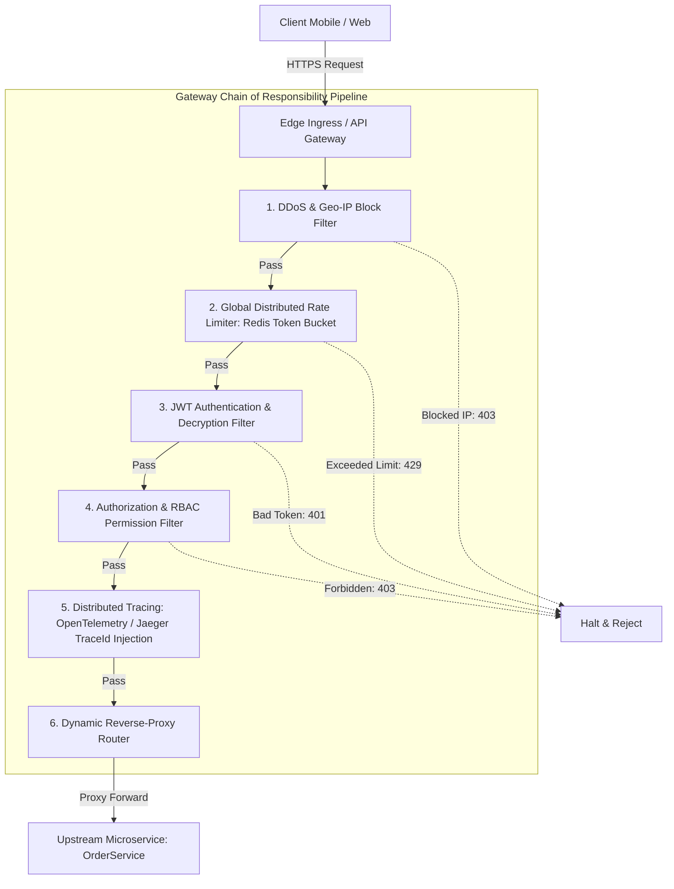

# 🌐 Module 04: Distributed Pipelines & API Gateways

[🏠 Back to Master Guide](./README.md) &nbsp; | &nbsp; [Previous: ⚖️ CoR vs. Decorator vs. Strategy](./03-COR_VS_DECORATOR_VS_STRATEGY_VS_COMPOSITE.md) &nbsp; | &nbsp; [Next: 🎙️ Interview Playbook](./05-INTERVIEW_PLAYBOOK_AND_ARTICULATION.md)

---

## 🎯 Executive Overview

In modern Cloud-Native & Microservices Architecture, the in-process **Chain of Responsibility** pattern scales out to become the **API Gateway Ingress Pipeline** (e.g., **Envoy Proxy**, **Kong Gateway**, **Spring Cloud Gateway**, and **AWS API Gateway**).

Before an HTTP request ever reaches a backend microservice, it traverses a distributed, multi-tiered Chain of Responsibility across the edge infrastructure.

---

## 🏛️ 1. The Distributed Gateway Pipeline Topology



---

## ⚡ 2. Standard Enterprise Filter Ordering

In High-Level Design interviews, interviewers frequently test whether you know the **optimal ordering** of filters in a gateway pipeline:

| Order | Gateway Filter Link | Why Placed at This Position | Rejection Code |
|---|---|---|:---:|
| **1** | **DDoS / WAF / Geo-IP Filter** | Block malicious IPs and SYN floods with zero CPU/DB cost before parsing headers. | HTTP 403 |
| **2** | **CORS & Pre-flight Filter** | Fast-path for browser `OPTIONS` requests; avoids downstream processing. | HTTP 204 |
| **3** | **Global Rate Limiter (Redis)** | Stop brute-force spikes before incurring expensive cryptographic JWT parsing. | HTTP 429 |
| **4** | **JWT Authentication Filter** | Cryptographically verify digital signatures and decrypt user identity claims. | HTTP 401 |
| **5** | **RBAC Authorization Filter** | Check if the authenticated user has permissions (e.g. `ROLE_ADMIN`). | HTTP 403 |
| **6** | **Tracing & Metric Injector** | Inject `X-Trace-Id` / `X-Request-Id` headers for distributed observability. | N/A (Pass-through) |
| **7** | **Circuit Breaker & Routing** | Route request to healthy upstream instance or fallback if upstream is down. | HTTP 503 |

> [!IMPORTANT]
> **Why Rate Limiting precedes JWT Verification:** Verifying an RSA/ECDSA cryptographic signature on a JWT consumes significant CPU cycles. Placing the Rate Limiter (a fast O(1) Redis memory check) *before* JWT verification protects your gateway against CPU-exhaustion Denial-of-Service attacks.

---

## 🛠️ 3. Spring Cloud Gateway Filter Implementation

In Spring Cloud Gateway, filters implement the `GatewayFilter` interface (Reactive Chain of Responsibility using Project Reactor `Mono`):

```java
@Component
public class DistributedRateLimitFilter implements GlobalFilter, Ordered {

    private final RedisRateLimiter redisRateLimiter;

    @Override
    public Mono<Void> filter(ServerWebExchange exchange, GatewayFilterChain chain) {
        String apiKey = exchange.getRequest().getHeaders().getFirst("X-API-KEY");

        return redisRateLimiter.isAllowed(apiKey)
            .flatMap(isAllowed -> {
                if (!isAllowed) {
                    // 🛑 Halt the chain and return HTTP 429 Too Many Requests
                    exchange.getResponse().setStatusCode(HttpStatus.TOO_MANY_REQUESTS);
                    return exchange.getResponse().setComplete();
                }
                // 🟢 Proceed down the Gateway Chain of Responsibility
                return chain.filter(exchange);
            });
    }

    @Override
    public int getOrder() {
        return -100; // High priority in the filter chain
    }
}
```

---

## 🔑 Key Takeaways for Interviews

1. Map **Chain of Responsibility** directly to **API Gateways (Kong, Envoy, Spring Cloud Gateway)** in System Design interviews.
2. Defend the **order of operations** (DDoS $\rightarrow$ Rate Limiting $\rightarrow$ Auth $\rightarrow$ Routing), highlighting why lightweight checks must precede heavy cryptographic checks.
3. Articulate how reactive non-blocking pipelines (Spring Cloud Gateway / Netty) eliminate thread-per-request blocking in distributed gateways.
