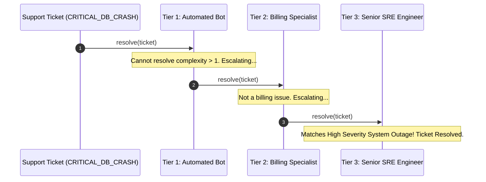

# 💼 Chain of Responsibility Case Studies — In Production Systems

[🏠 Back to Master Guide](./README.md) &nbsp; | &nbsp; [Previous: 🌍 Cross-Language Patterns](./06-CROSS_LANGUAGE_PATTERNS.md) &nbsp; | &nbsp; [Java Code Benchmarks](./JAVA/README.md)

---

## 🎯 Executive Overview

This document demonstrates two production-grade architectures utilizing the **Chain of Responsibility** pattern:
1. **Case Study 1:** Multi-Tier API Gateway Request Interceptor Pipeline.
2. **Case Study 2:** Tiered Customer Support Escalation Engine.

---

## 🏢 Case Study 1: Multi-Tier API Gateway Interceptor Pipeline

```mermaid
graph LR
    A[Inbound HTTP Request] --> B[RateLimiterMiddleware]
    B -->|Passed (200)| C[JwtAuthMiddleware]
    B -.->|Exceeded (429)| X[HALT & Return 429]
    C -->|Valid Token (200)| D[RoleAuthMiddleware]
    C -.->|Invalid (401)| Y[HALT & Return 401]
    D -->|Authorized (200)| E[OrderController]
    D -.->|Forbidden (403)| Z[HALT & Return 403]
```

### Complete Java Implementation:

```java
public abstract class Middleware {
    private Middleware next;

    public Middleware linkWith(Middleware next) {
        this.next = next;
        return next;
    }

    public abstract boolean check(String email, String role, int requestsCount);

    protected boolean checkNext(String email, String role, int requestsCount) {
        if (next == null) return true;
        return next.check(email, role, requestsCount);
    }
}

// Link 1: Rate Limiter
public class RateLimitMiddleware extends Middleware {
    @Override
    public boolean check(String email, String role, int requestsCount) {
        if (requestsCount > 100) {
            System.out.println("❌ [HTTP 429] Rate limit exceeded for " + email);
            return false; // HALT
        }
        System.out.println("✅ [RateLimit] OK");
        return checkNext(email, role, requestsCount);
    }
}

// Link 2: JWT Auth
public class JwtAuthMiddleware extends Middleware {
    @Override
    public boolean check(String email, String role, int requestsCount) {
        if (email == null || !email.endsWith("@company.com")) {
            System.out.println("❌ [HTTP 401] Unauthorized domain for " + email);
            return false; // HALT
        }
        System.out.println("✅ [Auth] Token Validated");
        return checkNext(email, role, requestsCount);
    }
}

// Link 3: Role Authorization
public class RoleAuthMiddleware extends Middleware {
    @Override
    public boolean check(String email, String role, int requestsCount) {
        if (!"ADMIN".equals(role)) {
            System.out.println("❌ [HTTP 403] Forbidden: Requires ADMIN role");
            return false; // HALT
        }
        System.out.println("✅ [Role] Admin Access Granted");
        return checkNext(email, role, requestsCount);
    }
}
```

---

## 🏢 Case Study 2: Tiered Customer Support Escalation Engine



### Key Production Insight:
* The customer support escalation engine uses the **Handling Model** (only the matching tier resolves the ticket and terminates the chain).
* If Tier 3 cannot resolve it, the terminal handler catches it and routes to an on-call PagerDuty alert.
