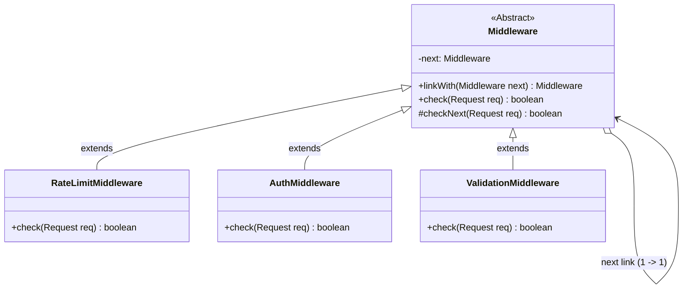
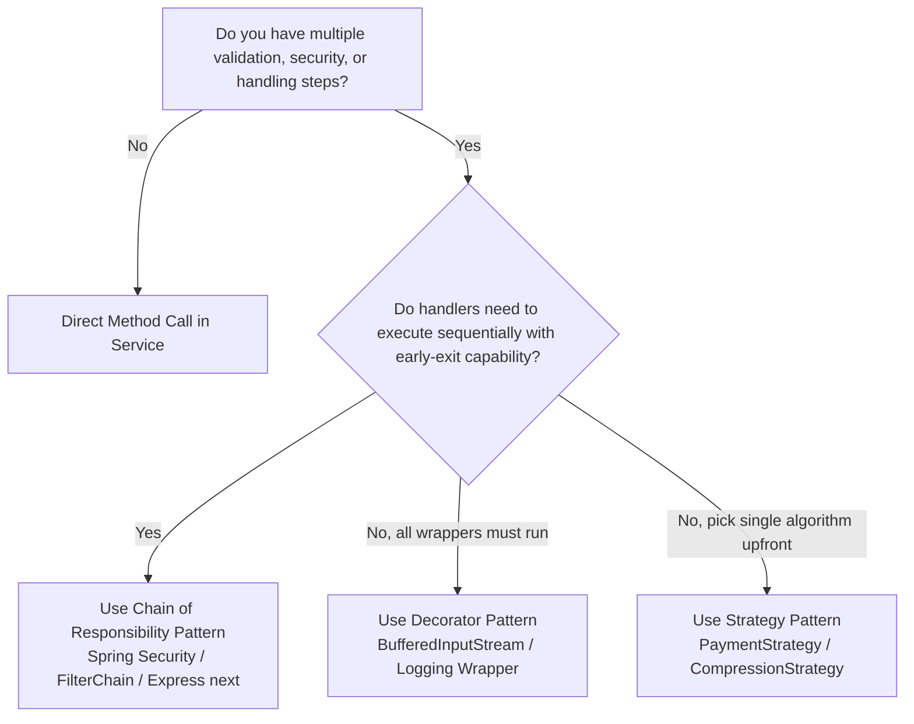

# 🔗 Chain of Responsibility Design Pattern — The Architectural Master Guide

> **Authoritative Guide for Senior Engineers & Technical Interview Prep**  
> *A comprehensive deep-dive into request pipelines, Spring Security filter chains, halting power, and distributed API Gateways.*

---

## 📑 Table of Contents

1. [Executive Summary & Core Intent](#-executive-summary--core-intent)
2. [Mental Models for Fast Intuition](#-mental-models-for-fast-intuition)
3. [Architecture Blueprint & Class Hierarchy](#-architecture-blueprint--class-hierarchy)
4. [Architecture Decision Framework](#-architecture-decision-framework)
5. [Modular Deep-Dive Reading Tracks](#-modular-deep-dive-reading-tracks)
6. [L4/Senior Interview Articulation Flashcards](#-l4senior-interview-articulation-flashcards)
7. [Cross-Repository Interlinking](#-cross-repository-interlinking)

---

## 🧭 Executive Summary & Core Intent

The **Chain of Responsibility (CoR)** is a behavioral design pattern that passes a request along a **dynamic chain of handlers**. Upon receiving a request, each handler decides either to:
1. **Process and Halt:** Consume the request or reject it early (e.g. HTTP 401/429).
2. **Process and Forward:** Mutate / validate the request and pass it to the next link in the chain (`checkNext()` / `chain.doFilter()`).



---

## 🧠 Mental Models for Fast Intuition

```
  ┌───────────────────────────────────────────────┬───────────────────────────────────────────────┐
  │         1. Airport Security Checkpoint        │         2. Web Application Middleware         │
  ├───────────────────────────────────────────────┼───────────────────────────────────────────────┤
  │ • Check 1: Boarding Pass verification.        │ • Check 1: Rate Limiter (Stops DDoS/429).     │
  │ • Check 2: Metal Detector / Baggage Scan.     │ • Check 2: JWT Auth (Validates Token/401).    │
  │ • Check 3: Customs Passport Control.          │ • Check 3: RBAC Permissions (Admin Role/403). │
  │ If ANY checkpoint fails, security immediately │ If ANY filter fails, execution HALTS immediately│
  │ HALTS you — you never board the plane!        │ before hitting the database or controller.    │
  └───────────────────────────────────────────────┴───────────────────────────────────────────────┘
```

---

## 🌳 Architecture Decision Framework



---

## 🗂️ Modular Deep-Dive Reading Tracks

For targeted interview prep and production mastery, navigate to the specialized sub-modules below:

```
                                      📂 CoR MASTER VAULT
                                              │
         ┌───────────────────┬────────────────┼───────────────────┬───────────────────┐
         ▼                   ▼                ▼                   ▼                   ▼
   ⚡ [Module 01]       🏛️ [Module 02]    ⚖️ [Module 03]      🌐 [Module 04]     🎙️ [Module 05]
    Pipeline Models      Spring Security   CoR vs Decorator    Distributed API     Interview
    & Execution Stack     & Middleware        & Strategy       Gateway Ingress     Playbook
```

* ⚡ **[01. Pipeline Architecture & Execution Models](./01-PIPELINE_ARCHITECTURE_AND_EXECUTION_MODELS.md)**:
  * Handling Model (first match wins) vs. Pipeline Model (cascading interception).
  * Recursive linked nodes vs. array-backed `FilterChain` with $O(1)$ stack overhead.
  * The Sentinel fallback handler for unhandled requests.

* 🏛️ **[02. Spring Security & Enterprise Middleware Deep Dive](./02-SPRING_SECURITY_AND_MIDDLEWARE_DEEP_DIVE.md)**:
  * Spring Security `SecurityFilterChain` and `OncePerRequestFilter` internals.
  * How Express.js `next()` works under the hood.
  * Netty bidirectional `ChannelPipeline` (inbound vs. outbound chains).
  * Dynamic chain assembly via Spring's `@Order` auto-injection.

* ⚖️ **[03. CoR vs. Decorator vs. Strategy vs. Composite](./03-COR_VS_DECORATOR_VS_STRATEGY_VS_COMPOSITE.md)**:
  * Definitive comparison matrix on halting capability, coupling, and runtime flexibility.
  * Why Decorator wraps to enhance while CoR intercepts to filter/halt.

* 🌐 **[04. Distributed Pipelines & API Gateways](./04-DISTRIBUTED_PIPELINES_AND_API_GATEWAYS.md)**:
  * Scaling CoR to **Envoy, Kong, and Spring Cloud Gateway**.
  * Optimal order of operations: DDoS $\rightarrow$ Rate Limiting $\rightarrow$ JWT Auth $\rightarrow$ Routing.
  * Protecting authentication layers against CPU-exhaustion attacks.

* 🎙️ **[05. L4/Senior Interview Playbook & Articulation](./05-INTERVIEW_PLAYBOOK_AND_ARTICULATION.md)**:
  * **5 Verbatim 30-Second Interview Scripts** for high-stakes hiring loops.
  * Rapid-fire 1-sentence FAANG answers and common interviewer traps.
  * Candidate self-assessment rubric.

* 🌍 **[06. Cross-Language Implementations](./06-CROSS_LANGUAGE_PATTERNS.md)**:
  * C++ smart pointers, Go functional `http.Handler` middleware chaining, TypeScript Express `next()`, and Python WSGI.

* 💼 **[Case Studies: Production Systems](./CASE_STUDY.md)**:
  * **Multi-Tier API Gateway Pipeline:** Rate Limiting $\rightarrow$ Auth $\rightarrow$ RBAC.
  * **Tiered Customer Support Escalation:** Automated Bot $\rightarrow$ Tier 2 $\rightarrow$ SRE Lead.

* ☕ **[Java Runnable Source Code](./JAVA/README.md)**:
  * Multi-tier runnable Java middleware simulation.

---

## 🎙️ L4/Senior Interview Articulation Flashcards

> [!TIP]
> Deliver these concise, high-impact statements during your technical interviews to immediately signal Senior (L4/L5) proficiency.

```
┌───────────────────────────────────────────────┬───────────────────────────────────────────────┐
│ Question                                      │ 30-Second Verbatim Senior Articulation        │
├───────────────────────────────────────────────┼───────────────────────────────────────────────┤
│ "What is the core difference between Chain of │ 'While both use composition, a Decorator wraps│
│  Responsibility and Decorator?"               │  an object to enhance behavior and executes   │
│                                               │  all layers; Chain of Responsibility passes a │
│                                               │  request along independent handlers where any │
│                                               │  link has the power to completely halt early.'│
├───────────────────────────────────────────────┼───────────────────────────────────────────────┤
│ "How does Spring Security implement CoR?"     │ 'Spring Security uses FilterChainProxy to     │
│                                               │  manage an ordered SecurityFilterChain. Each  │
│                                               │  OncePerRequestFilter either authenticates and│
│                                               │  calls filterChain.doFilter() to proceed, or  │
│                                               │  returns HTTP 401/403 to halt the pipeline.'  │
├───────────────────────────────────────────────┼───────────────────────────────────────────────┤
│ "Why place Rate Limiting before JWT Auth in   │ 'Because verifying cryptographic signatures on│
│  an API Gateway chain?"                       │  JWTs is CPU-intensive. An O(1) Redis rate    │
│                                               │  limiter check placed first stops volumetric  │
│                                               │  DDoS spikes before wasting CPU on auth.'     │
├───────────────────────────────────────────────┼───────────────────────────────────────────────┤
│ "How do you prevent silent drops in handling  │ 'By terminating the chain with a Sentinel     │
│  chains?"                                     │  Fallback Handler that logs unhandled requests│
│                                               │  to a Dead Letter Queue or throws an          │
│                                               │  UnhandledRequestException.'                  │
└───────────────────────────────────────────────┴───────────────────────────────────────────────┘
```

---

## 🔗 Cross-Repository Interlinking

* **[Single Responsibility Principle (SRP)](../../00-SOLID_Principles/01-Single_Responsibility/README.md)**: Eliminates bloated controllers by encapsulating validation, rate limiting, and auth in independent classes.
* **[Open/Closed Principle (OCP)](../../00-SOLID_Principles/02-Open_Closed/README.md)**: Inject new middleware links dynamically without modifying existing handlers or business controllers.
* **[Decorator Design Pattern](../../02-Structural/02-Decorator%20Design%20Pattern/README.md)**: Architectural comparison with wrapping patterns.
* **[API Gateway Architecture](../../../hld/05-API-Gateways/01-API-Gateway-Deep-Dive.md)**: High-Level Design scaling of filter pipelines.

---

## 🧠 Tracker Integration

* **Trigger Phrases:** *"Request pipeline"*, *"Sequential validation/interception"*, *"Middleware chain"*, *"Tiered escalation"*.
* **Confuses With:** 
  * **Decorator:** (Decorator enhances and executes all wrappers; CoR intercepts and can halt execution early).
  * **Strategy:** (Strategy chooses one algorithm upfront; CoR dynamically traverses a pipeline).
* **Anti-Freeze Starter Code:** 
  ```java
  public abstract class Handler {
      private Handler next;
      public Handler setNext(Handler next) { this.next = next; return next; }
      public void handle(Request req) {
          if (canHandle(req)) process(req);
          else if (next != null) next.handle(req);
      }
      protected abstract boolean canHandle(Request req);
      protected abstract void process(Request req);
  }
  ```
