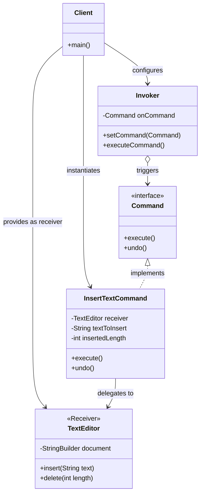
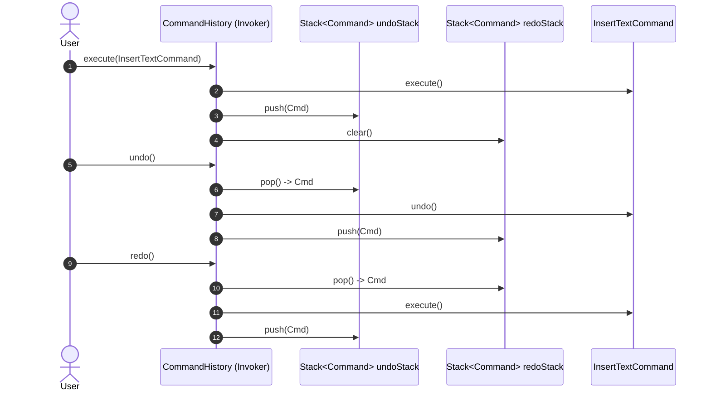

# ⚡ Module 01: Anatomy, Undo/Redo & Macro Commands

[🏠 Back to Master Guide](./README.md) &nbsp; | &nbsp; [Next: ⏳ Queuing, Scheduling & Async Execution](./02-QUEUING_SCHEDULING_AND_ASYNC_EXECUTION.md)

---

## 🎯 Executive Overview

The **Command Pattern** encapsulates a request as a standalone object containing all information necessary to perform an action. This decouples the object that invokes the operation (the **Invoker**) from the object that knows how to perform it (the **Receiver**).

This deep dive deconstructs:
1. The **4 Core Roles** of the Command Pattern.
2. **Thin Commands vs. Thick Commands** (The Anti-Pattern Debate).
3. **Undo/Redo History Stacks** & State Reversal.
4. **Composite / Macro Commands** (Batch Transaction Execution).

---

## 🏛️ 1. The 4 Structural Roles



### The 4 Actors Defined:
1. **Command (`interface`):** Declares execution contract (`execute()` and optional `undo()`).
2. **Concrete Command:** Binds a specific action to a Receiver; holds parameters required for execution.
3. **Receiver:** The business domain object that contains the actual implementation logic (e.g. `TextEditor`, `LightBulb`, `BankAccount`).
4. **Invoker:** Triggers the command without knowing the Receiver or what the command does (e.g. `UIButton`, `RemoteControl`, `JobQueue`).

---

## ⚠️ 2. Thin Commands vs. Thick Commands (Senior Design Rule)

```
  ┌───────────────────────────────────────────────┬───────────────────────────────────────────────┐
  │          Thin Commands (Best Practice)        │         Thick Commands (Anti-Pattern)         │
  ├───────────────────────────────────────────────┼───────────────────────────────────────────────┤
  │ • The Command merely delegates to the         │ • The Command contains the heavy business and │
  │   Receiver (`receiver.performAction()`).      │   database logic directly in `execute()`.     │
  │ • Decoupled: Domain logic stays in Receiver.  │ • Violates SRP: Mixes command encapsulation   │
  │ • Lightweight: Easy to serialize and test.    │   with domain business logic.                 │
  └───────────────────────────────────────────────┴───────────────────────────────────────────────┘
```

```java
// ✅ Thin Command: Pure Delegation
public class TransferFundsCommand implements Command {
    private final BankAccount sender;
    private final BankAccount receiver;
    private final double amount;

    public TransferFundsCommand(BankAccount sender, BankAccount receiver, double amount) {
        this.sender = sender;
        this.receiver = receiver;
        this.amount = amount;
    }

    @Override
    public void execute() {
        sender.withdraw(amount);  // Delegated to domain object
        receiver.deposit(amount); // Delegated to domain object
    }

    @Override
    public void undo() {
        receiver.withdraw(amount);
        sender.deposit(amount);
    }
}
```

---

## 🔄 3. Undo / Redo Stacks Architecture

To implement multi-level **Ctrl+Z (Undo)** and **Ctrl+Y (Redo)**:
1. Maintain an **`undoStack`** and a **`redoStack`**.
2. When a command is executed, push it to `undoStack` and clear `redoStack`.
3. When `undo()` is called, pop from `undoStack`, invoke `cmd.undo()`, and push to `redoStack`.
4. When `redo()` is called, pop from `redoStack`, invoke `cmd.execute()`, and push back to `undoStack`.



---

## 🧱 4. Macro / Composite Commands (Batch Transactions)

A **Macro Command** bundles multiple commands into a single composite executable unit:

```java
public class MacroCommand implements Command {
    private final List<Command> commands = new ArrayList<>();

    public void add(Command cmd) {
        commands.add(cmd);
    }

    @Override
    public void execute() {
        for (Command cmd : commands) {
            cmd.execute();
        }
    }

    @Override
    public void undo() {
        // ⚠️ Undo must execute in REVERSE order!
        for (int i = commands.size() - 1; i >= 0; i--) {
            commands.get(i).undo();
        }
    }
}
```

> [!IMPORTANT]
> **Reverse Execution on Undo:** When rolling back a composite command, sub-commands must be undone in **reverse chronological order** ($N \rightarrow 1$) to maintain state integrity.

---

## 🔑 Key Takeaways for Interviews

1. Clearly identify the **4 actors**: Client, Invoker, Command, and Receiver.
2. Defend **Thin Commands** over Thick Commands to preserve the Single Responsibility Principle.
3. Explain why `redoStack` must be cleared whenever a new command is executed.
4. Emphasize that **Macro Command Undo** must execute in strict reverse order.
