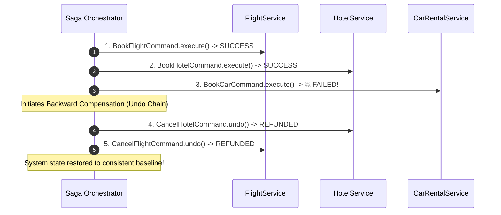

# 🏛️ Module 03: CQRS, Sagas & Transactional Rollbacks

[🏠 Back to Master Guide](./README.md) &nbsp; | &nbsp; [Previous: ⏳ Queuing & Scheduling](./02-QUEUING_SCHEDULING_AND_ASYNC_EXECUTION.md) &nbsp; | &nbsp; [Next: ⚖️ Command vs. Strategy vs. Memento](./04-COMMAND_VS_STRATEGY_VS_MEMENTO.md)

---

## 🎯 Executive Overview

In enterprise and distributed systems, the **Command Pattern** provides the architectural foundation for two major architectural patterns:
1. **CQRS (Command-Query Responsibility Segregation)**: Segregating write operations (Commands) from read operations (Queries).
2. **The Saga Pattern (Compensating Transactions)**: Handling distributed transactions across microservices without 2-Phase Commit (2PC) by executing compensating commands (`undo()`).
3. **Event Sourcing & Audit Replay**: Rebuilding system state from an immutable append-only log of executed commands.

---

## ⚡ 1. CQRS (Command-Query Responsibility Segregation)

```mermaid
graph TD
    Client[HTTP Client] -->|Mutations / POST / PUT| WriteAPI[Command Side]
    Client -->|Reads / GET| ReadAPI[Query Side]

    subgraph Command Model (Write)
        WriteAPI --> CommandBus[Command Bus]
        CommandBus --> CreateOrderCmd[CreateOrderCommand]
        CreateOrderCmd --> WriteDB[(Transactional Relational DB: PostgreSQL)]
    end

    subgraph Query Model (Read)
        WriteDB -.->|Async Sync / CDC Debezium| ReadDB[(Read-Optimized DB: Elasticsearch / Redis)]
        ReadAPI --> ReadDB
    end
```

### Core Principles of CQRS:
* **Commands:** Represent user intent to **mutate state** (e.g., `CreateOrderCommand`, `CancelSubscriptionCommand`). Commands do **not** return domain data; they return void or an execution status/ID.
* **Queries:** Retrieve data without mutating state (e.g., `GetOrderDetailsQuery`).
* **Advantage:** Read models and write models can scale on completely independent databases and caching tiers.

---

## 🔄 2. The Saga Pattern & Compensating Transactions

In distributed microservices, a single business transaction spans multiple databases (e.g. Booking a Holiday: Flight + Hotel + Rental Car). If Step 3 fails, the system cannot use traditional ACID database rollbacks.

### The Solution: Compensating Commands (`undo()`)



### Saga Orchestrator Implementation:

```java
public class BookingSagaOrchestrator {
    private final Stack<Command> executedCommands = new Stack<>();

    public boolean executeSaga(List<Command> sagaSteps) {
        for (Command step : sagaSteps) {
            try {
                step.execute();
                executedCommands.push(step); // Record successful step
            } catch (Exception e) {
                System.err.println("❌ Saga step failed: " + e.getMessage() + ". Initiating rollback...");
                rollback();
                return false;
            }
        }
        return true;
    }

    private void rollback() {
        // Rollback executed steps in reverse order
        while (!executedCommands.isEmpty()) {
            Command step = executedCommands.pop();
            try {
                step.undo(); // Compensating transaction
            } catch (Exception e) {
                System.err.println("🚨 Critical Compensation Failure on " + step + ": " + e.getMessage());
            }
        }
    }
}
```

---

## 📜 3. Event Sourcing & Audit Command Replay

Because Commands encapsulate all input parameters and timestamps:
1. Every executed command is serialized into an **Append-Only Event Store** (e.g. Kafka or EventStoreDB).
2. **State Replay:** If the database crashes or corrupts, a new service instance can replay all commands from timestamp $0$ to reconstruct the exact in-memory state.
3. **Audit Trail:** Provides non-repudiable audit logs for financial compliance.

---

## 🔑 Key Takeaways for Interviews

1. Connect the **Command Pattern** to **CQRS** in System Design interviews (Commands mutate state; Queries fetch data).
2. Explain the **Saga Pattern** as a distributed application of Command `execute()` and `undo()` for compensating transactions.
3. Highlight that **Saga rollbacks must execute in reverse order** to preserve data integrity.
