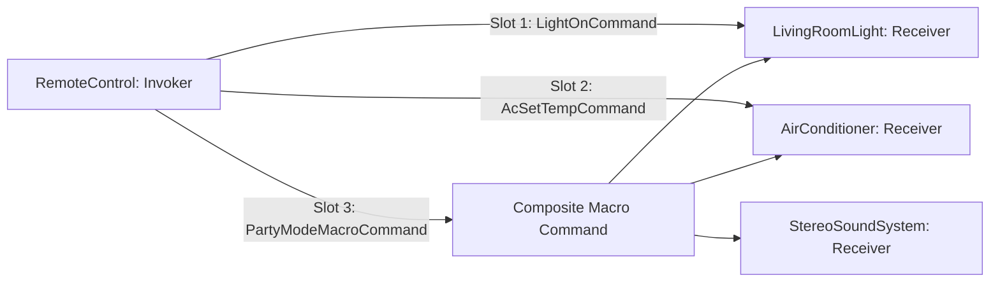
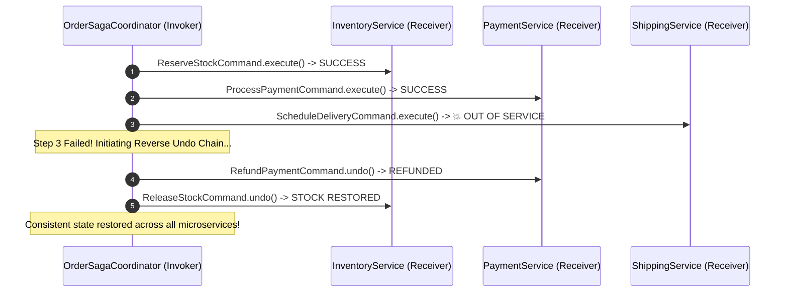

# 💼 Command Case Studies — In Production Systems

[🏠 Back to Master Guide](./README.md) &nbsp; | &nbsp; [Previous: 🌍 Cross-Language Patterns](./06-CROSS_LANGUAGE_PATTERNS.md) &nbsp; | &nbsp; [Java Code Benchmarks](./JAVA/README.md)

---

## 🎯 Executive Overview

This document presents two production-grade architectures utilizing the **Command Pattern**:
1. **Case Study 1:** Universal Smart Home Remote Control with Multi-Slot Undo.
2. **Case Study 2:** Distributed E-Commerce Saga Transaction Coordinator with Compensating Rollbacks.

---

## 🏢 Case Study 1: Universal Smart Home Remote Control



### Complete Java Implementation:

```java
// 1. Command Interface
public interface Command {
    void execute();
    void undo();
}

// 2. Receivers
public class Light {
    public void on() { System.out.println("💡 Light is ON"); }
    public void off() { System.out.println("🌑 Light is OFF"); }
}

public class AirConditioner {
    private int prevTemp = 24;
    private int currentTemp = 24;

    public void setTemperature(int temp) {
        this.prevTemp = this.currentTemp;
        this.currentTemp = temp;
        System.out.println("❄️ AC set to " + temp + "°C");
    }

    public void undoTemperature() {
        this.currentTemp = this.prevTemp;
        System.out.println("❄️ AC reverted back to " + currentTemp + "°C");
    }
}

// 3. Concrete Commands
public class LightOnCommand implements Command {
    private final Light light;
    public LightOnCommand(Light light) { this.light = light; }
    public void execute() { light.on(); }
    public void undo() { light.off(); }
}

public class SetAcTempCommand implements Command {
    private final AirConditioner ac;
    private final int targetTemp;
    public SetAcTempCommand(AirConditioner ac, int targetTemp) {
        this.ac = ac;
        this.targetTemp = targetTemp;
    }
    public void execute() { ac.setTemperature(targetTemp); }
    public void undo() { ac.undoTemperature(); }
}

// 4. Invoker: Remote Control with Undo History
public class RemoteControl {
    private final Command[] slots = new Command[5];
    private final Stack<Command> history = new Stack<>();

    public void setCommand(int slot, Command command) {
        slots[slot] = command;
    }

    public void pressButton(int slot) {
        if (slots[slot] != null) {
            slots[slot].execute();
            history.push(slots[slot]);
        }
    }

    public void pressUndo() {
        if (!history.isEmpty()) {
            Command lastCommand = history.pop();
            System.out.print("↩️ Undoing last action: ");
            lastCommand.undo();
        }
    }
}
```

---

## 🏢 Case Study 2: Distributed E-Commerce Saga Coordinator



### Production Takeaway:
* The Command Pattern provides a structured mechanism to record in-flight transaction steps and unwind them via **compensating commands (`undo()`)** during microservice failures.
