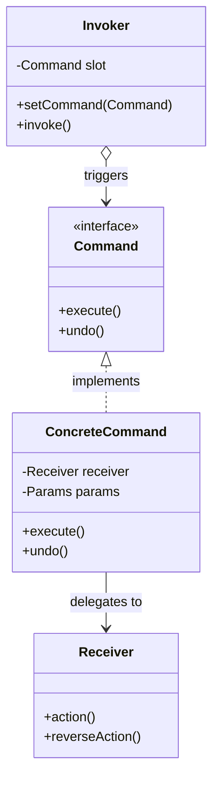
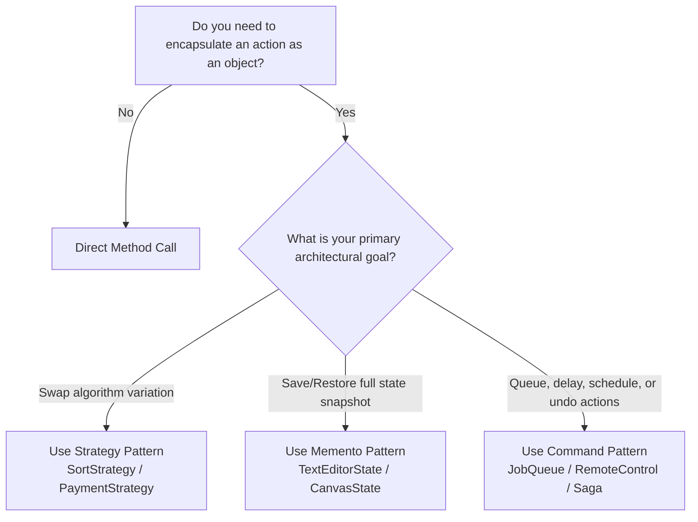

# 🎮 Command Design Pattern — The Architectural Master Guide

> **Authoritative Guide for Senior Engineers & Technical Interview Prep**  
> *A comprehensive deep-dive into request encapsulation, multi-level undo/redo stacks, asynchronous task queues, and distributed Saga rollbacks.*

---

## 📑 Table of Contents

1. [Executive Summary & Core Intent](#-executive-summary--core-intent)
2. [Mental Models for Fast Intuition](#-mental-models-for-fast-intuition)
3. [Architecture Blueprint & The 4 Actors](#-architecture-blueprint--the-4-actors)
4. [Architecture Decision Framework](#-architecture-decision-framework)
5. [Modular Deep-Dive Reading Tracks](#-modular-deep-dive-reading-tracks)
6. [L4/Senior Interview Articulation Flashcards](#-l4senior-interview-articulation-flashcards)
7. [Cross-Repository Interlinking](#-cross-repository-interlinking)

---

## 🧭 Executive Summary & Core Intent

The **Command Pattern** is a behavioral design pattern that **encapsulates a request as a standalone object** containing all information necessary to execute an action.

This transformation lets you:
1. **Decouple the Invoker from the Receiver** (the UI button does not know about the database).
2. **Support Multi-Level Undo and Redo** (via state inversion or snapshot restoration).
3. **Queue and Schedule Requests in Time** (background worker pools, delayed jobs).
4. **Coordinate Distributed Microservice Sagas** (compensating transaction rollbacks).



---

## 🧠 Mental Models for Fast Intuition

```
  ┌───────────────────────────────────────────────┬───────────────────────────────────────────────┐
  │         1. The Restaurant Order Ticket        │           2. The Universal Remote             │
  ├───────────────────────────────────────────────┼───────────────────────────────────────────────┤
  │ • Customer: Creates the request.              │ • Remote Button (Invoker): Pushing button #1  │
  │ • Waiter (Invoker): Takes the order ticket,   │   doesn't care if it's wired to a Light, TV,  │
  │   places it on the kitchen order queue.       │   or Air Conditioner.                         │
  │ • Order Ticket (Command): Contains exact meal │ • Command: Encapsulates the specific action   │
  │   parameters and table number.                │   (`turnOn()`, `setTemp(22)`).                │
  │ • Chef (Receiver): The only person who knows  │ • Receiver: The physical device executing     │
  │   how to cook the meal (domain logic).        │   the electrical hardware command.            │
  └───────────────────────────────────────────────┴───────────────────────────────────────────────┘
```

---

## 🌳 Architecture Decision Framework



---

## 🗂️ Modular Deep-Dive Reading Tracks

For targeted interview prep and production mastery, navigate to the specialized sub-modules below:

```
                                    📂 COMMAND MASTER VAULT
                                              │
         ┌───────────────────┬────────────────┼───────────────────┬───────────────────┐
         ▼                   ▼                ▼                   ▼                   ▼
   ⚡ [Module 01]       ⏳ [Module 02]    🏛️ [Module 03]      ⚖️ [Module 04]     🎙️ [Module 05]
    Anatomy & Dual      Queuing & Async   CQRS, Sagas &       Command vs Strategy Interview
    Undo/Redo Stacks      Schedulers       Rollbacks           & Memento           Playbook
```

* ⚡ **[01. Anatomy, Undo/Redo & Macro Commands](./01-ANATOMY_AND_UNDO_REDO_MECHANICS.md)**:
  * The 4 core actors: Client, Invoker, Command, and Receiver.
  * Thin Commands (best practice) vs. Thick Commands (anti-pattern).
  * Multi-level dual-stack Undo/Redo algorithm and Macro composite commands.

* ⏳ **[02. Queuing, Scheduling & Async Execution](./02-QUEUING_SCHEDULING_AND_ASYNC_EXECUTION.md)**:
  * Temporal decoupling: separating request creation from request execution.
  * Java's built-in `Runnable` and `Callable<V>` command interfaces.
  * Command serialization for distributed task queues (Celery / RabbitMQ / AWS SQS).

* 🏛️ **[03. CQRS, Sagas & Transactional Rollbacks](./03-CQRS_SAGAS_AND_TRANSACTIONAL_ROLLBACKS.md)**:
  * CQRS write-model commands vs. read-model queries.
  * Microservice Sagas: Orchestrated compensating transactions using `undo()`.
  * Event Sourcing and immutable command replay for system state reconstruction.

* ⚖️ **[04. Command vs. Strategy vs. Memento vs. Observer](./04-COMMAND_VS_STRATEGY_VS_MEMENTO.md)**:
  * Definitive comparison matrix distinguishing **WHAT** (Command) from **HOW** (Strategy).
  * Undo implementation trade-offs: Inverse operations (Command) vs. Full snapshots (Memento).

* 🎙️ **[05. L4/Senior Interview Playbook & Articulation](./05-INTERVIEW_PLAYBOOK_AND_ARTICULATION.md)**:
  * **5 Verbatim 30-Second Interview Scripts** for high-stakes hiring loops.
  * Rapid-fire 1-sentence FAANG answers and common interviewer traps.
  * Candidate self-assessment rubric.

* 🌍 **[06. Cross-Language Implementations](./06-CROSS_LANGUAGE_PATTERNS.md)**:
  * Modern C++ polymorphic commands, C# WPF `ICommand` / `RelayCommand`, Go channel task queues, and TypeScript undo stacks.

* 💼 **[Case Studies: Production Systems](./CASE_STUDY.md)**:
  * **Smart Home Universal Remote Control:** Multi-slot device control with undo.
  * **Distributed E-Commerce Saga Coordinator:** Compensating rollback workflow.

* ☕ **[Java Runnable Source Code](./JAVA/README.md)**:
  * Complete runnable Java demonstration suite.

---

## 🎙️ L4/Senior Interview Articulation Flashcards

> [!TIP]
> Deliver these concise, high-impact statements during your technical interviews to immediately signal Senior (L4/L5) proficiency.

```
┌───────────────────────────────────────────────┬───────────────────────────────────────────────┐
│ Question                                      │ 30-Second Verbatim Senior Articulation        │
├───────────────────────────────────────────────┼───────────────────────────────────────────────┤
│ "What is the core difference between Command  │ 'Strategy encapsulates HOW an algorithm is    │
│  and Strategy?"                               │  executed (e.g. sorting or encryption);       │
│                                               │  Command encapsulates WHAT action is to be    │
│                                               │  performed, storing execution parameters and  │
│                                               │  supporting queuing, scheduling, and undo.'   │
├───────────────────────────────────────────────┼───────────────────────────────────────────────┤
│ "How do you implement multi-level Undo/Redo?" │ 'We maintain two LIFO stacks: undoStack and   │
│                                               │  redoStack. On execute, we push to undoStack  │
│                                               │  and clear redoStack. On undo, we pop from    │
│                                               │  undoStack, call undo(), and push to redoStack│
│                                               │  to preserve historical timeline integrity.'  │
├───────────────────────────────────────────────┼───────────────────────────────────────────────┤
│ "What is a Thin Command vs Thick Command?"    │ 'A Thin Command purely delegates to the       │
│                                               │  Receiver, preserving SRP and domain integrity│
│                                               │  A Thick Command mixes business/database      │
│                                               │  logic inside execute(), which is an          │
│                                               │  anti-pattern leading to tight coupling.'     │
├───────────────────────────────────────────────┼───────────────────────────────────────────────┤
│ "How does Command enable distributed Sagas?"  │ 'In microservices without 2-Phase Commit, a   │
│                                               │  Saga models each step as a Command. If a step│
│                                               │  fails, the orchestrator invokes the undo()   │
│                                               │  compensating transactions in reverse order to│
│                                               │  issue refunds and restore consistency.'      │
└───────────────────────────────────────────────┴───────────────────────────────────────────────┘
```

---

## 🔗 Cross-Repository Interlinking

* **[Single Responsibility Principle (SRP)](../../00-SOLID_Principles/01-Single_Responsibility/README.md)**: Decouples UI controllers from complex domain business execution.
* **[Open/Closed Principle (OCP)](../../00-SOLID_Principles/02-Open_Closed/README.md)**: Add new command actions without modifying existing invokers or receivers.
* **[Strategy Design Pattern](../01-Strategy%20Design%20Pattern/README.md)**: In-depth comparison between algorithm swapping and request encapsulation.
* **[Memento Design Pattern](../09-Memento%20Design%20Pattern/README.md)**: State snapshot restoration for non-invertible undo operations.
* **[Saga Pattern in Distributed Systems](../../../hld/06-Message-Queues/09-Event-Driven-Architecture.md)**: Distributed transaction coordination across microservices.

---

## 🧠 Tracker Integration

* **Trigger Phrases:** *"Undo/Redo history"*, *"Transactional rollback"*, *"Task queue / Job scheduler"*, *"Macro batch execution"*.
* **Confuses With:** 
  * **Strategy:** (Strategy is *how* to execute an algorithm; Command is *what* request to execute with parameters).
  * **Memento:** (Command undoes via inverse operations with low memory overhead; Memento undoes via full state snapshots).
* **Anti-Freeze Starter Code:** 
  ```java
  public interface Command { void execute(); void undo(); }
  public class Invoker {
      private Command command;
      public void setCommand(Command command) { this.command = command; }
      public void click() { command.execute(); }
  }
  ```
