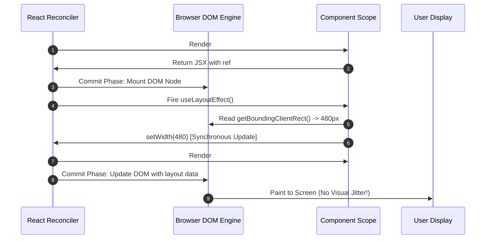

# Level 06 — React Fundamentals
## KPI 07 / KPI 10 — Refs & Imperative Escape Hatches
### PART 07 — Ref Measurement, Layout & DOM Synchronization

[⬅️ Previous Part (06: useImperativeHandle)](06-useimperativehandle-and-constrained-apis.md) | [📚 Level 06 Index](../README.md) | [🧪 Companion Lab](examples/07-ref-measurement-layout-dom-synchronization.html) | [Next Part ➡️](08-ref-driven-focus-selection-scrolling.md)

> **Tier:** 🔴 MUST KNOW (Core Senior Full-Stack Competency)  
> **Author:** [Prasenjeet](https://github.com/prasenjeet-0322) (Mid-Level Full Stack Developer)  
> **Lead System Architect & Approver:** [Srikar Kudurmalla](https://www.linkedin.com/in/kudurmallasrikar/) (Full Stack Developer | Founding Engineer)

---

# 🧭 Part Objective

React's programming model is purely declarative: **`UI = f(State, Props)`**. In this pipeline, React computes what the DOM should look like and commits those instructions to the host environment.

However, many critical UI decisions require geometric and spatial information that **does not exist until the browser layout engine has laid out the committed DOM**:
- *"How wide is this tooltip anchor relative to the viewport boundaries?"*
- *"Does this container's content overflow its visible bounds (`scrollHeight > clientHeight`)?"*
- *"Where should an absolute popover or dropdown menu anchor itself without clipping offscreen?"*
- *"How many responsive navigation items fit in the available header container width?"*

This creates an unavoidable feedback bridge:

```text
React Declarative Tree ──► Commit Phase ──► Native DOM Committed
                                                  │
                                                  ▼
                                      Measure Host Geometry
                                    (.getBoundingClientRect)
                                                  │
                         ┌────────────────────────┴────────────────────────┐
                         ▼                                                 ▼
             MEASUREMENT IN REF                                MEASUREMENT IN STATE
           (Transient / Imperative)                           (Drives React Re-render)
                         │                                                 │
                         ▼                                                 ▼
            Imperative Event Handler                              Reconciles New UI
            (e.g., Position Popover)                           (e.g., Responsive Branch)
```

The objective of this Part is to build an ironclad mental model of **DOM measurement, layout timing (`useEffect` vs `useLayoutEffect`), `ResizeObserver` subscriptions, layout thrashing prevention, and avoiding dangerous measurement-driven feedback loops**.

---

# ⚡ LAYER 1 — 30-Second Executive Cheat Sheet & Core Mental Models

## 1. The Core Measurement Distinction: Ref vs State

| Measurement Destination | When to Use | Triggers Re-render? | Typical Architectural Example |
| :--- | :--- | :---: | :--- |
| **Measurement in a Ref** (`useRef`) | Value is needed for imperative commands or event handlers; does **NOT** alter JSX markup. | ❌ **No** | Reading anchor coordinates when user clicks *"Open Menu"*. |
| **Measurement in State** (`useState`) | Rendered output depends directly on the observed physical dimensions. | ✅ **Yes** | Switching between `<CompactView />` and `<ExpandedView />` based on container width. |

---

## 2. Browser Geometry APIs: Master Comparison

| Native API | Physical Quantity Observed | Includes Padding? | Includes Border? | Typical Production Use Case |
| :--- | :--- | :---: | :---: | :--- |
| **`getBoundingClientRect()`** | Viewport-relative floating-point bounding box | ✅ Yes | ✅ Yes | Tooltip/popover positioning, mouse collision. |
| **`offsetWidth` / `offsetHeight`** | Layout box integer dimensions | ✅ Yes | ✅ Yes | Element physical size, basic layout checks. |
| **`clientWidth` / `clientHeight`** | Inner content box dimensions | ✅ Yes | ❌ No | Scrollable container visible viewport area. |
| **`scrollWidth` / `scrollHeight`** | Total scrollable content dimensions | ✅ Yes | ❌ No | Overflow detection (`scrollHeight > clientHeight`). |

---

## 3. Timing: `useEffect` vs `useLayoutEffect` for Layout Sync

```text
                     TIMING OF MEASUREMENT HOOKS
                                  │
    ┌─────────────────────────────┴─────────────────────────────┐
    ▼                                                           ▼
useLayoutEffect (Pre-Paint Synchronization)            useEffect (Post-Paint Passive)
───────────────────────────────────────────            ───────────────────────────────
• Runs SYNCHRONOUSLY after Commit Phase                • Runs ASYNCHRONOUSLY after Browser Paint
• Runs BEFORE the browser paints pixels to screen      • The user sees intermediate frame #1
• Modifying state re-renders BEFORE paint              • Modifying state causes VISUAL FLICKER!
• ✅ Ideal for: Pre-paint position/size corrections    • ✅ Ideal for: Analytics, network, subscriptions
```

> [!IMPORTANT]
> **The Golden Rule of DOM Measurement:**  
> If the browser must tell React something about the committed DOM **before** the user sees the screen (to prevent visual jumping/flicker), measure inside **`useLayoutEffect`**.  
> If the measurement does not determine what is rendered, keep it **out of React state** and store it in a **ref**.

---

# 🔬 LAYER 2 — Deep Mechanical Breakdown

## 1. Why Render Cannot Measure Its Own Future DOM

A frequent junior trap is attempting to measure `ref.current` during the render phase:

```tsx
// ❌ BROKEN: Circular dependency & null pointer bug!
function BrokenTooltip() {
  const ref = useRef<HTMLDivElement>(null);

  // ⚠️ ERROR: During render, the DOM node does NOT exist yet (or is from a stale frame)!
  const width = ref.current?.getBoundingClientRect().width; 

  return <div ref={ref}>Tooltip (Width: {width})</div>;
}
```

```text
THE CIRCULAR TIMING DILEMMA:

Render Phase:    Calculates "What DOM SHOULD exist in the future"
Commit Phase:    Creates and attaches the actual DOM nodes in the browser
Measurement:     Observes "What ACTUALLY exists right now in the browser"

You cannot observe the geometry of something that has not yet been committed to the layout engine!
```

---

## 2. The Two-Phase Measurement Cycle

Layout-dependent UI naturally operates across **two sequential render passes**:

```text
Render Phase #1:
  Component renders initial container.
  State: `width = 0` (or estimated placeholder).
         │
         ▼
Commit Phase #1:
  React creates host DOM element.
  `ref.current` is attached.
         │
         ▼
useLayoutEffect:
  Measures `ref.current.getBoundingClientRect().width` -> 480px.
  Calls `setWidth(480)`.
         │
         ▼
Render Phase #2 (Synchronous before Paint):
  Component renders layout-dependent UI with `width = 480`.
  React commits updated DOM.
         │
         ▼
Browser Paint:
  User sees the perfectly positioned/measured UI in a SINGLE frame! (Zero Flicker!)
```



---

## 3. Equality Checks: Preventing Measurement Render Storms

Blindly updating state on every measurement cycle creates catastrophic re-render loops. Always guard state updates with an **equality check**:

```tsx
function MeasuredBox() {
  const boxRef = useRef<HTMLDivElement>(null);
  const [dimensions, setDimensions] = useState({ width: 0, height: 0 });

  useLayoutEffect(() => {
    if (!boxRef.current) return;

    const { width, height } = boxRef.current.getBoundingClientRect();

    // ✅ Equality Guard: Only schedule render if physical dimensions actually changed!
    setDimensions((prev) => {
      if (Math.round(prev.width) === Math.round(width) && Math.round(prev.height) === Math.round(height)) {
        return prev; // Same object reference -> React bails out of rendering!
      }
      return { width: Math.round(width), height: Math.round(height) };
    });
  });

  return <div ref={boxRef}>Box Content</div>;
}
```

---

## 4. `ResizeObserver`: Subscribing to Continuous Geometry Changes

When element dimensions change dynamically due to window resizing, content injection, or font loading, static one-time measurement is insufficient. The browser provides `ResizeObserver` as an external event signal:

```tsx
import React, { useRef, useState, useLayoutEffect } from 'react';

export function ResponsiveCard() {
  const cardRef = useRef<HTMLDivElement>(null);
  const [isCompact, setIsCompact] = useState(false);

  useLayoutEffect(() => {
    const node = cardRef.current;
    if (!node) return;

    // 1. Create native browser observer
    const observer = new ResizeObserver((entries) => {
      const entry = entries[0];
      if (!entry) return;

      const inlineWidth = entry.contentRect.width;
      const compactMode = inlineWidth < 400;

      // 2. Synchronize to React state with bail-out guard
      setIsCompact((prev) => (prev !== compactMode ? compactMode : prev));
    });

    // 3. Attach observer to host node
    observer.observe(node);

    // 4. Cleanup on unmount / ref swap
    return () => {
      observer.disconnect();
    };
  }, []);

  return (
    <div ref={cardRef} className={`card ${isCompact ? 'compact' : 'expanded'}`}>
      {isCompact ? <span>Mini Card</span> : <h2>Detailed Enterprise Card</h2>}
    </div>
  );
}
```

---

## 5. Measurement Feedback Loops: Convergence vs Oscillation

```text
                 MEASUREMENT FEEDBACK RELATIONSHIP
                                │
                 Measure DOM Width (e.g., 490px)
                                │
                                ▼
               setState: Switch to Compact Mode
                                │
                                ▼
            Render Compact Mode (Takes Less Space)
                                │
                                ▼
                 DOM Width Shrinks (e.g., 510px)
                                │
                                ▼
               setState: Switch to Expanded Mode
                                │
                                ▼
                 🔁 INFINITE OSCILLATION LOOP!
```

### How to Guarantee Convergence:
1. **Never mutate the dimension you are measuring:** If you measure `container.width`, do not set `container.style.width` based on that measurement.
2. **Use Hysteresis / Buffers:** If switching to compact mode at `< 400px`, do not switch back to expanded mode until `> 440px` (40px dead-zone buffer).
3. **Prefer CSS Container Queries (`@container`):** When layout adjustments are purely visual/styling, let the browser CSS engine handle container queries natively without invoking React JavaScript execution!

---

## 6. Layout Thrashing (Interleaved Reads and Writes)

```text
❌ LAYOUT THRASHING (Forces multiple synchronous reflows):
  const w1 = el1.offsetWidth;       // [READ 1: Forces Reflow]
  el1.style.width = `${w1 + 10}px`;  // [WRITE 1: Invalidates Layout]
  const w2 = el2.offsetWidth;       // [READ 2: Forces 2nd Reflow!]
  el2.style.width = `${w2 + 10}px`;  // [WRITE 2: Invalidates Layout]

✅ BATCHED READS & WRITES (Single Reflow):
  const w1 = el1.offsetWidth;       // [READ 1]
  const w2 = el2.offsetWidth;       // [READ 2 - Uses cached layout!]
  
  el1.style.width = `${w1 + 10}px`;  // [WRITE 1]
  el2.style.width = `${w2 + 10}px`;  // [WRITE 2]
```

---

# 🧪 LAYER 3 — Diagnostic Labs & DevTools Profiling

## Lab 1: Layout Effect vs Passive Effect Flicker Probe

### Source Code
```tsx
import React, { useRef, useState, useEffect, useLayoutEffect } from 'react';

export function FlickerProbeLab() {
  const [mode, setMode] = useState<'useLayoutEffect' | 'useEffect'>('useLayoutEffect');
  const [offsetY, setOffsetY] = useState(0);
  const [renderCount, setRenderCount] = useState(0);
  const targetRef = useRef<HTMLDivElement>(null);

  // Hook dynamically selected for lab demonstration:
  const HookToUse = mode === 'useLayoutEffect' ? useLayoutEffect : useEffect;

  HookToUse(() => {
    if (targetRef.current) {
      const rect = targetRef.current.getBoundingClientRect();
      // Simulate positioning an attached popover 40px below target:
      setOffsetY(rect.height + 40);
    }
  }, [renderCount]);

  return (
    <div style={{ padding: 20, background: '#111827', color: '#fff', borderRadius: 12 }}>
      <h3>Flicker & Measurement Timing Lab</h3>

      <div style={{ marginBottom: 14 }}>
        <label style={{ marginRight: 16 }}>
          <input
            type="radio"
            name="hookMode"
            checked={mode === 'useLayoutEffect'}
            onChange={() => setMode('useLayoutEffect')}
          />
          useLayoutEffect (Pre-Paint: Zero Flicker)
        </label>
        <label>
          <input
            type="radio"
            name="hookMode"
            checked={mode === 'useEffect'}
            onChange={() => setMode('useEffect')}
          />
          useEffect (Post-Paint: Visible Jitter)
        </label>
      </div>

      <button onClick={() => setRenderCount((c) => c + 1)}>
        Trigger Layout Recalculation
      </button>

      <div
        ref={targetRef}
        style={{
          marginTop: 20,
          padding: 20,
          background: '#1e293b',
          border: '1px solid #334155',
          borderRadius: 8,
          position: 'relative',
        }}
      >
        Measured Target Container
        <div
          style={{
            position: 'absolute',
            top: offsetY,
            left: 20,
            padding: '6px 12px',
            background: mode === 'useLayoutEffect' ? '#10b981' : '#f43f5e',
            borderRadius: 6,
            fontSize: 12,
            fontWeight: 600,
          }}
        >
          Attached Floating Popover (offsetY: {offsetY}px)
        </div>
      </div>
    </div>
  );
}
```

---

## Lab 2: Measurement Telemetry & Efficiency Ratio Tracker

```typescript
export class MeasurementTelemetry {
  private static measurements = 0;
  private static renders = 0;

  public static recordMeasurement(label: string, width: number, height: number): void {
    this.measurements += 1;
    console.log(`📐 [Measurement #${this.measurements}] ${label}: ${width}x${height}px`);
  }

  public static recordRender(): void {
    this.renders += 1;
  }

  public static getEfficiencyRatio(): number {
    return this.renders === 0 ? 1 : this.measurements / this.renders;
  }
}
```

---

# 🔥 LAYER 4 — The Crucible (Anti-Patterns, Runbooks & Checklist)

## Crucible Challenge 1: The Tooltip Jumping Bug

### Symptom
When opening a dropdown menu or tooltip, it briefly flashes at `(0, 0)` in the top-left corner of the viewport before jumping to the correct anchor position 1 frame later.

### Root Cause
The anchor measurement was scheduled inside `useEffect` (which executes asynchronously after the browser has already painted the initial `top: 0, left: 0` frame).

### Senior Resolution
1. Switch positioning measurement to **`useLayoutEffect`** so the coordinates update before the first paint frame.
2. Initialize popover with `visibility: hidden` or `opacity: 0` until coordinates are computed.

---

## Crucible Challenge 2: The Resize Render Storm

### Flawed Code
```tsx
// ❌ DISASTER: Fires 200+ React re-renders per second while dragging window!
useEffect(() => {
  const onResize = () => {
    // Unbounded state writes on every single pixel resize tick!
    setWidth(window.innerWidth); 
  };
  window.addEventListener('resize', onResize);
  return () => window.removeEventListener('resize', onResize);
}, []);
```

### Senior Refactoring
1. Use **`ResizeObserver`** scoped specifically to the container element rather than the global window.
2. Store threshold boolean flags (`isCompact`) rather than raw pixel numbers.
3. If raw pixel values are needed for canvas/WebGL rendering, store them in a **ref** and update the canvas context directly without triggering React reconciler updates!

---

## Production Incident Runbook: Triaging Measurement Bugs

```text
                    MEASUREMENT INCIDENT TRIAGE TREE
                                   │
                   What is the observed symptom?
                                   │
  ┌────────────────────────────────┼────────────────────────────────┐
  ▼                                ▼                                ▼
Visual Flicker / Jump            Render Storm / High CPU          Observer Memory Leak
─────────────────────            ───────────────────────          ────────────────────
1. Is measurement in             1. Are equality guards missing   1. Check observer cleanup.
   `useEffect`?                     in state setters?             2. Is `observer.disconnect()`
2. Migrate to                    2. Replace raw pixel state with     called in effect return?
   `useLayoutEffect`.               boolean breakpoint flags.
```

---

# 📋 Production Verification Checklist

- [ ] Measurements that alter visible layout are synchronized using **`useLayoutEffect`** to eliminate visual jump/flicker.
- [ ] Measurements used solely for imperative calculations (mouse clicks, canvas draws) are stored in **refs**, never in React state.
- [ ] All `ResizeObserver` and window resize listeners have strict cleanup routines (`observer.disconnect()`, `removeEventListener`).
- [ ] Measurement state updates contain **equality guards** to prevent redundant re-render loops.
- [ ] Feedback loops between measured dimensions and CSS layout are bounded and checked for oscillation.
- [ ] CSS Container Queries (`@container`) are evaluated first before reaching for JavaScript-based resize observers.

---

# 📚 Knowledge Graph & Module Navigation

```text
Level 06 Master Hub (React Fundamentals)
  │
  └── 10-useRef-Mutable-Values (KPI 07 / KPI 10)
        ├── 01-useref-mental-model.md (Completed)
        ├── 02-dom-refs-forwardref.md (Completed)
        ├── 03-callback-refs.md (Completed)
        ├── 04-ref-lifecycle-and-ownership.md (Completed)
        ├── 05-forwarding-refs-and-component-boundaries.md (Completed)
        ├── 06-useimperativehandle-and-constrained-apis.md (Completed)
        ├── 07-ref-measurement-layout-and-dom-synchronization.md ◄── (You Are Here)
        └── 08-ref-driven-focus-selection-scrolling.md
```

[⬅️ Previous Part (06: useImperativeHandle)](06-useimperativehandle-and-constrained-apis.md) | [📚 Level 06 Index](../README.md) | [🧪 Companion Lab](examples/07-ref-measurement-layout-dom-synchronization.html) | [Next Part ➡️](08-ref-driven-focus-selection-scrolling.md)
