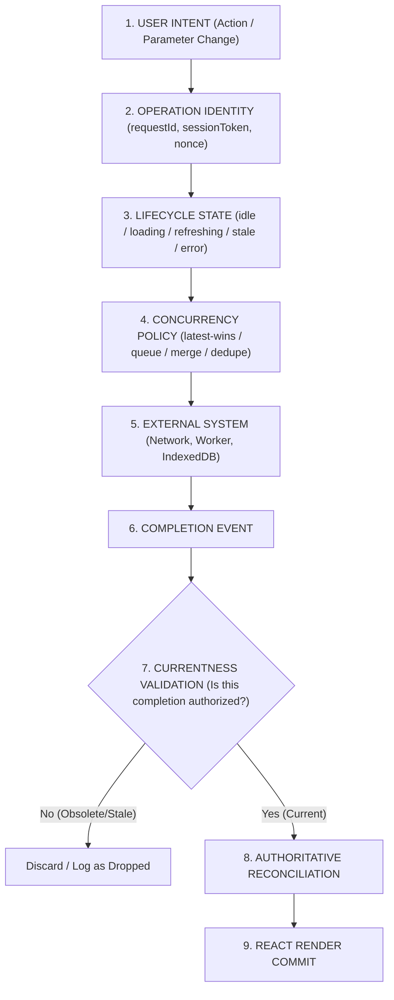

# Level 06 — React Fundamentals
# KPI 15 — Async UI State & Data Lifecycle
## PART 05 — Async UI Lifecycle Crucible, Architecture & Master Synthesis

[⬅️ Previous Part](./04-optimistic-ui-mutation-reconciliation.md) | [📚 Level 06 Index](../README.md) | [🧪 Companion Lab](./examples/05-async-data-architecture-crucible.html) | [Next KPI ➡️](../../16-Custom-Hooks-Design/README.md)

> **Tier:** 🔴 MUST KNOW (Core Senior Full-Stack Competency)  
> **Author & Lead System Architect:** [Srikar Kudurmalla](https://www.linkedin.com/in/kudurmallasrikar/) (Full Stack Developer | Founding Engineer)  
> **Co-Author:** Prasenjeet (Mid-Level Full Stack Developer)

---

# 1. ⚡ 30-Second Executive Cheat Sheet

### 1.1 The Senior Mental Model
Asynchronous UI is **not**:
```text
request() ──► loading ──► success / error
```

A production asynchronous UI is a temporal distributed state machine governed by explicit identity, concurrency rules, and authoritative reconciliation:



### 1.2 The Master Architectural Equation
$$\text{Reliable Async UI} = \text{State Model} + \text{Operation Identity} + \text{Concurrency Policy} + \text{Lifecycle Ownership} + \text{Freshness Semantics} + \text{Error Semantics} + \text{Authoritative Reconciliation}$$

If **any single term** of this equation is missing or left to temporal chance, the UI will exhibit transient bugs under production network jitter, client concurrency, or race conditions.

---

# 2. 🧭 The Five Core Architectural Questions

Whenever designing or reviewing an asynchronous UI component, every senior engineer must interrogate:

| # | Question | Core Architectural Risk Prevented |
| :--- | :--- | :--- |
| **1** | **What does the UI currently believe?** | Ambiguous state combinations (e.g., `isLoading && isError`), blank screen flicker. |
| **2** | **Which operation produced this payload?** | Stale response overwrites (Operation $A$ returning after Operation $B$). |
| **3** | **Is that operation still authorized to mutate state?** | Race conditions where superseded promises resolve and corrupt current view. |
| **4** | **How fresh is the currently displayed information?** | Unnecessary refetches, silent cache staleness, data drift. |
| **5** | **Who is the authoritative owner of truth?** | Dual source-of-truth conflicts between local optimistic projections and server data. |

---

# 3. 🔬 Deep Mechanical Breakdown: Async UI as a Temporal System

### 3.1 The Dimensions of Async State vs. Boolean Explosions
A simplistic approach uses independent booleans:
```typescript
// ❌ DANGEROUS: 2^8 = 256 possible states, most of which are nonsensical
interface NaiveAsyncState<T> {
  isLoading: boolean;
  isRefreshing: boolean;
  isError: boolean;
  isSuccess: boolean;
  hasData: boolean;
  isRetrying: boolean;
  isOffline: boolean;
  isCancelled: boolean;
  data: T | null;
  error: Error | null;
}
```

A production-grade discriminated union separates **Lifecycle Status**, **Payload Availability**, and **Operation Metadata**:

```typescript
export type AsyncDataState<T> =
  | { status: "idle"; data: null; error: null }
  | { status: "loading"; data: null; error: null; requestId: string; startedAt: number }
  | { status: "success"; data: T; error: null; fetchedAt: number; staleAt: number }
  | { status: "refreshing"; data: T; error: null; fetchedAt: number; staleAt: number; requestId: string }
  | { status: "error"; data: null; error: Error; failedAt: number; retryCount: number }
  | { status: "error-with-data"; data: T; error: Error; fetchedAt: number; failedAt: number; retryCount: number };
```

```
┌───────────────────────────────────────────────────────────────────────────┐
│                             Async UI Lifecycle                            │
└───────────────────────────────────────────────────────────────────────────┘

               ┌───────────────┐
               │     IDLE      │
               └───────┬───────┘
                       │ FETCH (first time)
                       ▼
               ┌───────────────┐
       ┌───────┤    LOADING    ├───────┐
       │       └───────┬───────┘       │
       │ FAILURE       │ SUCCESS       │ ABORT
       ▼               ▼               ▼
┌──────────────┐ ┌───────────────┐ ┌───────────────┐
│    ERROR     │ │    SUCCESS    │ │   CANCELLED   │
└──────┬───────┘ └───────┬───────┘ └───────────────┘
       │ RETRY           │ BACKGROUND REVALIDATE
       │                 ▼
       │         ┌───────────────┐
       │         │  REFRESHING   │ (Preserves existing data)
       │         └───────┬───────┘
       │                 │
       │        ┌────────┴────────┐
       │        │ SUCCESS         │ FAILURE
       ▼        ▼                 ▼
 ┌───────────────────────┐ ┌───────────────────────┐
 │        SUCCESS        │ │   ERROR-WITH-DATA     │
 └───────────────────────┘ └───────────────────────┘
```

### 3.2 Error-With-Data as a First-Class Citizen
When a background revalidation fails on an active dashboard, wiping the UI to display a full-page error banner destroys user context and productivity. 

```tsx
// ✅ PRODUCTION ARCHITECTURE: Non-destructive error rendering
export function LiveAnalyticsDashboard({ state, onRetry }: { state: AsyncDataState<AnalyticsData>; onRetry: () => void }) {
  if (state.status === "idle" || state.status === "loading") {
    return <DashboardSkeleton />;
  }

  if (state.status === "error") {
    return <FullPageErrorBanner error={state.error} onRetry={onRetry} />;
  }

  // Covers "success", "refreshing", and "error-with-data"
  return (
    <div className="relative dashboard-container">
      {state.status === "refreshing" && (
        <div className="absolute top-2 right-2 flex items-center gap-2 bg-blue-500/10 text-blue-400 px-3 py-1 rounded text-xs">
          <Spinner size="xs" /> Refreshing live metrics...
        </div>
      )}

      {state.status === "error-with-data" && (
        <div className="bg-amber-500/20 border border-amber-500/40 text-amber-200 p-3 rounded mb-4 flex justify-between items-center text-sm">
          <span>⚠️ Displaying cached data from {new Date(state.fetchedAt).toLocaleTimeString()}. Refresh failed ({state.error.message}).</span>
          <button onClick={onRetry} className="px-3 py-1 bg-amber-600 hover:bg-amber-500 rounded text-xs font-semibold">Retry</button>
        </div>
      )}

      <MetricGrid data={state.data} />
    </div>
  );
}
```

---

# 4. 🔬 The 6 Production Crucible Incidents & Post-Mortems

```
┌──────────────────────────────────────────────────────────────────────────────────┐
│                           PRODUCTION CRUCIBLE INCIDENTS                          │
├───────────────────┬──────────────────────────────────┬───────────────────────────┤
│ Incident          │ Root Cause                       │ Architectural Fix         │
├───────────────────┼──────────────────────────────────┼───────────────────────────┤
│ 1. Search Race    │ Fast query resolves after slow   │ Request Identity &        │
│                   │ superseded query.                │ AbortController Guard     │
├───────────────────┼──────────────────────────────────┼───────────────────────────┤
│ 2. Flashing UI    │ Refresh wipes data to loading.   │ Stale-While-Revalidate    │
│                   │                                  │ with background indicator │
├───────────────────┼──────────────────────────────────┼───────────────────────────┤
│ 3. Infinite Retry │ Uncontrolled useEffect error     │ Exponential Backoff +     │
│                   │ triggering retry.                │ Max Retry Count Bound     │
├───────────────────┼──────────────────────────────────┼───────────────────────────┤
│ 4. Double Delete  │ Optimistic deletion not cleared  │ Layered Projection Model  │
│                   │ during authoritative refetch.    │ with Mutation Key Map     │
├───────────────────┼──────────────────────────────────┼───────────────────────────┤
│ 5. Timeout Ambiguity│ Client assumes timeout = fail,  │ Idempotency Nonce +       │
│                   │ retries payment duplicate.       │ Authoritative Status Sync │
├───────────────────┼──────────────────────────────────┼───────────────────────────┤
│ 6. Normalized Data│ Server capitalizes/formats, but  │ Authoritative Server      │
│    Drift          │ client keeps raw typed string.   │ Payload Reconciliation    │
└───────────────────┴──────────────────────────────────┴───────────────────────────┘
```

### Crucible Incident #1: Search-As-You-Type Race Condition
* **Scenario:** User types `"rea"`, triggering Request $A$ (300ms network delay). User immediately continues typing `"react"`, triggering Request $B$ (50ms network delay).
* **Observed Failure:** Request $B$ returns at $t=50\text{ms}$ rendering `"react"` results. Request $A$ returns at $t=300\text{ms}$ and overwrites the state with obsolete `"rea"` results.
* **Architectural Resolution:** Strict request monotonicity checking via `requestId` or monotonic `generationToken`.

```typescript
// Reducer Currentness Enforcement
function asyncDataReducer<T>(state: AsyncDataState<T>, action: AsyncAction<T>): AsyncDataState<T> {
  switch (action.type) {
    case "SUCCESS": {
      // Guard: Ignore if response does not match active in-flight requestId
      if (state.status === "loading" || state.status === "refreshing") {
        if (state.requestId !== action.requestId) {
          console.warn(`[Async Guard] Dropped stale response for request: ${action.requestId}. Active: ${state.requestId}`);
          return state;
        }
      }
      return {
        status: "success",
        data: action.data,
        error: null,
        fetchedAt: action.timestamp,
        staleAt: action.timestamp + action.ttl
      };
    }
    // ...
  }
}
```

---

# 5. 🛠️ Complete Production Architecture: Unified Async Coordinator

Here is the principal-level architecture combining:
1. Monotonic request identity tracking.
2. In-flight request deduplication.
3. Optimistic mutation layering.
4. Auto-revalidation with exponential backoff and jitter.
5. Cache invalidation graph.

```typescript
// Unified Async Coordinator Types
export type ConcurrencyMode = "latest-wins" | "first-wins" | "queue" | "dedupe";

export interface RequestConfig<T> {
  key: string;
  fetcher: (signal: AbortSignal) => Promise<T>;
  ttl?: number;
  concurrency?: ConcurrencyMode;
  maxRetries?: number;
  retryDelayMs?: number;
}

export class AsyncDataCoordinator {
  private cache = new Map<string, { data: any; fetchedAt: number; staleAt: number }>();
  private inFlight = new Map<string, { promise: Promise<any>; controller: AbortController; requestId: string }>();
  private listeners = new Map<string, Set<(state: any) => void>>();
  private activeRequestTokens = new Map<string, number>();

  public subscribe(key: string, listener: (state: any) => void): () => void {
    if (!this.listeners.has(key)) {
      this.listeners.set(key, new Set());
    }
    this.listeners.get(key)!.add(listener);
    return () => {
      this.listeners.get(key)?.delete(listener);
    };
  }

  public async execute<T>(config: RequestConfig<T>): Promise<T> {
    const { key, fetcher, ttl = 60000, concurrency = "latest-wins", maxRetries = 3, retryDelayMs = 500 } = config;

    // 1. Deduplication Check
    if (concurrency === "dedupe" && this.inFlight.has(key)) {
      return this.inFlight.get(key)!.promise;
    }

    // 2. Cancellation for Latest-Wins
    if (concurrency === "latest-wins" && this.inFlight.has(key)) {
      this.inFlight.get(key)!.controller.abort();
    }

    const controller = new AbortController();
    const token = (this.activeRequestTokens.get(key) || 0) + 1;
    this.activeRequestTokens.set(key, token);
    const requestId = `req_${key}_${token}_${Date.now()}`;

    const executeWithRetry = async (attempt: number): Promise<T> => {
      try {
        const result = await fetcher(controller.signal);
        
        // Guard: Verify Token Monotonicity
        if (this.activeRequestTokens.get(key) !== token) {
          throw new Error("STALE_REQUEST_OBSOLETE");
        }

        // Update Cache
        const now = Date.now();
        this.cache.set(key, { data: result, fetchedAt: now, staleAt: now + ttl });
        this.emit(key, { status: "success", data: result, fetchedAt: now, staleAt: now + ttl });
        return result;
      } catch (err: any) {
        if (err.name === "AbortError" || err.message === "STALE_REQUEST_OBSOLETE") {
          throw err;
        }

        if (attempt < maxRetries) {
          const jitter = Math.random() * 100;
          const delay = retryDelayMs * Math.pow(2, attempt) + jitter;
          await new Promise((res) => setTimeout(res, delay));
          return executeWithRetry(attempt + 1);
        }

        this.emit(key, { status: "error", error: err, failedAt: Date.now() });
        throw err;
      } finally {
        if (this.inFlight.get(key)?.requestId === requestId) {
          this.inFlight.delete(key);
        }
      }
    };

    const promise = executeWithRetry(0);
    this.inFlight.set(key, { promise, controller, requestId });
    return promise;
  }

  private emit(key: string, payload: any) {
    this.listeners.get(key)?.forEach((fn) => fn(payload));
  }
}
```

---

# 6. 🧠 10 Staff-Level Interview Questions & Authoritative Answers

### Q1: Why is `const [isLoading, setIsLoading] = useState(false)` classified as an architectural hazard for enterprise React applications?
**Answer:** `isLoading` collapses distinct asynchronous lifecycle states (initial mount loading, background cache revalidation, mutation pending, pagination loading, and retry backoff) into a single binary flag. This leads to destructive UI renders where background refreshes wipe out visible data in favor of loading spinners, prevents graceful handling of `error-with-data`, and fails to prevent out-of-order race conditions when multiple requests overlap.

### Q2: How does operation currentness differ from request cancellation?
**Answer:** Cancellation (`AbortController.abort()`) is a transport-level hint asking the browser or server to terminate network processing. Operation currentness (`requestId` / monotonicity tokens) is an application-level state invariant determining whether a completed promise has the authorization to mutate the current UI state. Even if an abort fails, arrives late, or is ignored by an upstream service, currentness checks guarantee that superseded payloads are discarded without state corruption.

### Q3: What is the mechanical risk of replacing a client-generated temporary ID with a server ID during optimistic creation?
**Answer:** If the React component rendering the optimistic item uses the temporary ID (`temp-123`) as its `key`, replacing it with the canonical server ID (`server-8492`) triggers a React Fiber unmount and remount. This obliterates local component state (cursor position, active form focus, ongoing micro-animations, internal input state). The solution is either identity migration via stable local mapping keys or preserving stable wrapper container identities during reconciliation.

### Q4: Explain the difference between "Replace", "Merge", and "Invalidate" mutation reconciliation policies.
**Answer:**
* **Replace:** The client overwrites the optimistic projection entirely with the canonical entity returned in the mutation payload. Best when the server returns full authoritative objects with computed fields and timestamps.
* **Merge:** The client merges authoritative server fields into local client-specific fields (e.g., UI selection state or draft inputs).
* **Invalidate:** The mutation response triggers a stale-flag update across a dependency graph, scheduling an asynchronous re-fetch for dependent collections whose server derivations cannot be predicted locally.

### Q5: Why can a client network timeout never be treated as a definitive server failure?
**Answer:** Network timeouts occur when the client stops waiting for a response socket. The server may have successfully received, validated, and committed the mutation to the database before the response packet was dropped by network transit. Treating a timeout as a failure and offering an un-guarded "Retry" button risks duplicate destructive actions (e.g., double billing). Proper architecture requires an `Idempotency-Key` and an explicit reconciliation/status-query workflow.

### Q6: How should concurrent mutations to the same resource be handled when order of completion does not match order of intent?
**Answer:** Through **Optimistic Mutation Layers** paired with **Desired-State Projections**. The rendered visible state is computed as $\text{Visible} = \text{Authoritative Snapshot} + \sum \text{Pending Intent Queue}$. If mutation $M_1$ finishes after $M_2$, $M_1$'s completion reconciles against the authoritative base, and the pending queue recalculates without wiping out $M_2$'s desired state.

### Q7: Under what conditions should optimistic UI be strictly forbidden?
**Answer:**
1. Low prediction certainty (e.g., operations with complex server validation or permission checks).
2. High consequence of failure (e.g., financial disbursements, credit card charging, destructive database schema updates).
3. Ambiguous rollback paths (e.g., irreversible multi-party workflows).
4. Operations where server generation is substantial and non-deterministic (e.g., dynamic pricing algorithms).

### Q8: How does `useOptimistic` in React 19 interact with asynchronous transitions?
**Answer:** `useOptimistic` creates a temporary projection of state that automatically reverts when the enclosing `startTransition` async action settles. However, it does not manage cache invalidation, network retries, idempotency tokens, or background data reconciliation across independent subtrees. It is a rendering projection primitive, not a distributed consistency coordinator.

### Q9: What is the difference between "Stale" data and "Invalid" data?
**Answer:** Stale data is previously verified authoritative data whose TTL has expired relative to cache freshness rules; it remains valid for display while revalidation occurs in the background. Invalid data is known to be false, corrupted, or structurally unauthorized, and must never be displayed to the user.

### Q10: What is the single most important rule of distributed frontend state management?
**Answer:** **The client may predict, but the server decides.** The client UI must always treat its local state as a temporary speculative projection that continuously converges toward authoritative remote truth.

---

# 7. ✅ 50-Point Senior Async UI Architecture Mastery Checklist

```
┌────────────────────────────────────────────────────────────────────────┐
│               50-POINT SENIOR ASYNC ARCHITECTURE AUDIT                 │
├────────────────────────────────────────────────────────────────────────┤
│ [ ] 01. No boolean explosions (isLoading + isError anti-patterns)      │
│ [ ] 02. Discriminated union status types for all async boundaries      │
│ [ ] 03. Explicit 'error-with-data' state modeled and rendered          │
│ [ ] 04. Background refresh does not flash loading skeletons            │
│ [ ] 05. Monotonic request ID / token attached to all requests          │
│ [ ] 06. AbortController wired to unmount and superseded actions        │
│ [ ] 07. Reducer verifies operation currentness before mutating state   │
│ [ ] 08. In-flight request deduplication implemented for queries       │
│ [ ] 09. Exponential backoff with randomized jitter on auto-retries     │
│ [ ] 10. Maximum retry bound enforced to prevent infinite network loops │
│ [ ] 11. Stale-While-Revalidate TTL timestamps recorded (`fetchedAt`)   │
│ [ ] 12. Stale data distinguished from absent data                      │
│ [ ] 13. Non-blocking background revalidation indicators                │
│ [ ] 14. Cache invalidation graph for dependent query invalidation      │
│ [ ] 15. Optimistic mutations modeled as layered projections            │
│ [ ] 16. Server responses treated as authoritative truth                │
│ [ ] 17. Server normalization reconciled with local form inputs         │
│ [ ] 18. Temporary IDs mapped cleanly to canonical server IDs           │
│ [ ] 19. Component keys remain stable during ID reconciliation          │
│ [ ] 20. Layered rollbacks preserve subsequent valid mutations          │
│ [ ] 21. Idempotency nonces sent with non-safe mutations (POST/PATCH)   │
│ [ ] 22. Network timeouts modeled as 'unknown' rather than 'failure'    │
│ [ ] 23. Concurrency policies explicitly chosen (latest-wins vs queue)  │
│ [ ] 24. Component lifetime decoupled from data operation lifetime     │
│ [ ] 25. Pagination state maintains cache boundaries without leaks     │
│ [ ] 26. Memory leak guards on asynchronous callbacks after unmount    │
│ [ ] 27. Search inputs debounced and guarded with latest-request IDs    │
│ [ ] 28. Offline network states handled with offline-cached indicators  │
│ [ ] 29. Granular error classifications (network, 4xx, 5xx, timeout)   │
│ [ ] 30. Retryable errors segregated from non-retryable 4xx errors      │
│ [ ] 31. Form submission buttons disabled against duplicate clicks      │
│ [ ] 32. Optimistic toggles revert smoothly on 500 error                │
│ [ ] 33. Empty collections rendered with distinct EmptyState components │
│ [ ] 34. Race conditions reproducible via deliberate delay injectors    │
│ [ ] 35. DevTools telemetry logger for async state transitions          │
│ [ ] 36. Synchronous state transitions separated from async effects     │
│ [ ] 37. WebSocket stream merges respect authoritative snapshot version │
│ [ ] 38. Window focus revalidation respects minimum stale intervals    │
│ [ ] 39. Garbage collection of inactive query cache entries             │
│ [ ] 40. Batch mutations support partial success and partial rollback   │
│ [ ] 41. Optimistic list reordering supports server conflict rejection  │
│ [ ] 42. Server timestamp clock-skew tolerance implemented              │
│ [ ] 43. Form dirty states preserved during background revalidation     │
│ [ ] 44. Async boundaries isolated within React ErrorBoundaries         │
│ [ ] 45. Suspense integration patterns decoupled from business logic    │
│ [ ] 46. React 19 `useOptimistic` utilized for local form projections   │
│ [ ] 47. Diagnostic timelines recorded in production error logs         │
│ [ ] 48. Zero visual layout shifts (CLS) during async transitions       │
│ [ ] 49. Senior peer code review criteria documented for async hooks    │
│ [ ] 50. All async logic verified through comprehensive unit/mock tests │
└────────────────────────────────────────────────────────────────────────┘
```

---

# 8. 🏁 Graduation Gate: The Senior Architecture Crucible

To graduate from **KPI 15 (Async UI State & Data Lifecycle)**, analyze this real-world production incident and explain every step of the failure and its architectural remediation:

### Crucible Challenge Scenario
A collaborative project management board displays tasks in a Kanban layout. 
1. The user drags Task $X$ from "In Progress" to "Done".
2. The UI optimistically updates Task $X$ position and sends `PATCH /tasks/X { status: "DONE" }`.
3. Simultaneously, a background poller triggers `GET /tasks` (which returns the previous state where Task $X$ is "In Progress" because the server hasn't committed the write yet).
4. While the poller request is in-flight, the user edits Task $X$'s title to `"Deploy v2.0"`, sending `PATCH /tasks/X { title: "Deploy v2.0" }`.
5. The poller finishes first and overwrites the Kanban board with the stale list.
6. The `PATCH /tasks/X status` request fails with a `504 Gateway Timeout`.
7. The `PATCH /tasks/X title` request succeeds with `{ id: "X", title: "Deploy v2.0", status: "IN_PROGRESS", version: 14 }`.

### Senior Architectural Diagnosis Required:
1. **Why did Task $X$ jump backwards to "In Progress" before jumping again?**
2. **What happened to the user's optimistic title edit when the poller returned?**
3. **Did the 504 Gateway Timeout mean the status wasn't changed? How should the UI respond?**
4. **Design the exact layered projection store that guarantees zero UI flicker and convergent authoritative state.**

---

[⬅️ Previous Part](./04-optimistic-ui-mutation-reconciliation.md) | [📚 Level 06 Index](../README.md) | [🧪 Companion Lab](./examples/05-async-data-architecture-crucible.html) | [Next KPI ➡️](../../16-Custom-Hooks-Design/README.md)
